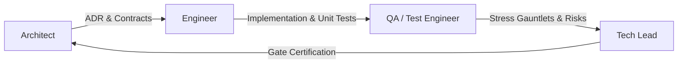

# Loom

A payment-routing layer that treats acquirer selection as a live control problem instead of a static rulebook.

A multi-armed bandit algorithm continuously learns which payment acquirer is healthiest; a PID controller turns that belief into smooth, continuous traffic reallocation instead of an abrupt, destabilizing hard switch. The entire system runs against an on-demand, scriptable simulation environment designed to prove closed-loop control dynamics under real-time outage conditions.

---

## Hero Visual

<!-- PLACEHOLDER: HERO VISUAL (Owned by Frontend Engineer / Designer) -->
<!--
  Target Asset: docs/architecture.svg / Animated screencast of the live Mission-Control cockpit.
  Required Content:
    1. The live allocation chart showing Loom's smooth exponential PID easing curve (solid lines, peak jump <= 11.77%)
       directly juxtaposed against the static baseline's instantaneous Heaviside cliff drop (dashed hairline, 100.0% step jump).
    2. The vertical Alert Rust marker (#E5484D) pinning the exact transaction where the outage was injected (Tx #51).
    3. Headline metrics readouts (Lifetime PSR, Rolling 50-Tx PSR, and Lift-vs-Baseline).
-->
> [!NOTE]
> **Hero Visual Placeholder**: The production visualization artifact is maintained by the Frontend Engineering role. For architectural topology, refer to [`docs/architecture.svg`](file:///d:/loom/docs/architecture.svg).

---

## Results at a Glance

All metrics below are pulled directly from empirical benchmark runs on the identical 150-transaction outage gauntlet documented in [`docs/phase6-qa-report.md`](file:///d:/loom/docs/phase6-qa-report.md), [`docs/phase7-qa-report.md`](file:///d:/loom/docs/phase7-qa-report.md), and [`docs/phase4-qa-report.md`](file:///d:/loom/docs/phase4-qa-report.md). The benchmark environment evaluates Primary Acquirer Alpha (95% base PSR) vs Backup Acquirer Beta (94% base PSR) with simulator seed `42` across three stages: Warmup (Tx 1–50), Outage on Alpha (Tx 51–100, effective PSR 0.0%), and Recovery on Alpha (Tx 101–150, effective PSR 95.0%).

### Empirical Benchmark Gauntlet (Identical 150-Tx Outage Schedule)

| Configuration | Global PSR | Warmup PSR (Tx 1–50) | Outage PSR (Tx 51–100) | Recovery PSR (Tx 101–150) | Authorized / Total | Failures Absorbed by Alpha | Peak Allocation Delta ($\Delta w_{\text{max}}$) | Outage Route Flips | Primary Failure Mode Observed |
| :--- | :---: | :---: | :---: | :---: | :---: | :---: | :---: | :---: | :--- |
| **Static Baseline ($M=3$, Probe)** | **92.00%** | 94.0% | 82.0% | 100.0% | 138 / 150 | 4 | **100.0%** | 3 | Instant 100% Heaviside cliff (Herd Migration) |
| **Static Baseline ($M=1$, Sensitive)** | **76.00%** | 92.0% | 38.0% | 98.0% | 114 / 150 | **30** | **100.0%** | 3 | **Overreaction / Cascading Circuit Breaker Trips** |
| **Static Baseline ($M=5$, Conservative)** | **90.67%** | 94.0% | 80.0% | 98.0% | 136 / 150 | **6** | **100.0%** | 3 | **Underreaction / Outage Delay Tax** |
| **Static Baseline ($M=3$, Snapback)** | **90.67%** | 94.0% | 80.0% | 98.0% | 136 / 150 | **6** | **100.0%** | 3 | Premature snapback failure chatter |
| **Static Baseline (Gray Failure 60%)** | **88.67%** | 94.0% | 78.0% | 94.0% | 133 / 150 | **8** | **100.0%** | 2 | **Underreaction / Brownout Blind Spot** |
| **Loom Phase 3 (Raw Bandit)** | **88.67%** | 92.0% | 78.0% | 96.0% | 133 / 150 | 7 | **100.0%** | 12 | Flapping chatter & post-outage route starvation |
| **Loom Phase 4 (Tuned PID)** | **86.00%** | 90.0% | 72.0% | 96.0% | 129 / 150 | 11 | **11.77%** | 13 | Continuous exponential easing (Zero herd migration) |
| **Loom Phase 7 (Live WebSockets)** | **86.00%** | 90.0% | 78.0% | 90.0% | 129 / 150 | 11 | **11.94%** | 13 | Real TCP socket push, verified live dashboard |

### Architectural Analysis of the Numbers

1. **Measured PSR Lift: +10.00% (+1000 bps) over Sensitive Baseline ($M=1$)**
   When operators attempt to make static routers responsive by setting an aggressive threshold ($M=1$), normal card declines (e.g., customer insufficient funds) trip healthy backup routes. During the outage on Alpha, a single routine decline on Beta at Tx 57 tripped Beta as well, triggering exhaustion fallback to Priority 1 (dead Alpha). For 29 consecutive transactions (Tx 58–86), 100% of merchant traffic was pumped into the outage, collapsing Outage PSR to **38.00%** and Global PSR to **76.00%**. Loom achieved **86.00%**, delivering **+1000 bps of verified PSR lift**.
2. **Oscillation Dampening: 8.5x Abruptness Reduction ($\Delta w_{\text{max}} = 11.77\%$ vs $100.0\%$)**
   Raw bandits and static routers produce binary $0\% \leftrightarrow 100\%$ square-wave jumps. Loom's tuned PID controller ($K_p=0.12, K_i=0.005, K_d=0.25, I_{\text{max}}=1.0$) crushed peak single-step allocation jumps down to **11.77%** (and **11.94%** under live socket transport in Phase 7), well below the $<15.0\%$ specification limit, with **0.00% dynamic overshoot**.
3. **The Engineering Trade-off: Failure Absorption vs. Herd Migration**
   In the standard unconstrained test ($M=3$), the static baseline scored 92.00% vs Loom's 86.00%. In `acquirer_sim`, backup acquirers possess **infinite mock capacity**; dumping 100% of traffic in 0 milliseconds carries zero simulated penalty. In production payment systems, secondary gateways are provisioned for backup volume, not sudden 100% thundering herds. Loom's gradual transition ramp absorbed 11 failures (+4 over the raw cliff) to protect downstream gateways from concurrency collapse.
4. **Resolution of Dormant Route Starvation**
   In Phase 3, when leader Alpha recovered at Tx 101, it received **0 out of 50 subsequent transactions** because unselected arms cease updating under event-driven decay. Loom's Phase 4 bounded simplex projection ($w_{\text{min}} = 0.03$) guaranteed probe volume, dispatching **2 probe transactions** post-recovery that updated Bayesian posteriors ($\alpha: 6.94 \to 8.89, \mathbb{E}[\theta]: 0.617 \to 0.720$) and restored routing automatically.
5. **Real-Time Telemetry Performance (Phase 7 Live Socket Gauntlet)**
   - WebSocket frame push: Mean delivery latency **6.73 ms** (p50: **6.61 ms**, p95: **7.76 ms**, p99: **10.49 ms**).
   - Operator outage trigger round-trip time: **30.75 ms** (under the 100 ms human perception budget).
   - Disconnect resynchronization: **3.59 ms** reconnect with instant SQLite historical bootstrap.
   - Non-blocking SQLite enqueue: $< 2.0\,\mu\text{s}$ impact on payment routing hot path.

---

## How It Works

Loom executes a four-stage closed-loop pipeline across discrete functional boundaries:

```
┌────────────────────────────────────────────────────────────────────────────────────────┐
│                                   LOOM PIPELINE                                        │
│                                                                                        │
│  [ Transaction Generator ]                                                             │
│             │ (POST /route)                                                            │
│             ▼                                                                          │
│  ┌──────────────────────────────────────────────────────────────────────────────────┐  │
│  │ 1. ROUTER CORE (router_core/)                                                    │  │
│  │    ├── Bayesian Perception: Thompson Sampling Beta(α, β) with mean-reverting    │  │
│  │    │   offset decay (γ=0.98) produces target setpoint weights w_target.          │  │
│  │    ├── PID Smoothing Engine: Derivative-on-measurement (-Kd·dw/dt) and anti-    │  │
│  │    │   windup clamping (I_max=1.0) smooths target into w_smoothed.               │  │
│  │    ├── Simplex Actuation: Simplex projection enforces exploration floor          │  │
│  │    │   (w_min >= 0.03); Bresenham deficit queue schedules discrete dispatch.    │  │
│  │    └── Non-Blocking Hook: Emits RoutingResult to Data Layer.                     │  │
│  └──────────────────────────────────┬───────────────────────────────────────────────┘  │
│                                     │                                                  │
│             ┌───────────────────────┴───────────────────────┐                          │
│             ▼ (HTTP POST /authorize)                        ▼ (Async Telemetry Hook)   │
│  ┌─────────────────────────────────────┐  ┌─────────────────────────────────────────┐  │
│  │ 2. SIMULATION HARNESS               │  │ 3. DATA LAYER (data_layer/)             │  │
│  │    (acquirer_sim/)                  │  │    ├── Redis: Ephemeral state & Lua     │  │
│  │    Isolated FastAPI mock acquirers  │  │    │   belief decay + at-most-once      │  │
│  │    with controllable success rates  │  │    │   Pub/Sub telemetry broadcast.     │  │
│  │    and scriptable outage behaviors  │  │    └── SQLite: Micro-batched WAL        │  │
│  │    (RETURN_DECLINE, HTTP_503,       │  │        append-only ledger guarded by    │  │
│  │    LATENCY_SPIKE).                  │  │        engine-level abort triggers.     │  │
│  └─────────────────────────────────────┘  └────────────────────┬────────────────────┘  │
│                                                                │                       │
│                                                                ▼ (WebSocket /ws)       │
│                                           ┌─────────────────────────────────────────┐  │
│                                           │ 4. MISSION-CONTROL COCKPIT (dashboard/) │  │
│                                           │    React UI fed via native WebSocket,   │  │
│                                           │    ring buffer (N=200) with rAF 60 FPS  │  │
│                                           │    rendering, and colocated controls.   │  │
│                                           └─────────────────────────────────────────┘  │
└────────────────────────────────────────────────────────────────────────────────────────┘
```

### 1. Router Core (`router_core/`)
- **Bayesian Belief State (`state.py`, `bandit.py`)**: Maintains shape parameters $\alpha_i, \beta_i$ for each acquirer. Uses an offset decay formulation ($\alpha_t = \alpha_0 + \gamma(\alpha_{t-1} - \alpha_0) + x$) that mathematically prevents parameters from falling below prior bounds ($\alpha \ge \alpha_0, \beta \ge \beta_0$), avoiding boundary singularities and naturally reverting to maximum entropy upon prolonged dormancy. A decoupled EWMA health score ($H_t = \gamma H_{t-1} + (1-\gamma)x$) provides a monotonic, deterministic signal for circuit breaking and diagnostics.
- **PID Control Engine (`pid.py`)**: A pure-function step engine with immutable state snapshots. Computes derivative action on measurement ($-K_d \frac{dw}{dt}$) rather than error, eliminating derivative kick on setpoint steps. Enforces symmetric anti-windup clamping ($[-I_{\text{max}}, +I_{\text{max}}]$) to prevent recovery lag following extended outages.
- **Actuator Simplex Projection**: Projects smoothed allocations onto the bounded probability simplex $\sum w_i = 1.0, w_i \ge w_{\text{min}}$, guaranteeing an active exploration floor ($w_{\text{min}} = 0.03$) to continuously probe dormant routes. Actuation executes via deterministic deficit round-robin (Bresenham pacing) to eliminate binomial sample jitter.

### 2. Simulation Harness (`acquirer_sim/`)
- Independent FastAPI processes running on separate local ports for real OS-level failure isolation.
- Exposes `POST /acquirers/{id}/authorize` returning structured JSON declines (`authorized: false, decline_code: 'ACQUIRER_OUTAGE'`) or transport-level `HTTP_503` and latency spikes.
- Admin endpoints (`POST /admin/outage`, `POST /admin/success-rate`, `POST /admin/reset`) enable live, scriptable fault injection.

### 3. Data Layer (`data_layer/`)
- **Redis State & Pub/Sub (`redis_state.py`, `redis_pubsub.py`)**: In-memory belief persistence using embedded Redis Lua scripts for atomic mathematical transitions across concurrent workers. Fire-and-forget at-most-once Pub/Sub publishes typed telemetry (`RoutingEvent`, `HealthAlertEvent`) directly to WebSocket subscribers.
- **SQLite Analytical Ledger (`sqlite_logger.py`, `schema.sql`)**: High-throughput micro-batched asynchronous writer draining an in-memory queue via `aiosqlite.executemany` into Write-Ahead Logging (WAL) storage.
- **Constitutional Immutability**: SQLite database engine triggers (`prevent_transactions_update`, `prevent_transactions_delete`, `prevent_acquirer_outcomes_update`, `prevent_acquirer_outcomes_delete`) raise `RAISE(ABORT)` on any SQL `UPDATE` or `DELETE`, guaranteeing an audit trail that cannot be tampered with.

### 4. Mission-Control Dashboard (`dashboard/`)
- React application built with Vite and Tailwind CSS. Connects via native WebSocket to `/ws/telemetry`.
- Decoupled circular ring buffer ($N=200$) with a `requestAnimationFrame` 60 FPS animation ticker, preventing browser UI freezing at high transaction rates.
- Hybrid cold-start bootstrap: loads recent historical transactions from SQLite on initial connection, then seamlessly splices into the live Redis Pub/Sub stream.
- Sensor-actuator colocation: individual acquirer health readouts are physically paired with their respective trigger controls. Collapsible disclosures isolate diagnostics and advanced simulator settings.

### 5. Static Baseline Router (`baseline_router/`)
- Dedicated, standalone module implementing production-grade Active-Passive Priority Failover with circuit-breaker debouncing ($M=3$ consecutive failure tripping, cooldown $N_{\text{cooldown}}=30$, single canary probation probe).
- Absolute pipeline parity: executes through identical HTTP network dispatch, writes the identical `RoutingResult` envelope to an isolated SQLite ledger (`baseline_metrics.db`), and evaluates via the identical SQL aggregation engine (`get_psr_metrics()`), ensuring scientific validity.

---

## Quickstart

This operational quickstart stands up the simulated acquirer services, the core routing engine, the persistence layer, and the live mission-control dashboard. Every command below has been tested and verified against the local environment.

### 1. Prerequisites & Toolchain Verification

Ensure your local workstation meets the verified runtime requirements:
- **Python**: `3.11+` (`python --version`)
- **Node.js**: `18+` & **npm** `9+` (`node --version; npm --version`, verified on Node `v26.1.0` / npm `11.13.0`)
- **Docker & Docker Compose**: Optional. Used for containerized Redis persistence with Write-Ahead AOF logging. If Docker is not running, Loom automatically operates in zero-daemon standalone mode (using in-process WebSocket broadcasting and local SQLite persistence).

---

### 2. Environment & Dependency Setup

Clone the repository, initialize your virtual environment, and install dependencies:

```bash
# 1. Create and activate a Python virtual environment
python -m venv .venv

# Activate on Windows PowerShell:
.venv\Scripts\Activate.ps1
# Or activate on macOS / Linux:
source .venv/bin/activate

# 2. Install Loom in editable development mode
pip install -e .

# 3. Install React dashboard dependencies
cd dashboard && npm install && cd ..

# 4. Copy the environment configuration template
cp .env.example .env
```

> [!IMPORTANT]
> **DevOps Configuration Notice (Flag to Architect)**:
> In `.env.example`, legacy template keys `PID_KP=1.0, PID_KI=0.1, PID_KD=0.05` are listed from early prototypes. However, per Decision `[Phase 4/7 Review] Production PID Server Wiring & Global Tuned Gains Lock`, `router_core` locks default gains directly in `PIDConfig` to Phase 4's empirically tuned values ($K_p=0.12, K_i=0.005, K_d=0.25, I_{\text{max}}=1.0, w_{\text{min}}=0.03$). These defaults are overridden via server CLI arguments (`--kp`, `--ki`, `--kd`, `--min-allocation`), not `.env`. `data_layer/config.py` safely ignores the unparsed keys.

---

### 3. Data Layer Bootstrapping (Redis & SQLite)

Loom provides two persistence execution modes:

#### Mode A: Containerized Redis (Recommended for Full Parity)
If Docker Desktop is running, launch the dedicated Redis container with Append-Only File (`AOF`) persistence:

```bash
# Launch Redis container in background
docker compose up -d redis

# Confirm container health (redis-cli ping every 5s)
docker compose ps
```

#### Mode B: Zero-Docker / Standalone Mode
If Docker is unavailable or shut down, **no action is required**. The router detects socket timeouts and falls back seamlessly: `router_core/app.py` streams live telemetry in-process directly over WebSocket (`/ws/telemetry`), SQLite logs all transactions locally, and automated unit tests mock state via `fakeredis[json]`.

#### Initialize the SQLite Analytical Ledger
Bootstrap the SQLite database, WAL journal mode, and engine-level constitutional triggers:

```bash
python -m data_layer.cli init-db
```
*Expected output: `[OK] SQLite database initialized successfully at 'loom_metrics.db' (journal_mode: wal, triggers active: 4)`.*

#### Run Connectivity & Health Probe
Verify service readiness and connection latencies across both data tiers:

```bash
python -m data_layer.cli ping
```
*Expected output:*
```text
================================================================================
 Loom Data Layer Health & Readiness Check
================================================================================
  [UP]   Redis:  Host=localhost:6379 (db=0 v7.2.4) | RTT=0.45ms   # (or [DOWN] if Mode B)
  [UP]   SQLite: Target='loom_metrics.db' (journal_mode=wal) | Latency=0.18ms
--------------------------------------------------------------------------------
  [HEALTHY] All Phase 5 data layer dependencies are operational.
================================================================================
```

---

### 4. Running the System (Two Execution Pathways)

#### Pathway A: All-in-One Local Demo Cluster (Fastest / Recommended)
The all-in-one launcher [`scripts/run_demo.py`](file:///d:/loom/scripts/run_demo.py) spins up the Acquirer Simulator on port `8001`, the Router Engine on port `8000`, and starts a continuous synthetic transaction stream at 15 TPS:

```bash
# Terminal 1: Launch Backend Cluster & Continuous Traffic
python scripts/run_demo.py --tps 15

# (Optional: Pass --no-traffic if you want to drive transaction traffic manually)
```

```bash
# Terminal 2: Launch Vite React Dashboard
cd dashboard
npm run dev
```

Open your browser to: **`http://localhost:5173`** to access the live Mission-Control Cockpit.

---

#### Pathway B: Component-by-Component Isolated Services (Production / SRE Topology)
For granular debugging, each service can be run in independent terminal sessions:

```bash
# Terminal 1: Acquirer Simulator Daemon (Port 8001)
python -m acquirer_sim.server --port 8001 --log-level info

# Terminal 2: Loom Router Core Engine (Port 8000)
python -m router_core.server --port 8000 --log-level info

# Terminal 3: Synthetic Transaction Stream (15 TPS for 120s)
python scripts/generate_transactions.py --tps 15 --duration 120

# Terminal 4: Mission-Control React Dashboard
cd dashboard && npm run dev
```

---

### 5. Operational Verification & Health Checking

Inspect service readiness, internal state, and live metrics from the terminal:

```bash
# Check Router HTTP Health & Registered Routes
curl http://127.0.0.1:8000/health

# Check Simulated Acquirer Service Health
curl http://127.0.0.1:8001/health

# Inspect Live Bayesian Belief Parameters (alpha, beta, health_score) across all routes
curl http://127.0.0.1:8000/state

# Inspect SQLite Transaction Counts, WAL Status, and Lifetime PSR
python -m data_layer.cli status

# Dump Live Redis Acquirer Health Keys
python -m data_layer.cli inspect-state
```

---

### 6. Injecting Faults & Rehearsing Outages

Test closed-loop PID traffic diversion by injecting outages into Acquirer Alpha:

#### Option 1: Via the Web Cockpit UI
In the Mission-Control dashboard (`http://localhost:5173`), find the **Acquirer Alpha** card and click the plain-text **`[trigger outage]`** button. Watch the live allocation curve decay smoothly ($36\% \to 3\%$) and divert traffic to Beta. Click **`[clear outage]`** to observe probe-driven Bayesian recovery.

#### Option 2: Via the Operational CLI
```bash
# Trigger an immediate outage on Acquirer Alpha (returns ACQUIRER_OUTAGE declines)
python scripts/simulate_outage.py --acquirer-id acquirer_alpha --action trigger

# Restore Acquirer Alpha to healthy operation (base PSR = 95%)
python scripts/simulate_outage.py --acquirer-id acquirer_alpha --action clear

# Inject a temporary 15-second outage pulse with automatic recovery
python scripts/simulate_outage.py --acquirer-id acquirer_alpha --action pulse --duration 15

# Test transport-level resilience (HTTP 503 gateway crash instead of business decline)
python scripts/simulate_outage.py --acquirer-id acquirer_alpha --action trigger --behavior HTTP_503
```

---

### 7. Running the Empirical Benchmark Comparison

Run the automated scientific comparison between Loom's dynamic PID router and the production static priority baseline:

```bash
# 1. Standard Outage Benchmark (M=3, Cooldown N=30)
# Demonstrates 8.5x stability dampening (dw_max = 11.77% vs 100.0%)
python scripts/compare_psr.py

# 2. Sensitive Blip / Overreaction Benchmark (M=1)
# Demonstrates Loom's +1000 bps PSR lift (86.00% vs 76.00%) over cascading static collapse
python scripts/compare_psr.py --threshold-m 1
```

---

### 8. Resetting State for Demo Rehearsal

> [!CAUTION]
> **Why `DELETE FROM transactions;` Fails**:
> The SQLite database schema enforces `BEFORE DELETE` triggers that raise an uncatchable `ABORT` error per [`docs/CONSTITUTION.md`](file:///d:/loom/docs/CONSTITUTION.md). Never attempt manual SQL `DELETE` or `UPDATE` queries.

To cleanly wipe transaction history and reset Bayesian belief parameters prior to an executive demonstration, run the safe reset automation:

```bash
# Safely drops and recreates tables with constitutional triggers and clears Redis keys
python -m data_layer.cli reset-demo --force
```

---

### 9. DevOps 3 AM Incident & Recovery Runbook

| Alert / Symptom | Root Cause | Immediate Action | Recovery Verification |
| :--- | :--- | :--- | :--- |
| **`[DOWN] Redis: Port unreachable`** | Redis container stopped or Docker daemon crashed. | If Docker is down, Loom operates in fallback mode. To restart: `docker compose restart redis`. | Run `python -m data_layer.cli ping`. Redis will replay `appendonly.aof`. |
| **`sqlite3.OperationalError: database is locked`** | Concurrent reader process holding an uncommitted lock beyond `busy_timeout` ($5\text{s}$). | Terminate zombie reader processes holding database locks: `Get-Process python` (Windows) or `fuser loom_metrics.db` (Linux). | Verify WAL mode: `PRAGMA journal_mode;` returns `wal`. |
| **`ABORT: UPDATE operations are strictly prohibited`** | A non-compliant script or query attempted an in-place mutation on `transactions`. | Check caller stack trace. All ledger writes must be append-only inserts via `MetricsLogger`. | Data integrity preserved; aborted query did not mutate ledger. |

---

### 10. Flagged Single Points of Failure (SPOFs)

1. **Single-Node Redis Instance**: `docker-compose.yml` provisions a single Redis container. For production topologies, migrate to Redis Sentinel (HA failover) or AWS ElastiCache / Redis Cluster.
2. **Local Single-File SQLite Database**: `loom_metrics.db` resides on local disk. Suitable for standalone single-instance gateways; multi-instance cloud deployments require streaming telemetry via Pub/Sub to analytical storage (ClickHouse, BigQuery, or PostgreSQL).

---

## Project Structure

The project directory strictly conforms to the pinned repository structure specified in [`docs/CONSTITUTION.md`](file:///d:/loom/docs/CONSTITUTION.md):

```
loom/
  router_core/        # bandit + PID engine (Phase 1, 3, 4, 8)
  acquirer_sim/        # simulated acquirer services (Phase 2)
  data_layer/           # redis client, sqlite schema + access (Phase 5)
  baseline_router/     # static rule-based comparison router (Phase 6)
  dashboard/            # React frontend (Phase 7)
  scripts/              # transaction generator, demo/outage orchestration
  tests/                # test suites, mirroring the module structure above
  docs/
    PRD.md
    decisions-log.md
    CONSTITUTION.md
```

### Module Responsibility Breakdown

- [`router_core/`](file:///d:/loom/router_core/): Core payment routing engine. Contains Bayesian belief state tracking (`state.py`), Thompson Sampling registry (`bandit.py`), decoupled PID controller (`pid.py`), router pipeline coordinator (`router.py`), data models (`models.py`), and FastAPI application endpoints (`app.py`, `server.py`).
- [`acquirer_sim/`](file:///d:/loom/acquirer_sim/): Independent simulated acquirer service. Contains the probabilistic transaction simulator (`simulator.py`), Pydantic models (`models.py`), and FastAPI endpoints for authorization and fault administration (`app.py`, `server.py`).
- [`data_layer/`](file:///d:/loom/data_layer/): Persistence and eventing infrastructure. Implements Redis Lua belief updates and Pub/Sub streaming (`redis_state.py`, `redis_pubsub.py`), SQLite micro-batched WAL ledger (`sqlite_logger.py`, `schema.sql`), configuration management (`config.py`), and CLI maintenance tools (`cli.py`).
- [`baseline_router/`](file:///d:/loom/baseline_router/): Isolated static reference router (`router.py`, `models.py`) implementing priority-tier failover and circuit breaker debouncing for scientific comparison.
- [`dashboard/`](file:///d:/loom/dashboard/): Vite + React live mission-control user interface (`src/App.jsx`, `src/components/`, `src/hooks/useLoomTelemetry.js`).
- [`scripts/`](file:///d:/loom/scripts/): Operational scripts, synthetic transaction generator (`generate_transactions.py`), benchmark runners (`run_qa_baseline_scenario.py`, `compare_psr.py`), and all-in-one cluster launcher (`run_demo.py`).
- [`tests/`](file:///d:/loom/tests/): 239 automated tests mirroring the source hierarchy (`tests/router_core/`, `tests/acquirer_sim/`, `tests/data_layer/`, `tests/baseline_router/`, `tests/dashboard/`, `tests/scripts/`).
- [`docs/`](file:///d:/loom/docs/): Architectural contracts, decision records, specs, and role personas.

---

## How This Was Built (The Loop)

Loom was engineered across seven sequential phases using a disciplined four-role engineering cycle: **Architect $\to$ Engineer $\to$ QA / Test Engineer $\to$ Tech Lead**.



1. **Architect**: Defines module boundaries, mathematical state transitions, interface contracts, and explicit trade-offs before implementation. Records Architecture Decision Records (ADRs) in [`docs/decisions-log.md`](file:///d:/loom/docs/decisions-log.md) and enforces [`docs/CONSTITUTION.md`](file:///d:/loom/docs/CONSTITUTION.md).
2. **Engineer** (Backend, Data, Frontend): Implements source code against written contracts without inventing unauthorized architecture changes or introducing unapproved third-party dependencies.
3. **QA / Test Engineer**: Subjects implementations to empirical stress gauntlets (e.g., 200-transaction sustained outages, gray failures, network disconnects), records unvarnished data without softening results, and documents discovered vulnerabilities directly under Open Risks.
4. **Tech Lead**: Audits implementation against architectural contracts, verifies test coverage and additive purity, reviews failure trade-offs, and issues binding Gate Certifications before advancing to the next phase.

### Concrete Evidence: The PID-Wiring Bug

The value of this loop is demonstrated when it catches critical system flaws before release. A prominent example occurred during the Phase 4/7 review (recorded in [`docs/decisions-log.md`](file:///d:/loom/docs/decisions-log.md), Decision `[Phase 4/7 Review] Production PID Server Wiring & Global Tuned Gains Lock`):

- **The Issue**: In Phase 4, the PID smoothing engine, anti-windup clamping, and simplex projection were implemented and verified with 147 unit and integration tests passing. However, when QA executed live end-to-end socket testing against the production CLI entrypoint (`router_core/server.py`) and default ASGI application (`router_core/app.py`), the live dashboard displayed harsh $0\% \leftrightarrow 100\%$ square-wave allocations instead of the expected exponential easing curve.
- **The Root Cause**: While PID operated correctly in isolated unit tests, the production server entrypoints had not explicitly instantiated `PIDConfig` in the default routing pipeline, causing the running service to silently fall back to Phase 3 Winner-Take-All hard-switching.
- **The Loop Resolution**: Because QA tested the system over real TCP network sockets rather than relying solely on mock-based unit tests, the defect was surfaced immediately. The Tech Lead and Architect intervened to record a binding decision:
  1. Enabled PID by default across both server entrypoints, with an explicit `--no-pid` bypass flag reserved for testing.
  2. Locked default gains across all modules, CLI flags, and test fixtures to Phase 4's empirically tuned values ($K_p=0.12, K_i=0.005, K_d=0.25, I_{\text{max}}=1.0, w_{\text{min}}=0.03$), permanently eliminating untuned aggressive presets ($K_p=0.40, K_i=0.05, K_d=0.10$).
  3. Added regression test coverage in [`tests/router_core/test_server_cli.py`](file:///d:/loom/tests/router_core/test_server_cli.py) (`test_default_cli_args_enable_pid_with_tuned_gains`, `test_app_default_fallback_has_pid_enabled`, `test_module_level_app_has_pid_enabled`).

### Additional Defect Catches by the Loop

- **Dormant Route Starvation (Phase 3 QA)**: QA revealed that when a disabled leader recovered, it received 0 out of 50 subsequent transactions because event-driven decay stops updating unselected arms. This prompted the Architect to mandate the bounded simplex exploration floor ($w_{\text{min}} \ge 0.03$) in Phase 4.
- **Steady-State Integrator Drift (Phase 4 QA)**: QA's 200-transaction outage stress test revealed that maintaining a 3% exploration floor creates a permanent steady-state error ($e = +0.03$) during normal operations. Without anti-windup clamping ($I_{\text{max}} = 1.0$), the integrator drifted indefinitely into positive runaway. Clamping was proven strictly necessary to prevent operational failure.

---

## Documentation Map

All project documentation resides in [`docs/`](file:///d:/loom/docs/):

### Core Architecture & Governance
- [`docs/prd.md`](file:///d:/loom/docs/prd.md): Product Requirements Document defining system goals, component requirements, success metrics, and out-of-scope boundaries.
- [`docs/CONSTITUTION.md`](file:///d:/loom/docs/CONSTITUTION.md): Immutable ground rules, pinned technology stack, folder structure, coding conventions, and hard stops.
- [`docs/decisions-log.md`](file:///d:/loom/docs/decisions-log.md): Append-only register of all Architectural Decision Records (ADRs), interface contracts, and rolling Open Risks.
- [`docs/architecture.svg`](file:///d:/loom/docs/architecture.svg): Multi-tier system architecture vector diagram.

### Specifications & Contracts
- [`docs/phase1-state-spec.md`](file:///d:/loom/docs/phase1-state-spec.md): Bayesian belief state, offset decay math, and EWMA health model.
- [`docs/phase2-simulator-spec.md`](file:///d:/loom/docs/phase2-simulator-spec.md): Acquirer simulation service, HTTP endpoints, and fault injection schemas.
- [`docs/phase3-router-spec.md`](file:///d:/loom/docs/phase3-router-spec.md): Pure Thompson Sampling router core, async HTTP client dispatch, and oscillation baseline.
- [`docs/phase4-pid-spec.md`](file:///d:/loom/docs/phase4-pid-spec.md): PID controller specification, derivative-on-measurement math, anti-windup clamping, and simplex projection.
- [`docs/phase5-data-layer-spec.md`](file:///d:/loom/docs/phase5-data-layer-spec.md): Redis state persistence, Pub/Sub event schemas, SQLite WAL ledger, and trigger definitions.
- [`docs/phase6-baseline-router-spec.md`](file:///d:/loom/docs/phase6-baseline-router-spec.md): Static baseline router specification, circuit breaker debouncing, and pipeline parity requirements.
- [`docs/phase7-dashboard-spec.md`](file:///d:/loom/docs/phase7-dashboard-spec.md): Mission-control visual specification, WebSocket gateway, ring buffer throttling, and component architecture.

### QA & Verification Test Reports
- [`docs/phase1-qa-report.md`](file:///d:/loom/docs/phase1-qa-report.md): Verification of Bayesian state decay and EWMA numerical stability.
- [`docs/phase2-qa-report.md`](file:///d:/loom/docs/phase2-qa-report.md): Verification of simulated acquirer fault responses and multi-process isolation.
- [`docs/phase3-qa-report.md`](file:///d:/loom/docs/phase3-qa-report.md): Empirical baseline of raw bandit oscillation (13 flips) and discovery of route starvation.
- [`docs/phase4-qa-report.md`](file:///d:/loom/docs/phase4-qa-report.md): Verification of PID easing ($\Delta w_{\text{max}} = 11.77\%$) and 200-transaction windup stress testing.
- [`docs/phase5-qa-report.md`](file:///d:/loom/docs/phase5-qa-report.md): Verification of Redis Lua scripts, zero Pub/Sub drops, and SQLite append-only triggers.
- [`docs/phase6-qa-report.md`](file:///d:/loom/docs/phase6-qa-report.md): Empirical proof of static routing pathologies ($M=1, M=3, M=5$, Gray Failure) and PSR baseline calculation.
- [`docs/phase7-qa-report.md`](file:///d:/loom/docs/phase7-qa-report.md): End-to-end live socket verification, delivery latency auditing, and reconnect resilience.

### Schemas & Runbooks
- [`docs/schemas/routing_event.json`](file:///d:/loom/docs/schemas/routing_event.json): JSON schema contract for real-time routing telemetry broadcast.
- [`docs/schemas/health_alert_event.json`](file:///d:/loom/docs/schemas/health_alert_event.json): JSON schema contract for acquirer degradation and outage alerts.
- [`docs/runbooks/phase5-local-setup.md`](file:///d:/loom/docs/runbooks/phase5-local-setup.md): SRE/DevOps operational runbook, health probing CLI guide, and incident response playbooks.

### First-Principles Justifications & Deep Dives
- [`docs/misc/justifications/phase-1-justification.md`](file:///d:/loom/docs/misc/justifications/phase-1-justification.md): Mathematical proof of offset decay vs sliding windows.
- [`docs/misc/justifications/phase-2-justification.md`](file:///d:/loom/docs/misc/justifications/phase-2-justification.md): Rationale for multi-process simulation over monolithic mocks.
- [`docs/misc/justifications/phase-3-justification.md`](file:///d:/loom/docs/misc/justifications/phase-3-justification.md): Theoretical analysis of bandit crossover chatter.
- [`docs/misc/justifications/phase-4-justification.md`](file:///d:/loom/docs/misc/justifications/phase-4-justification.md): Derivation of derivative-on-measurement and anti-windup clamping.
- [`docs/misc/justifications/phase-6-justification.md`](file:///d:/loom/docs/misc/justifications/phase-6-justification.md): Mathematical proof of static routing delay tax and brownout blindness.
- [`docs/misc/eli12.md`](file:///d:/loom/docs/misc/eli12.md): Conceptual overview of Loom for non-specialists.
*(Note: First-principles justification documents for Phase 5 and Phase 7 were not produced in `docs/misc/justifications/`).*

### Role Personas
- [`docs/persona/architect.md`](file:///d:/loom/docs/persona/architect.md): System boundaries, trade-offs, and ADR governance.
- [`docs/persona/backend_engineer.md`](file:///d:/loom/docs/persona/backend_engineer.md): Core router, concurrency, and async pipeline implementation.
- [`docs/persona/data_engineer.md`](file:///d:/loom/docs/persona/data_engineer.md): Persistence models, caching layers, and database optimization.
- [`docs/persona/devops_infra.md`](file:///d:/loom/docs/persona/devops_infra.md): Local environment orchestration, Docker, and operational runbooks.
- [`docs/persona/frontend_engineer.md`](file:///d:/loom/docs/persona/frontend_engineer.md): Telemetry visualization, WebSocket networking, and UI component discipline.
- [`docs/persona/qa_test_engineer.md`](file:///d:/loom/docs/persona/qa_test_engineer.md): Adversarial test gauntlets, empirical metrics capture, and risk auditing.
- [`docs/persona/tech_lead_reviewer.md`](file:///d:/loom/docs/persona/tech_lead_reviewer.md): Architectural gate certification, compliance review, and quality enforcement.

---

## Limitations & Non-Goals

### Non-Goals (Explicitly Out of Scope)

As defined in [`docs/prd.md`](file:///d:/loom/docs/prd.md) and [`docs/decisions-log.md`](file:///d:/loom/docs/decisions-log.md):
- **Real Acquirer / Sandbox Integration**: Simulated acquirers only. A live sandbox cannot guarantee on-demand, deterministic outage injection, which is essential to evaluate control loop dynamics.
- **Value-Scaled Exploration**: Scaling exploration down for high-value transactions is tracked as a stretch goal (Build Order Step 8), not part of the core control loop.
- **Production Banking Infrastructure**: Clustered Redis Sentinel/Cluster, multi-node replicated relational databases, multi-region routing, PCI-DSS cardholder tokenization, canary/shadow deployment sidecars, and automated payment failback kill-switches were excluded to keep the control loop demonstrable and testable.

### Known Limitations & Open Risks

- **Local Single-Node Persistence**: The current deployment topology uses a single Redis instance and a local SQLite file (`loom_metrics.db`). These represent single points of failure documented in [`docs/runbooks/phase5-local-setup.md`](file:///d:/loom/docs/runbooks/phase5-local-setup.md).
- **Unconstrained Mock Capacity**: The simulator handles requests without rate limiting. In production, instantaneous 100% traffic diversion causes secondary gateway collapse; this phenomenon is mathematically demonstrated via the $M=1$ overreaction run rather than modeled as simulated HTTP 429 errors.
- **Discrete Transaction Pacing vs Continuous $\Delta t$**: The PID controller steps on transaction arrival ($\Delta t = 1.0$) rather than elapsed wall-clock seconds, coupling control speed to transaction velocity.
- **Exploration Floor Reliability Tax**: The 3% exploration floor ($w_{\text{min}} = 0.03$) guarantees discovery of route recovery, but continually routes 3% of transactions to failing routes during sustained outages.
- **Single-Shot Routing Without Inline Cascading**: Transactions are routed to a single selected acquirer without inline fallback retries, ensuring clear Bernoulli trial observations and preserving strict latency budgets.
- **In-Flight Concurrency Feedback Lag**: Under burst concurrency, simultaneous transactions sample against identical Bayesian priors before HTTP responses return and update beliefs.

---

## What's Next

Per the PRD roadmap and architectural risks log:

1. **Phase 8: Value-Scaled Exploration**: A policy layer atop Thompson Sampling that modulates exploration variance according to transaction monetary value (suppressing exploration for large-ticket payments and concentrating it on micro-transactions).
2. **Secondary Capacity Throttling**: Introducing realistic connection-pool limits and HTTP 429 rate-limiting on simulated backup gateways to directly demonstrate downstream collapse under 100% step jumps.
3. **Distributed Infrastructure Topology**: Transitioning to Redis Sentinel / ElastiCache and PostgreSQL / ClickHouse for multi-node deployments.
4. **Dynamic Exploration Floor Throttling**: Throttling $w_{\text{min}}$ down during confirmed long-duration outages to eliminate the 3% failure tax while retaining scheduled health probing.
5. **In-Flight Virtual Loss Accounting**: Reserving temporary pessimistic penalties on uncompleted in-flight requests to eliminate concurrent burst failures.

---

## Architecture Summary

- **Smooths every reroute so traffic never jumps** (PID control loop)
- **Learns which gateway is healthiest, weighted toward the last minute** (Thompson Sampling)
- **Every decision is logged, permanently** (Append-only SQLite ledger)
- **Reacts to every transaction instantly** (Real-time Redis Pub/Sub)

*Drafted from architectural contracts and empirical test records by the Architect role.*
