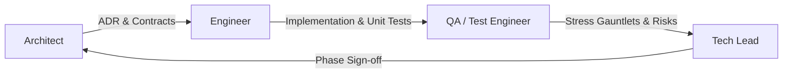

# Loom

A payment-routing experiment that adapts acquirer selection to observed outcomes instead of a static rulebook.

A multi-armed bandit (Thompson Sampling) estimates which payment acquirer is healthiest; a PID-style smoothing filter turns each per-transaction bandit choice into a gradually changing allocation weight instead of an abrupt 0%↔100% switch. The PID smooths the bandit's own output; acquirer outcomes reach it only through the bandit's beliefs. Everything runs against an on-demand, scriptable simulator of acquirers with injectable outages.

---

## Results at a Glance

### Known results and limitations (read this first)

- **Hard outages:** Loom **loses** to a standard 3-consecutive-failure circuit breaker: −3.19 pp PSR over 100 paired seeds (95% CI [−3.69, −2.69]), winning only 6 of 100.
- **Gray failures (partial brownout):** Loom **beats** the same breaker: +2.71 pp, 95% CI [+2.08, +3.35], when Alpha degrades to 60%.
- **Healthy acquirers that differ slightly:** beliefs decay per observation (≈50 observations of memory per acquirer at γ=0.98), so the bandit cannot settle on the better of two close acquirers. With Alpha at 95% and Beta at 94% it keeps sending about 46% of traffic to Beta, and that share does not shrink with more traffic.

See [Known Limitations & Open Risks](#known-limitations--open-risks) for the rest.

### Single-seed benchmark (seed 42; one draw)

Primary Acquirer Alpha (95% base PSR) vs Backup Acquirer Beta (94% base PSR), simulator seed `42`, Loom router seed `777`, in three stages: Warmup (Tx 1–50), Outage on Alpha (Tx 51–100, effective PSR 0%, or 60% in the gray-failure rows), and Recovery (Tx 101–150, 95%).

| Configuration | Global PSR | Warmup PSR (Tx 1–50) | Outage PSR (Tx 51–100) | Recovery PSR (Tx 101–150) | Authorized / Total | Outage Failures on Alpha | Peak Allocation Delta ($\Delta w_{\text{max}}$)* | Outage Route Flips |
| :--- | :---: | :---: | :---: | :---: | :---: | :---: | :---: | :---: |
| **Static Baseline ($M=3$, Probe)** | **92.00%** | 94.0% | 82.0% | 100.0% | 138 / 150 | 4 | 100.0% | 3 |
| **Static Baseline ($M=1$, Sensitive)** | **76.00%** | 92.0% | 38.0% | 98.0% | 114 / 150 | 30 | 100.0% | 3 |
| **Static Baseline ($M=5$, Conservative)** | **90.67%** | 94.0% | 80.0% | 98.0% | 136 / 150 | 6 | 100.0% | 3 |
| **Static Baseline ($M=3$, Snapback)** | **90.67%** | 94.0% | 80.0% | 98.0% | 136 / 150 | 6 | 100.0% | 3 |
| **Static Baseline ($M=3$, Gray Failure 60%)** | **88.67%** | 94.0% | 78.0% | 94.0% | 133 / 150 | 8 | 100.0% | 2 |
| **Loom Phase 4 PID (Gray Failure 60%)** | **90.00%** | 90.0% | 84.0% | 96.0% | 135 / 150 | 6 | 11.89% | — |
| **Loom Phase 3 (Raw Bandit, no PID)** | **88.67%** | 92.0% | 78.0% | 96.0% | 133 / 150 | 7 | 100.0% | 12 |
| **Loom Phase 4 (Tuned PID)** | **86.00%** | 90.0% | 72.0% | 96.0% | 129 / 150 | 11 | 11.77% | 13 |

*Loom's $\Delta w$ is the change in its continuous allocation weight; the static router's is its 0/1 dispatch indicator. These are different quantities: every individual Loom transaction still goes 100% to one acquirer.

**Phase 7 live run (different configuration, not comparable to the table):** `scripts/qa_phase7_live_verification.py` uses three acquirers (Alpha 0.95, Beta 0.90, Gamma 0.85), stochastic actuation and decay 0.95. It produces Warmup 90.0% / Outage 72.0% / Recovery 94.0%, lifetime 85.3% (128 / 150), and a peak weight change of 11.94%.

### Multi-seed results (100 paired seeds, same schedule and configuration as the table)

Seed 42 above is one draw. The table below comes from `python scripts/compare_psr.py --n-seeds 100` (simulator seeds 42, 52, …, 1032 paired with Loom seeds 777–876; 95% CIs use the t-distribution). Across seeds, Loom's own PSR ranges from 82.00% to 96.00% (mean 89.10%); 15 of 100 seeds score below the 86.00% shown above.

| Comparison | Mean PSR difference (Loom − other) | 95% CI | Loom wins / ties / losses |
| :--- | :---: | :---: | :---: |
| vs Static $M=1$ | **+13.47 pp** | [+12.10, +14.84] | 91 / 1 / 8 |
| vs Static $M=3$ | **−3.19 pp** | [−3.69, −2.69] | 6 / 4 / 90 |
| vs Static $M=5$ | **−1.95 pp** | [−2.44, −1.45] | 15 / 8 / 77 |
| vs Static $M=3$, gray failure (Alpha at 60%) | **+2.71 pp** | [+2.08, +3.35] | 77 / 7 / 16 |
| PID Loom vs raw bandit (no PID) | **−1.71 pp** | [−1.99, −1.44] | 5 / 8 / 87 |

### Reading the Numbers

1. **The +1000 bps result is against the $M=1$ breaker, a weak baseline.** At seed 42 a single routine issuer decline (`DO_NOT_HONOR`) on Beta at Tx 57 trips Beta; with both routes tripped, the exhaustion fallback sends Tx 58–86 to the dead primary, collapsing outage PSR to 38.00% and global PSR to 76.00% (Loom: 86.00%). That breaker counts issuer declines as route failures and falls back to a route it knows is dead. Loom also counts issuer declines as failures (both routers use `success = payload.authorized`); its bandit just reacts more softly.
2. **Against the standard $M=3$ breaker, Loom loses**: 86.00% vs 92.00% at seed 42, −3.19 pp across 100 seeds. Loom's ramp absorbed 11 failures on Alpha during the outage: +7 over the $M=3$ static cliff (4) and +4 over the raw bandit (7). The simulator gives backup acquirers unlimited capacity, so any benefit from avoiding a 100% traffic shift is not measured anywhere in this repo.
3. **Smoothing, and what it costs.** The tuned PID ($K_p=0.12, K_i=0.005, K_d=0.25, I_{\text{max}}=1.0$) keeps the per-transaction change in allocation weight between 9.63% and 12.37% across 100 seeds, and the weight crosses 50% a mean of 0.98 times during the outage. It does not reduce route flips: with deficit actuation consecutive transactions alternate acquirers (13.05 outage flips on average, vs 7.66 for the raw bandit and 3.01 for static $M=3$). The weight curve is not monotonic; it can move toward the failed acquirer for a few transactions after the outage starts. The PID costs 1.71 pp of PSR vs the raw bandit.
4. **Dormant route starvation is reduced, not resolved.** In Phase 3 (raw bandit), recovered Alpha received 0 of the 50 recovery transactions because unselected arms never update. With PID, the 3% exploration floor ($w_{\text{min}} = 0.03$) sends Alpha 2 probe transactions, raising its posterior mean from 0.496 (Tx 100) to 0.521 (Tx 103) to 0.544 (Tx 136). Alpha's weight is still at the 0.03 floor at Tx 150: routing back to Alpha is not restored within the benchmark window.
5. **Real-time telemetry (local loopback, single runs).** `POST /route` → WebSocket frame receipt: mean 8.20 ms, p95 11.87 ms (Phase 7 script, 150 serial transactions, no warmup; includes the routing request). Pure server-to-client push: mean 0.58 ms, max 1.98 ms (91 frames on the live demo). Operator outage trigger round-trip: 30.78 ms (one sample). WebSocket reconnect + `BOOTSTRAP` frame: 3.80 ms with a Python client; the dashboard's own reconnect backoff starts at ≥500 ms, and `BOOTSTRAP` carries current in-memory beliefs only.

---

## How It Works

Loom's pipeline is built from four stages behind separate module boundaries. In the served application today only stages 1, 2 and 4 are connected (see the Data Layer note below).

```
┌────────────────────────────────────────────────────────────────────────────────────────┐
│                                   LOOM PIPELINE                                        │
│                                                                                        │
│  [ Transaction Generator ]                                                             │
│             │ (POST /route)                                                            │
│             ▼                                                                          │
│  ┌──────────────────────────────────────────────────────────────────────────────────┐  │
│  │ 1. ROUTER CORE (router_core/)                                                    │  │
│  │    ├── Bayesian Perception: Thompson Sampling Beta(α, β) with mean-reverting     │  │
│  │    │   per-observation decay; each draw yields a one-hot target w_target.        │  │
│  │    ├── PID Smoothing: Derivative-on-measurement (-Kd·dw/dt) and anti-windup      │  │
│  │    │   clamping (I_max=1.0) low-pass filters the target into w_smoothed.         │  │
│  │    ├── Simplex Actuation: Simplex projection enforces exploration floor          │  │
│  │    │   (w_min >= 0.03); deficit or categorical draw picks the acquirer.          │  │
│  │    └── Optional Hooks: Emits RoutingResult to Data Layer when wired in.          │  │
│  └──────────────────────────────────┬───────────────────────────────────────────────┘  │
│                                     │                                                  │
│             ┌───────────────────────┴───────────────────────┐                          │
│             ▼ (HTTP POST /authorize)                        ▼ (Optional, scripts only) │
│  ┌─────────────────────────────────────┐  ┌─────────────────────────────────────────┐  │
│  │ 2. SIMULATION HARNESS               │  │ 3. DATA LAYER (data_layer/)             │  │
│  │    (acquirer_sim/)                  │  │    ├── Redis: belief state via          │  │
│  │    Isolated FastAPI mock acquirers  │  │    │   WATCH/MULTI transactions +       │  │
│  │    with controllable success rates  │  │    │   at-most-once Pub/Sub.            │  │
│  │    and scriptable outage behaviors  │  │    └── SQLite: Micro-batched WAL        │  │
│  │    (RETURN_DECLINE, HTTP_503,       │  │        ledger with UPDATE/DELETE        │  │
│  │    LATENCY_SPIKE).                  │  │        guard triggers.                  │  │
│  └─────────────────────────────────────┘  └─────────────────────────────────────────┘  │
│                                                                                        │
│             (served router broadcasts directly over WebSocket /ws/telemetry)           │
│                                           ┌─────────────────────────────────────────┐  │
│                                           │ 4. MISSION-CONTROL COCKPIT (dashboard/) │  │
│                                           │    React UI fed via native WebSocket,   │  │
│                                           │    120-event history buffer, and        │  │
│                                           │    colocated operator controls.         │  │
│                                           └─────────────────────────────────────────┘  │
└────────────────────────────────────────────────────────────────────────────────────────┘
```

### 1. Router Core (`router_core/`)
- **Bayesian Belief State (`state.py`, `bandit.py`)**: Maintains $\alpha_i, \beta_i$ for each acquirer. The offset decay $\alpha_t = \alpha_0 + \gamma(\alpha_{t-1} - \alpha_0) + x$ keeps parameters at or above their priors. Decay is applied **per observation, only to the selected acquirer**; there is no wall-clock decay, so an acquirer receiving no traffic keeps its last belief. A separate EWMA health score ($H_t = \gamma H_{t-1} + (1-\gamma)x$) is computed and logged but not used for routing.
- **PID Smoothing Engine (`pid.py`)**: A pure-function step engine with immutable state snapshots. Its setpoint is the one-hot winner of the current Thompson draw and its measured variable is its own previous output weight, so in effect it is a low-pass filter on the bandit's choices. Derivative action is computed on the measurement ($-K_d \frac{dw}{dt}$); anti-windup clamps to $[-I_{\text{max}}, +I_{\text{max}}]$ before zero-sum centring.
- **Actuator Simplex Projection**: Projects the smoothed weights onto $\sum w_i = 1.0, w_i \ge w_{\text{min}}$ (3% exploration floor), then picks the acquirer by deficit round-robin (`actuation_mode="deficit"`, used by the benchmark) or a categorical draw (`"stochastic"`, the `PIDConfig` default used by the served app).

### 2. Simulation Harness (`acquirer_sim/`)
- Independent FastAPI processes that can run on separate local ports.
- `POST /acquirers/{id}/authorize` returns structured JSON declines (`decline_code: 'ACQUIRER_OUTAGE'` during outages, `'DO_NOT_HONOR'` for ordinary declines), transport-level `HTTP 503`, or latency spikes. `LATENCY_SPIKE` adds 500 ms by default, below the router's 2 s timeout, so it behaves like a decline outage.
- Admin endpoints (`POST /admin/outage`, `POST /admin/success-rate`, `POST /admin/reset`) enable live, scriptable fault injection. Unknown acquirer IDs are auto-registered rather than rejected.

### 3. Data Layer (`data_layer/`)
- **Redis State & Pub/Sub (`redis_state.py`, `redis_pubsub.py`)**: Belief state in Redis hashes, updated with `WATCH`/`MULTI` optimistic transactions (up to 5 retries, synchronous client; no Lua scripts). Pub/Sub publishes typed telemetry (`RoutingEvent`, `HealthAlertEvent`), at-most-once by design.
- **SQLite Analytical Ledger (`sqlite_logger.py`, `schema.sql`)**: Micro-batched asynchronous writer draining an in-memory queue via `aiosqlite.executemany` into Write-Ahead Logging (WAL) storage. Records still in its queue at shutdown can be lost.
- **Append-only guard triggers**: `prevent_transactions_update`, `prevent_transactions_delete`, `prevent_acquirer_outcomes_update` and `prevent_acquirer_outcomes_delete` raise `RAISE(ABORT)` on `UPDATE` or `DELETE`. They guard against accidental mutation; the error is an ordinary, catchable `sqlite3.IntegrityError`. They are not tamper-proofing: `DROP TRIGGER`, `INSERT OR REPLACE`, `DROP TABLE`, replacing the file, and `reset-demo` all bypass them.
- **Not wired into the served app.** `router_core/app.py`, `router_core/server.py` and `scripts/run_demo.py` do not connect `MetricsLogger`, `EventPublisher` or the Redis state registry. The data layer is exercised only by tests and by scripts such as `scripts/compare_psr.py` and `scripts/run_phase5_e2e_verification.py`. A running router keeps its beliefs in process memory, and they are lost on restart.

### 4. Mission-Control Dashboard (`dashboard/`)
- React application built with Vite and Tailwind CSS. Connects via native WebSocket to `/ws/telemetry`.
- Keeps the latest 120 routing events in React state and re-renders on each message.
- On connect, the server sends a `BOOTSTRAP` frame with the current in-memory acquirer beliefs; no transaction history is loaded.
- Sensor-actuator colocation: individual acquirer health readouts are paired with their trigger controls. Collapsible disclosures isolate diagnostics and advanced simulator settings.
- The benchmark comparison card (under **Diagnostics**) reads its numbers from `dashboard/src/data/baselineComparison.json`, which `scripts/compare_psr.py --n-seeds 100 --out-json …` writes. It shows Loom against static $M=1$, $M=3$ and the gray-failure case side by side.

### 5. Static Baseline Router (`baseline_router/`)
- Active-Passive Priority Failover with a consecutive-failure circuit breaker (default $M=3$, cooldown $N_{\text{cooldown}}=30$ transactions, single canary probe, exhaustion fallback to the primary when all routes are tripped).
- Comparable pipeline: same HTTP dispatch, same `RoutingResult` envelope, same SQL aggregation (`get_psr_metrics()`). In the benchmark the baseline logs through its own logger while Loom is logged by the script, and the simulator's per-acquirer random streams mean the two routers do not see identical outcome draws for the same transaction index.

---

## Quickstart

This quickstart stands up the simulated acquirer services, the routing engine and the live mission-control dashboard. The SQLite/Redis data layer can be initialised and probed, but the served router does not write to it (see above).

### 1. Prerequisites

- **Python**: `3.11+` (`python --version`)
- **Node.js**: `18+` and **npm** `9+` (`node --version; npm --version`)
- **Docker & Docker Compose**: Optional. Used for a Redis container with AOF persistence. The router runs the same without it, because it never uses Redis.

---

### 2. Environment & Dependency Setup

Clone the repository, initialize your virtual environment, and install dependencies:

```bash
# 1. Create and activate a Python virtual environment
python -m venv .venv

# Activate on Windows PowerShell:
.venv\Scripts\Activate.ps1
# Or activate on macOS / Linux:
source .venv/bin/activate

# 2. Install Loom with the [dev] extras.
#    httpx is only declared in [dev], but router_core and the scripts import it at runtime;
#    a plain `pip install -e .` fails with ModuleNotFoundError: httpx.
pip install -e ".[dev]"

# 3. Install React dashboard dependencies
cd dashboard && npm install && cd ..

# 4. Copy the environment configuration template
cp .env.example .env
```

> [!IMPORTANT]
> **Configuration Notice**: Only the data-layer keys in `.env` are read (`REDIS_*`, `KEY_PREFIX`, `REDIS_CHANNEL_*`, `SQLITE_*`, via `data_layer/config.py`). `PID_KP`, `PID_KI`, `PID_KD`, `DECAY_HALF_LIFE_SEC`, `APP_ENV` and `LOG_LEVEL` are never read. PID gains default to $K_p=0.12, K_i=0.005, K_d=0.25, I_{\text{max}}=1.0, w_{\text{min}}=0.03$ in `PIDConfig` and are overridden via server CLI arguments (`--kp`, `--ki`, `--kd`, `--min-allocation`).

> [!NOTE]
> **Running the tests:** `pytest` collects and runs 262 tests; CI runs the same suite with coverage. Dependencies are unpinned, and `pyproject.toml` turns warnings into errors, so a new library release can still break collection. A few tests assert wall-clock latency and can fail on a loaded machine.

---

### 3. Data Layer Bootstrapping (Redis & SQLite)

#### Mode A: Containerized Redis
If Docker Desktop is running, launch the dedicated Redis container with Append-Only File (`AOF`) persistence:

```bash
# Launch Redis container in background
docker compose up -d redis

# Confirm container health (redis-cli ping every 5s)
docker compose ps
```

#### Mode B: No Redis
If Docker is unavailable, the router, simulator, dashboard and benchmark scripts still run, because none of them require Redis. Unit tests mock Redis with `fakeredis[json]`. The data-layer CLI reports Redis as down (see `ping` below).

#### Initialize the SQLite Ledger
Create the SQLite database, WAL journal mode, and append-only guard triggers:

```bash
python -m data_layer.cli init-db
```
*Expected output: `[OK] SQLite database initialized successfully at 'loom_metrics.db' (journal_mode: wal, triggers active: 4).`*

#### Run Connectivity & Health Probe

```bash
python -m data_layer.cli ping
```
*Output in Mode B (no Redis), exit code 1:*
```text
================================================================================
 Loom Data Layer Health & Readiness Check
================================================================================
  [DOWN] Redis:  Host=localhost:6379 | Error: Port unreachable on 127.0.0.1:6379 (timed out)
  [UP]   SQLite: Target='loom_metrics.db' (journal_mode=wal) | Latency=<ms>
--------------------------------------------------------------------------------
  [UNHEALTHY] One or more data layer services are unreachable or degraded.
================================================================================
```
With Redis running (Mode A), the Redis line reports `[UP]` with its host, version and round-trip time.

---

### 4. Running the System (Two Execution Pathways)

#### Pathway A: All-in-One Local Demo Cluster (Fastest)
The all-in-one launcher [`scripts/run_demo.py`](scripts/run_demo.py) starts the Acquirer Simulator on port `8001`, the Router Engine on port `8000`, and a background synthetic transaction stream. The stream waits for each response and then sleeps `1/--tps`, so the delivered rate is below the target: `--tps 15` delivered about 9 TPS locally.

```bash
# Terminal 1: Launch Backend Cluster & Continuous Traffic
python scripts/run_demo.py --tps 15

# (Optional: Pass --no-traffic if you want to drive transaction traffic manually)
```

```bash
# Terminal 2: Launch Vite React Dashboard
cd dashboard
npm run dev
```

Open your browser to: **`http://localhost:5173`** to access the live Mission-Control Cockpit.

---

#### Pathway B: Component-by-Component Isolated Services
For granular debugging, each service can be run in an independent terminal session. The generator's `--tps 15` delivered about 13 TPS locally.

```bash
# Terminal 1: Acquirer Simulator Daemon (Port 8001)
python -m acquirer_sim.server --port 8001 --log-level info

# Terminal 2: Loom Router Core Engine (Port 8000)
python -m router_core.server --port 8000 --log-level info

# Terminal 3: Synthetic Transaction Stream (target 15 TPS for 120s)
python scripts/generate_transactions.py --tps 15 --duration 120

# Terminal 4: Mission-Control React Dashboard
cd dashboard && npm run dev
```

The served router uses three acquirers by default (`acquirer_alpha`, `acquirer_beta`, `acquirer_gamma`), decay $\gamma=0.98$ and stochastic actuation, which differs from the benchmark configuration (two acquirers, $\gamma=0.95$, deficit actuation).

---

### 5. Operational Verification & Health Checking

Inspect service readiness, internal state, and metrics from the terminal:

```bash
# Check Router HTTP Health & Registered Routes
curl http://127.0.0.1:8000/health

# Check Simulated Acquirer Service Health
curl http://127.0.0.1:8001/health

# Inspect live Bayesian belief parameters (alpha, beta, health_score) across all routes
curl http://127.0.0.1:8000/state

# Inspect SQLite transaction counts and WAL status
# (the served router does not log, so counts stay at 0 unless a script wrote them)
python -m data_layer.cli status

# Dump Redis acquirer state keys (requires Redis; exits 1 in Mode B)
python -m data_layer.cli inspect-state
```

---

### 6. Injecting Faults & Rehearsing Outages

Test traffic diversion by injecting outages into Acquirer Alpha:

#### Option 1: Via the Web Cockpit UI
In the Mission-Control dashboard (`http://localhost:5173`), find the **Acquirer Alpha** card and click the plain-text **`[trigger outage]`** button. Alpha's allocation weight eases down toward the 3% floor and traffic shifts to the other acquirers. Click **`[clear outage]`** to restore Alpha; its weight usually stays near the floor for a long time afterwards, because only probe traffic updates its belief.

#### Option 2: Via the Operational CLI
```bash
# Trigger an immediate outage on Acquirer Alpha (returns ACQUIRER_OUTAGE declines)
python scripts/simulate_outage.py --acquirer-id acquirer_alpha --action trigger

# Restore Acquirer Alpha to healthy operation (base PSR = 95%)
python scripts/simulate_outage.py --acquirer-id acquirer_alpha --action clear

# Inject a temporary 15-second outage pulse with automatic recovery
python scripts/simulate_outage.py --acquirer-id acquirer_alpha --action pulse --duration 15

# Test transport-level resilience (HTTP 503 gateway crash instead of business decline)
python scripts/simulate_outage.py --acquirer-id acquirer_alpha --action trigger --behavior HTTP_503
```

---

### 7. Running the Benchmark Comparison

Compare Loom's PID router against the static priority baseline on the 150-transaction schedule.

> [!WARNING]
> Single-seed mode deletes and recreates its two output databases (default `compare_psr_baseline.db` and `compare_psr_loom.db` in the current directory; override with `--base-db` / `--loom-db`). It refuses to use the data layer's default ledger, `loom_metrics.db`. Multi-seed mode keeps its ledgers in memory and writes no database files.

```bash
# 1. Standard outage benchmark (M=3, cooldown N=30), one draw: static 92.00% vs Loom 86.00%
python scripts/compare_psr.py

# 2. Sensitive breaker (M=1), one draw: static 76.00% vs Loom 86.00%
python scripts/compare_psr.py --threshold-m 1

# 3. Another draw: pick the simulator and Loom seeds
python scripts/compare_psr.py --seed 52 --loom-seed 778

# 4. The multi-seed table above (100 paired seeds; about 3 minutes), plus the dashboard card's data
python scripts/compare_psr.py --n-seeds 100 --out-json dashboard/src/data/baselineComparison.json
```

The report header prints the $M$ and $N$ actually used. The remaining single-seed rows in the results table come from `python scripts/run_qa_baseline_scenario.py`.

---

### 8. Resetting State for Demo Rehearsal

> [!CAUTION]
> **Why `DELETE FROM transactions;` Fails**:
> The SQLite schema installs `BEFORE DELETE` and `BEFORE UPDATE` triggers that abort the statement. The error is a normal `sqlite3.IntegrityError` that the caller can catch. The triggers protect against accidental edits, not against deliberate tampering.

To wipe transaction history and reset Redis keys before a demonstration:

```bash
# Drops and recreates the tables (bypassing the triggers) and clears Redis keys
python -m data_layer.cli reset-demo --force
```

---

### 9. DevOps Incident & Recovery Runbook

| Alert / Symptom | Root Cause | Immediate Action | Recovery Verification |
| :--- | :--- | :--- | :--- |
| **`[DOWN] Redis: Port unreachable`** | Redis container stopped or Docker daemon not running. | The router does not use Redis, so routing is unaffected. To restart: `docker compose restart redis`. | Run `python -m data_layer.cli ping`. Redis will replay `appendonly.aof`. |
| **`sqlite3.OperationalError: database is locked`** | Concurrent reader process holding an uncommitted lock beyond `busy_timeout` ($5\text{s}$). | Terminate zombie reader processes holding database locks: `Get-Process python` (Windows) or `fuser loom_metrics.db` (Linux). | Verify WAL mode: `PRAGMA journal_mode;` returns `wal`. |
| **`ABORT: UPDATE operations are strictly prohibited`** | A script or query attempted an in-place mutation on `transactions`. | Check the caller stack trace. Ledger writes should be inserts via `MetricsLogger` or `SQLiteMetricsStore`. | The aborted statement did not mutate the ledger. |

---

### 10. Flagged Single Points of Failure (SPOFs)

1. **In-process router state**: Beliefs, PID state and dispatch counters live in the router process, so a restart resets them, and multiple router processes would each learn independently.
2. **Single-Node Redis Instance (when used by scripts)**: `docker-compose.yml` provisions a single Redis container. For production topologies, migrate to Redis Sentinel (HA failover) or AWS ElastiCache / Redis Cluster.
3. **Local Single-File SQLite Database**: `loom_metrics.db` resides on local disk. Multi-instance deployments would need to stream telemetry to analytical storage (ClickHouse, BigQuery, or PostgreSQL).

---

## Project Structure

The directory layout follows the folder structure in [`docs/CONSTITUTION.md`](docs/CONSTITUTION.md):

```
loom/
  router_core/        # bandit + PID engine (Phase 1, 3, 4, 8)
  acquirer_sim/        # simulated acquirer services (Phase 2)
  data_layer/           # redis client, sqlite schema + access (Phase 5)
  baseline_router/     # static rule-based comparison router (Phase 6)
  dashboard/            # React frontend (Phase 7)
  scripts/              # transaction generator, demo/outage orchestration
  tests/                # test suites, mirroring the module structure above
  docs/
    prd.md
    decisions-log.md
    CONSTITUTION.md
```

### Module Responsibility Breakdown

- [`router_core/`](router_core/): Core payment routing engine. Contains Bayesian belief state tracking (`state.py`), Thompson Sampling registry (`bandit.py`), PID smoothing controller (`pid.py`), value-scaled exploration policy (`value_policy.py`), router pipeline coordinator (`router.py`), data models (`models.py`), and FastAPI application endpoints (`app.py`, `server.py`).
- [`acquirer_sim/`](acquirer_sim/): Independent simulated acquirer service. Contains the probabilistic transaction simulator (`simulator.py`), Pydantic models (`models.py`), and FastAPI endpoints for authorization and fault administration (`app.py`, `server.py`).
- [`data_layer/`](data_layer/): Persistence and eventing infrastructure. Implements Redis belief state with `WATCH`/`MULTI` updates and Pub/Sub (`redis_state.py`, `redis_pubsub.py`), SQLite micro-batched WAL ledger (`sqlite_logger.py`, `schema.sql`), configuration (`config.py`), and CLI maintenance tools (`cli.py`).
- [`baseline_router/`](baseline_router/): Isolated static reference router (`router.py`, `models.py`) implementing priority-tier failover and circuit-breaker debouncing for comparison.
- [`dashboard/`](dashboard/): Vite + React live mission-control user interface (`src/App.jsx`, `src/components/`, `src/hooks/useLoomTelemetry.js`).
- [`scripts/`](scripts/): Operational scripts, synthetic transaction generator (`generate_transactions.py`), benchmark runners (`run_qa_baseline_scenario.py`, `compare_psr.py`), and all-in-one cluster launcher (`run_demo.py`).
- [`tests/`](tests/): 262 automated tests mirroring the source hierarchy (`tests/router_core/`, `tests/acquirer_sim/`, `tests/data_layer/`, `tests/baseline_router/`, `tests/dashboard/`, `tests/scripts/`). `tests/dashboard/` contains Python backend tests for the Phase 7 scenarios; the React code itself has no tests.
- [`docs/`](docs/): Architectural contracts, decision records, specs, and role personas.

---

## How This Was Built (The Loop)

Loom was built across eight sequential phases by a single author, working each phase through four AI-assisted roles defined as role prompts in [`docs/persona/`](docs/persona/): **Architect $\to$ Engineer $\to$ QA / Test Engineer $\to$ Tech Lead**. These are working roles within one person's workflow, not independent reviewers.


```mermaid
graph LR
    A[Architect] -->|ADR & Contracts| B[Engineer]
    B -->|Implementation & Unit Tests| C[QA / Test Engineer]
    C -->|Stress Gauntlets & Risks| D[Tech Lead]
    D -->|Phase Sign-off| A
```

1. **Architect**: Defines module boundaries, mathematical state transitions, interface contracts, and trade-offs before implementation. Records Architecture Decision Records (ADRs) in [`docs/decisions-log.md`](docs/decisions-log.md) and follows [`docs/CONSTITUTION.md`](docs/CONSTITUTION.md).
2. **Engineer** (Backend, Data, Frontend): Implements source code against the written contracts.
3. **QA / Test Engineer**: Runs stress scenarios (e.g., 200-transaction sustained outages, gray failures, network disconnects) and records open risks.
4. **Tech Lead**: Reviews the implementation against the contracts and signs off the phase.

### Example: The PID-Wiring Defect

This defect was missed by three phase sign-offs and caught by live testing (recorded in [`docs/decisions-log.md`](docs/decisions-log.md), Decision `[Phase 4/7 Review] Production PID Server Wiring & Global Tuned Gains Lock`):

- **The Issue**: The PID engine, anti-windup clamping and simplex projection were implemented and unit-tested in Phase 4, but the production entrypoints (`router_core/server.py`, `router_core/app.py`) never instantiated `PIDConfig`. The running service used Phase 3 winner-take-all switching through the Phase 4, 5 and 6 sign-offs, because unit tests did not cover the entrypoints.
- **How It Was Caught**: In Phase 7, end-to-end testing over real TCP sockets showed $0\% \leftrightarrow 100\%$ square-wave allocations on the live dashboard instead of the expected easing curve.
- **The Fix**: PID enabled by default in both entrypoints (with a `--no-pid` flag), default gains set to Phase 4's tuned values ($K_p=0.12, K_i=0.005, K_d=0.25, I_{\text{max}}=1.0, w_{\text{min}}=0.03$), and regression tests added in [`tests/router_core/test_server_cli.py`](tests/router_core/test_server_cli.py). The served configuration still differs from the benchmark (stochastic actuation, $\gamma=0.98$).

### Other Issues Found During Development

- **Dormant Route Starvation (Phase 3 QA)**: A disabled leader that recovered received 0 of 50 subsequent transactions, because decay only updates the selected arm. This led to the exploration floor ($w_{\text{min}} = 0.03$) in Phase 4, which provides probe traffic but does not restore routing to the recovered acquirer within the benchmark window (see Results).
- **Steady-State Integrator Saturation (Phase 4 QA)**: The one-hot target can never be reached under a 3% floor, so the integrator accumulates a permanent error; clamping ($I_{\text{max}} = 1.0$) bounds it. In the closed-loop stress script (`scripts/qa_pid_comparison_and_windup_stress.py`), bounded and unbounded integrators produced the same recovery behaviour.

---

## Documentation Map

All project documentation resides in [`docs/`](docs/). The QA reports are the phase-time records; where they differ from the results above, the results above are the reproduced values.

### Core Architecture & Governance
- [`docs/prd.md`](docs/prd.md): Product Requirements Document defining system goals, component requirements, success metrics, and out-of-scope boundaries.
- [`docs/CONSTITUTION.md`](docs/CONSTITUTION.md): Ground rules, pinned technology stack, folder structure, coding conventions, and hard stops.
- [`docs/decisions-log.md`](docs/decisions-log.md): Append-only register of Architectural Decision Records (ADRs), interface contracts, and rolling Open Risks.
- [`docs/architecture.svg`](docs/architecture.svg): System architecture diagram.
- [`docs/WHITEPAPER_L1.md`](docs/WHITEPAPER_L1.md): From-scratch explainer of the payment domain, Thompson Sampling, decay, PID smoothing and Loom's experiments, with a register of doc/code mismatches.
- [`docs/AUDIT.md`](docs/AUDIT.md): Independent adversarial audit of the code at commit `8001acb`: findings, reproduced claims and a roadmap. Later PRs address its findings.

### Specifications & Contracts
- [`docs/phase1-state-spec.md`](docs/phase1-state-spec.md): Bayesian belief state, offset decay math, and EWMA health model.
- [`docs/phase2-simulator-spec.md`](docs/phase2-simulator-spec.md): Acquirer simulation service, HTTP endpoints, and fault injection schemas.
- [`docs/phase3-router-spec.md`](docs/phase3-router-spec.md): Pure Thompson Sampling router core, async HTTP client dispatch, and oscillation baseline.
- [`docs/phase4-pid-spec.md`](docs/phase4-pid-spec.md): PID controller specification, derivative-on-measurement math, anti-windup clamping, and simplex projection.
- [`docs/phase5-data-layer-spec.md`](docs/phase5-data-layer-spec.md): Redis state persistence, Pub/Sub event schemas, SQLite WAL ledger, and trigger definitions.
- [`docs/phase6-baseline-router-spec.md`](docs/phase6-baseline-router-spec.md): Static baseline router specification, circuit breaker debouncing, and pipeline parity requirements.
- [`docs/phase7-dashboard-spec.md`](docs/phase7-dashboard-spec.md): Mission-control visual specification, WebSocket gateway, and component architecture.
- [`docs/phase8-value-scaled-exploration-spec.md`](docs/phase8-value-scaled-exploration-spec.md): Value-scaled exploration policy layer and contract.

### QA & Verification Test Reports
- [`docs/phase1-qa-report.md`](docs/phase1-qa-report.md): Verification of Bayesian state decay and EWMA numerical stability.
- [`docs/phase2-qa-report.md`](docs/phase2-qa-report.md): Verification of simulated acquirer fault responses and multi-process isolation.
- [`docs/phase3-qa-report.md`](docs/phase3-qa-report.md): Raw bandit oscillation baseline and discovery of route starvation. Its 13 flips include the transition at the outage boundary; the results table counts 12.
- [`docs/phase4-qa-report.md`](docs/phase4-qa-report.md): PID easing ($\Delta w_{\text{max}} = 11.77\%$) and 200-transaction windup stress testing.
- [`docs/phase5-qa-report.md`](docs/phase5-qa-report.md): Verification of Redis state updates, Pub/Sub delivery (in-process fakeredis) and SQLite append-only triggers.
- [`docs/phase6-qa-report.md`](docs/phase6-qa-report.md): Static routing pathologies ($M=1, M=3, M=5$, Gray Failure) and PSR baseline calculation.
- [`docs/phase7-qa-report.md`](docs/phase7-qa-report.md): End-to-end live socket verification, delivery latency, and reconnect behaviour.
- [`docs/phase8-qa-report.md`](docs/phase8-qa-report.md): Controlled experiment and regression audit for value-scaled exploration (run without PID).
- [`docs/phase8-tech-lead-review.md`](docs/phase8-tech-lead-review.md): Phase 8 keep/cut review.

### Schemas & Runbooks
- [`docs/schemas/routing_event.json`](docs/schemas/routing_event.json): JSON schema contract for routing telemetry events.
- [`docs/schemas/health_alert_event.json`](docs/schemas/health_alert_event.json): JSON schema contract for acquirer degradation and outage alerts.
- [`docs/runbooks/phase5-local-setup.md`](docs/runbooks/phase5-local-setup.md): Local setup runbook, health probing CLI guide, and incident playbooks.

### First-Principles Justifications & Deep Dives
- [`docs/misc/justifications/phase-1-justification.md`](docs/misc/justifications/phase-1-justification.md): Offset decay vs sliding windows.
- [`docs/misc/justifications/phase-2-justification.md`](docs/misc/justifications/phase-2-justification.md): Rationale for multi-process simulation over monolithic mocks.
- [`docs/misc/justifications/phase-3-justification.md`](docs/misc/justifications/phase-3-justification.md): Analysis of bandit crossover chatter.
- [`docs/misc/justifications/phase-4-justification.md`](docs/misc/justifications/phase-4-justification.md): Derivative-on-measurement and anti-windup clamping.
- [`docs/misc/justifications/phase-6-justification.md`](docs/misc/justifications/phase-6-justification.md): Static routing delay tax and brownout blindness.
- [`docs/misc/eli12.md`](docs/misc/eli12.md): Conceptual overview of Loom for non-specialists.
*(Note: justification documents for Phases 5, 7 and 8 were not produced in `docs/misc/justifications/`.)*

### Role Personas
- [`docs/persona/architect.md`](docs/persona/architect.md): System boundaries, trade-offs, and ADR governance.
- [`docs/persona/backend_engineer.md`](docs/persona/backend_engineer.md): Core router, concurrency, and async pipeline implementation.
- [`docs/persona/data_engineer.md`](docs/persona/data_engineer.md): Persistence models, caching layers, and database optimization.
- [`docs/persona/devops_infra.md`](docs/persona/devops_infra.md): Local environment orchestration, Docker, and operational runbooks.
- [`docs/persona/frontend_engineer.md`](docs/persona/frontend_engineer.md): Telemetry visualization, WebSocket networking, and UI component discipline.
- [`docs/persona/qa_test_engineer.md`](docs/persona/qa_test_engineer.md): Stress scenarios, metrics capture, and risk recording.
- [`docs/persona/tech_lead_reviewer.md`](docs/persona/tech_lead_reviewer.md): Phase review and sign-off.

---

## Limitations & Non-Goals

### Non-Goals (Explicitly Out of Scope)

As defined in [`docs/prd.md`](docs/prd.md) and [`docs/decisions-log.md`](docs/decisions-log.md):
- **Real Acquirer / Sandbox Integration**: Simulated acquirers only. A live sandbox cannot guarantee on-demand, deterministic outage injection, which is needed to evaluate control-loop dynamics.
- **Production Banking Infrastructure**: Clustered Redis Sentinel/Cluster, multi-node replicated databases, multi-region routing, PCI-DSS cardholder tokenization, canary/shadow deployment, idempotency handling, eligibility rules, and automated failback kill-switches were excluded to keep the control loop demonstrable and testable.

### Value-Scaled Exploration (Phase 8, opt-in)

Phase 8 adds [`router_core/value_policy.py`](router_core/value_policy.py), which shrinks each Thompson sample toward the posterior mean as transaction value grows. It is **off by default** (`value_scaled_config=None`) and was evaluated only with PID disabled. With PID enabled (the default), the policy changes only the PID target, not which acquirer the current transaction goes to. In a test with 10 high-value (5,000) transactions per run during an outage on Alpha (30 seeds), the number sent to the dead acquirer was 1.23 → 1.53 (deficit) and 1.40 → 1.10 (stochastic) with the policy off → on: no protective effect.

### Known Limitations & Open Risks

- **Loses to a standard breaker on hard outages; wins on gray failures**: see [Multi-seed results](#multi-seed-results-100-paired-seeds-same-schedule-and-configuration-as-the-table).
- **Steady-state regret from per-observation decay**: With $\gamma=0.98$ each belief reflects about the last 50 observations of that acquirer ($1/(1-\gamma)$), too little to separate acquirers a few points apart. With Alpha at 95% and no outage, the share of transactions 500–2000 sent to the worse Beta (10 seeds) was 46.8% / 29.2% / 19.2% for Beta at 94% / 92% / 90% in the served config, and 46.3% / 38.6% / 30.5% in the benchmark config ($\gamma=0.95$, deficit).
- **Issuer declines count as acquirer failures**: `success = payload.authorized` in both routers, so an ordinary `DO_NOT_HONOR` lowers the chosen acquirer's belief exactly like an outage.
- **Transaction-clocked control**: The PID steps once per transaction ($\Delta t = 1.0$), not per wall-clock second, so ramp time and memory scale inversely with traffic volume.
- **Exploration Floor Reliability Tax**: The 3% floor keeps sending 3% of traffic to a failing route for the whole outage.
- **Data layer not wired into the served router**: No live decision is logged or published (see Data Layer above).
- **Single-Shot Routing Without Inline Cascading**: Each transaction goes to a single acquirer, with no retry on a second acquirer.
- **In-Flight Concurrency Feedback Lag**: Under burst concurrency, simultaneous transactions sample against the same beliefs before any HTTP response returns and updates them.
- **Unconstrained Mock Capacity**: The simulator never rate-limits, so the effect of shifting 100% of traffic onto a backup acquirer is not modelled.

---

## What's Next

Per the PRD roadmap and architectural risks log:

1. **Wire the data layer into the served router**: logging and publishing for every live decision.
2. **Classify declines**: count only acquirer-attributable failures (outages, 5xx, timeouts) toward health, not issuer declines.
3. **Secondary Capacity Throttling**: connection-pool limits and HTTP 429 rate limiting on simulated backup gateways, so the herd-migration argument for smoothing can actually be measured.
4. **Wall-clock decay and probing**: replace per-observation decay and the volume-based exploration floor with time-based equivalents.
5. **Distributed Infrastructure Topology**: Redis Sentinel / ElastiCache and PostgreSQL / ClickHouse for multi-node deployments.
6. **In-Flight Virtual Loss Accounting**: temporary pessimistic penalties on uncompleted in-flight requests.

---

## Architecture Summary

- **Smooths allocation weights, not individual routing decisions**: the weight changes by at most ~12.4% per transaction, but each transaction still goes to one acquirer (PID filter).
- **Learns acquirer success rates from roughly the last 50 observations of each acquirer**, counting issuer declines as failures (Thompson Sampling with per-observation decay).
- **Logs decisions to an append-only SQLite ledger and publishes them over Redis Pub/Sub only when wired in by a script or test**; the served router keeps state in memory.
- **Updates beliefs and pushes a WebSocket frame for every transaction** (in-process broadcast from the router).
