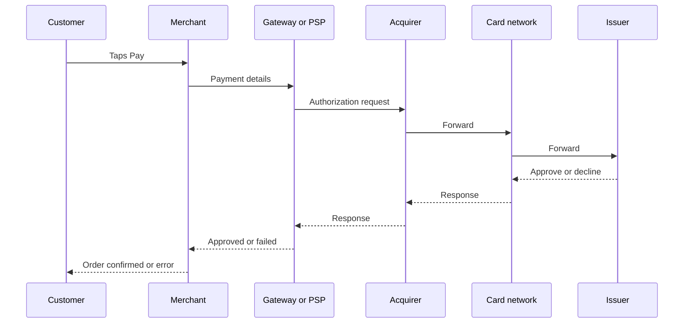
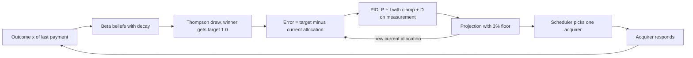
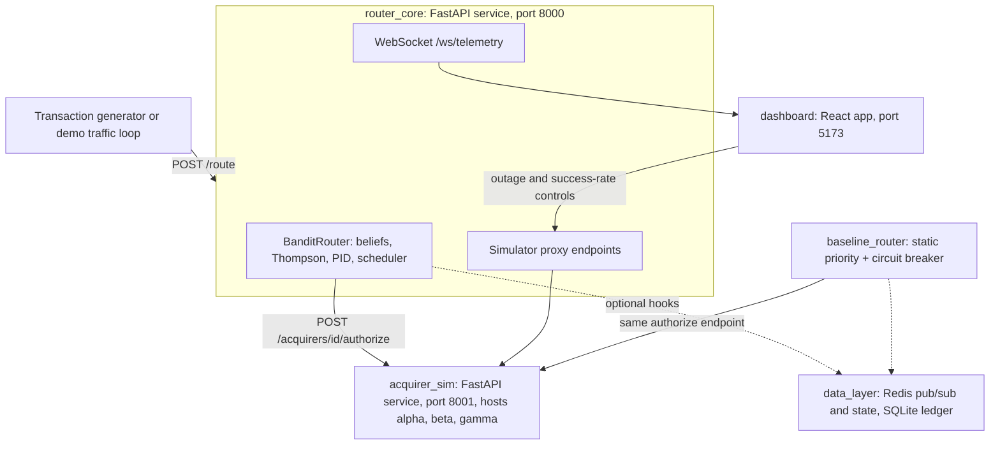
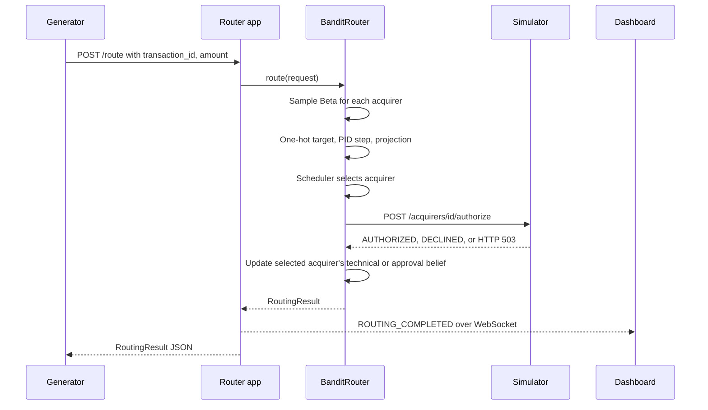

# Loom, From Scratch: Learning and Steering Payment Traffic as a Control Problem

*A Layer 1 white paper: what Loom is, how it works, and why it was built this way.*

*Every worked example and benchmark figure in this paper is printed by `python scripts/whitepaper_examples.py`; the 100-seed table in Section 8.3 comes from `python scripts/compare_psr.py --n-seeds 100`. Where this paper and [`AUDIT.md`](AUDIT.md) discuss the same defect, the audit's finding ID (F-xx) is given.*

---

## 1. The seconds after someone taps "Pay"

Maya is buying a pair of running shoes online for 40 dollars. She types her card number, taps **Pay**, and a spinner turns for about a second. Then she sees either "Thank you for your order" or "Payment failed."

During that second, the question "may this card be charged 40 dollars?" passes through several companies to her bank and back, and her bank answers yes or no.

When the answer is no, we usually assume something is wrong with Maya: no money, an expired card, a typo. Often that is true. But sometimes the payment fails for a reason that has nothing to do with her. A company in the middle of the chain is having a bad minute: a slow link, an overloaded computer. Her bank would have said yes, but the question never arrived, or the answer never came back.

The shop often has a choice about which path the question takes. If one path is having a bad minute and another is healthy, choosing the healthy one turns a failure into a sale, and Maya never knows anything went wrong.

Loom is a software project about making that choice well. If you must pick a path for every payment, and the paths change health without warning, how do you learn which path is best right now, and how do you move traffic toward it without causing new problems?

This paper builds the answer from scratch: first how card payments travel, then a way of *learning* under uncertainty (probability) and a way of *steering* smoothly (control theory), then Loom's actual code, experiments and design choices. Early sections need only arithmetic.

---

## 2. How card payments really travel

### 2.1 The cast of characters

A card payment usually involves six kinds of participant:

- **Customer (cardholder):** Maya, the person paying.
- **Merchant:** the shop selling the shoes.
- **Payment gateway or payment service provider (PSP):** a company that takes payment details from the merchant's website and passes them on securely. A **gateway** is mainly the technical pipe; a **PSP** commonly bundles it with fraud checks, reporting and moving the money. The terms overlap a lot in practice.
- **Acquirer:** a bank or licensed processor that accepts card payments *on behalf of the merchant*.
- **Card network:** the scheme whose logo is on the card. It carries messages between acquirers and issuers and sets the rules.
- **Issuer:** Maya's bank, which *issued* her card. The issuer makes the final yes-or-no decision.

### 2.2 The authorization round trip

The question "may I charge this card?" is called an **authorization request**. It travels roughly like this:

*Notice that the gateway's only real choice in this picture is the arrow to the acquirer; everything after it is out of the gateway's hands.*

Authorization is only the first step. Later, often in batches at the end of the day, a separate process called **settlement** actually moves the money. Loom deals only with authorization, the real-time yes or no.

### 2.3 Why payments fail

Declines come in roughly three families:

1. **Customer-side declines.** The account lacks funds, the card has expired, or the details were typed wrong.
2. **Issuer declines.** The bank refuses for its own reasons, for example suspected fraud or a generic "do not honor" code.
3. **Technical declines.** Something in the middle breaks: a timeout, an overloaded processor, a dropped connection, an acquirer outage.

The first two families mostly do not depend on the path. The third often does: a technical failure at one acquirer may not happen at another. Routing can only fix this third family. Since PR #4, Loom books technical failures and issuer declines against separate beliefs (Section 5.6).

### 2.4 What "routing" means

Many merchants and PSPs hold connections to more than one acquirer, and **payment orchestrators** specialize in choosing among several PSPs or acquirers. **Routing** is choosing, for each payment, which connection carries the authorization request.

Real routing commonly weighs cost, approval rate, country, currency and contracts. Loom looks only at the **payment success rate (PSR)**: the fraction of payments authorized. Its product requirements document (the **PRD**) argues PSR carries the most economic weight, since 1% of failed payments is 1% of lost sales.

### 2.5 How routing is traditionally done

Traditional routers are built from fixed rules:

- **Static rules:** "Cards from country X go to acquirer A."
- **Priority lists:** "Try A first; if A is unavailable, use B."
- **Failover:** switching to a backup when the primary is judged unhealthy.
- **Circuit breakers:** a rule borrowed from electrical engineering. After a set number of consecutive failures (call it $M$), the route is "tripped" and gets no traffic. After a waiting period called a **cooldown**, a single test payment called a **canary probe** is sent to see whether the route has recovered.

These rules are easy to audit, but they have three weak spots that Loom's documents are organized around:

- **They cannot tell a blip from an outage.** Three failures in a row might mean the acquirer is down, or three customers with empty accounts. A small $M$ trips on bad luck; a large $M$ reacts slowly.
- **They switch all-or-nothing.** When the breaker trips, 100% of traffic jumps to the backup at once. Loom's documents call this **herd migration**: a backup sized for a trickle receives the flood.
- **They miss partial failures.** An acquirer that degrades from 95% to 60% success (a **gray failure**, or brownout) may never fail enough times in a row to trip.

### 2.6 A running analogy: the dispatcher and the bridges

A dispatcher at a depot must send each delivery van across one of several bridges to a town on the far side. The **vans** are payments, the **bridges** are acquirers, the **town** is the world of issuers, and the **dispatcher** is the router.

Some parcels are refused in town because nobody is home: a customer or issuer decline, unrelated to the bridge. Sometimes a bridge closes without warning, and every van sent over it comes back undelivered: a technical outage. There is no status board. The only way to learn how a bridge is doing is to send vans and watch what comes back. Where this picture stops matching Loom, we will say so.

> **But why?** *Why not retry a failed payment on another acquirer?* Many real systems do, but Loom sends each transaction to exactly one acquirer. Its decision log says a retry would hide the first route's failure from the learner. In the analogy, an undelivered van is not sent out again.

**Code pointer:** `baseline_router/router.py`, `baseline_router/models.py` (the circuit-breaker router Loom compares against).

---

## 3. What Loom is, and the exact problem it targets

Loom is a self-contained research and demonstration project, not a payments product. The PRD says the point is to "prove the *control loop* works". It never touches a real acquirer or real money; every acquirer is a simulated service whose success rate and outages the experimenter controls.

The target problem in one sentence: **for each payment, choose one of several acquirers so the success rate stays high while acquirer health changes without warning, and shift traffic gradually rather than in all-or-nothing jumps.**

Loom answers the two halves with two branches of mathematics:

1. **Learning which acquirer is healthiest now** uses **Thompson Sampling**, from the family of *multi-armed bandit* problems, with beliefs that fade over time.
2. **Moving traffic smoothly** uses a **PID controller**, a classic feedback controller from control engineering, plus a minimum traffic share for every acquirer and a scheduler that turns shares into individual decisions.

Around that core sit a simulator, a rule-based baseline router, a data layer (Redis, an in-memory data store, and SQLite, a single-file database) and a live dashboard, built in eight documented phases recorded in a **decision log** (`docs/decisions-log.md`).

> **But why?** *Why a simulation instead of real acquirers?* The decision log says a real test environment cannot produce an outage on command, and the whole point is to watch the loop react to one. The cost is that every result describes the simulator, not the real world.

**Code pointer:** `docs/prd.md`, `router_core/router.py`.

---

## 4. Learning which bridge is best

### 4.1 The explore/exploit dilemma

Bridge A has delivered 9 of its last 10 vans; bridge B, 3 of 4. A says 90%, B says 75%, so A? But B has only 4 trips on record. Its true rate could be 95%. If we always pick whatever looks best *today*, we may never learn otherwise. The tension has a name:

- **Exploitation:** use the option that currently looks best.
- **Exploration:** try an uncertain option, to learn more.

Pure exploitation can lock onto a mediocre choice forever; pure exploration wastes vans on known-bad bridges. Good strategies mix the two.

### 4.2 Multi-armed bandits

This is the **multi-armed bandit** problem, named after slot machines ("one-armed bandits"). Each machine, or **arm**, has an unknown payout rate; you pull one at a time and see only that result. In Loom, each acquirer is an arm and each payment is a pull. This **partial feedback** is crucial: a van over bridge A teaches nothing about bridge B.

### 4.3 Describing "how sure we are": the Beta distribution

We need more than one number per bridge; we need to know how *sure* we are. Keep two tallies: $\alpha$ (alpha) counts successes plus one, and $\beta$ (beta) counts failures plus one. Both start at 1, meaning "no evidence yet". After 9 successes and 1 failure, bridge A has $\alpha = 10$, $\beta = 2$.

These tallies define a curve, the **Beta distribution** $\text{Beta}(\alpha, \beta)$. Its horizontal axis covers every possible true success rate from 0 to 1, and its height says how plausible each rate is given the evidence. Two facts about it are all we need:

$$
\text{mean} = \frac{\alpha}{\alpha + \beta}, \qquad \text{variance} = \frac{\alpha\beta}{(\alpha+\beta)^2(\alpha+\beta+1)}
$$

In plain English: the **mean** is our best guess (roughly successes divided by trips), and the **variance** measures how spread out, or uncertain, the belief is; it shrinks as trips accumulate. Bridge A's $\text{Beta}(10, 2)$ has mean $10/12 \approx 0.83$ and is fairly narrow. Bridge B's $\text{Beta}(4, 2)$ has mean $4/6 \approx 0.67$ and is much wider: B is *probably* worse, but we are far less sure.

The starting belief $\text{Beta}(1, 1)$, a flat line, is called the **prior**; the updated belief is the **posterior**. Adding 1 to $\alpha$ per success and 1 to $\beta$ per failure is the exact update for a yes/no process, which is why Beta curves are the standard tool here.

> **But why?** *Why start the tallies at 1 instead of 0?* $\text{Beta}(1,1)$ is flat, honestly saying "anything is possible"; zeros would break the math. Loom requires positive priors (`router_core/state.py:71-74`) and defaults both to 1.

### 4.4 Thompson Sampling: let the uncertainty do the exploring

**Thompson Sampling**, proposed in 1933, is simple. For each payment: draw one random number from each arm's Beta curve (a *plausible* success rate), pick the arm with the highest draw, then update that arm's tallies with the outcome.

Exploration happens by itself. A narrow, confident curve almost always draws near its mean. A wide, uncertain curve sometimes draws high by chance, and then that arm gets a turn and we learn more. As evidence grows, curves narrow and lucky draws from bad arms become rare.

**A worked example.** Let acquirer A be $\text{Beta}(20, 2)$ (mean about 0.91) and B be $\text{Beta}(3, 2)$ (mean 0.60, very uncertain). Five draws with a fixed random **seed** (a starting value that makes the random numbers repeatable), using the Beta sampler from NumPy (Python's numerical library) that Loom calls (`router_core/state.py:318`):

| Draw | A ~ Beta(20,2) | B ~ Beta(3,2) | Winner |
|---|---|---|---|
| 1 | 0.936 | 0.367 | A |
| 2 | 0.910 | 0.875 | A |
| 3 | 0.881 | 0.779 | A |
| 4 | 0.925 | 0.335 | A |
| 5 | 0.983 | 0.587 | A |

B came close on draw 2. Over 100,000 pairs, B won about 5.6% of the time, roughly one payment in eighteen. The amount of exploration is set by the uncertainty itself, not by a hand-picked percentage.

> ⚠️ **Doc/code mismatch (M-1):** `docs/CONSTITUTION.md` pins `scipy.stats.beta` as the Thompson Sampling library vs the code, which draws samples with NumPy's `Generator.beta` (`router_core/state.py:318`).

> **But why?** *Why not something simpler, like "explore 10% of the time"?* That rule, epsilon-greedy, is rejected in the decision log because a fixed rate "can't adapt exploration to actual confidence". UCB, which adds an optimism bonus to uncertain arms, was set aside because its output "composes less cleanly" with the smoothing layer.

**Code pointer:** `router_core/state.py` (`AcquirerState.sample`), `router_core/bandit.py` (`BanditStateRegistry.sample_all`), `router_core/router.py:204-231`.

---

## 5. A world that changes: why old evidence must fade

### 5.1 The problem with perfect memory

Classic Thompson Sampling assumes each arm's success rate never changes. Acquirers can run at 95% for an hour, drop to 0% in an outage, then recover; such a drifting world is called **non-stationary**. With perfect memory, an acquirer with 10,000 past successes would need thousands of failures before its mean dropped noticeably. The fix is to let old evidence fade, like tallies written in ink that fades as the clock ticks.

### 5.2 Loom's update rule

Loom fades evidence on the clock. Let $h$ be the **half-life** in seconds: the time after which an observation counts half as much (default 2.3 s, set by `DECAY_HALF_LIFE_SEC` or `--half-life-sec` on the router server). Let $x$ be a payment's outcome: 1 for success, 0 for failure. Let $\alpha_0$ and $\beta_0$ be the priors (by default $\alpha_0 = 4$, $\beta_0 = 1$ for the technical belief and 1 and 1 for the approval belief; Section 5.6). When $\Delta t$ seconds have passed since an acquirer's tallies were last faded, Loom shrinks the evidence above the prior by

$$
f = 0.5^{\Delta t / h}
$$

and, if an outcome has just arrived, adds it:

$$
\alpha_t = \max\!\big(\alpha_0,\; \alpha_0 + f(\alpha_{t-1} - \alpha_0) + x\big)
$$
$$
\beta_t = \max\!\big(\beta_0,\; \beta_0 + f(\beta_{t-1} - \beta_0) + (1 - x)\big)
$$

In plain English: take the evidence *above* the prior, shrink it by how much time has passed, and add the new outcome. The prior never fades, so $\alpha$ and $\beta$ never drop below their starting values; the `max` only guards against rounding. The decision log calls this the "mean-reverting offset" form.

Fading happens when an outcome is recorded and again just before every Thompson draw, using the router's clock (`router_core/state.py`, `decay_beliefs` and `step_beliefs`; `router_core/router.py`, `clock`). So an acquirer that receives no traffic still drifts back toward its prior.

**Per-observation mode.** Before this change Loom used a different rule, still available by setting `decay_factor` (`--decay-factor` on the server): replace $f$ with a fixed $\gamma$ just below 1, applied each time *that acquirer* records an outcome, however much time has passed. It is easy to check by hand. Starting from $\text{Beta}(1,1)$ with $\gamma = 0.98$, the outcomes success, success, success, failure, success produced (real output):

| After | $\alpha$ | $\beta$ | Mean |
|---|---|---|---|
| S | 2.0000 | 1.0000 | 0.667 |
| S | 2.9800 | 1.0000 | 0.749 |
| S | 3.9404 | 1.0000 | 0.798 |
| F | 3.8816 | 2.0000 | 0.660 |
| S | 4.8240 | 1.9800 | 0.709 |

Check the second row: $1 + 0.98 \times (2 - 1) + 1 = 2.98$. On the failure row, $\alpha$ shrinks slightly ($1 + 0.98 \times 2.9404 = 3.8816$) while $\beta$ gains a full point.

### 5.3 What the half-life controls

- **Memory in seconds is fixed.** An outcome's weight halves every $h$ seconds, whatever the traffic.
- **Memory in observations follows traffic.** An acquirer receiving $r$ payments per second holds about $r h / \ln 2$ observations' worth of evidence. At 15 payments per second with $h = 2.3$ s that is 49.8 for an acquirer carrying all the traffic, 48.3 for one at 97%, and 1.5 for one held at the 3% floor.
- **Maximum confidence.** After endless successes, $\alpha$ settles near $\alpha_0 + r h / \ln 2$: about 54 for the busiest acquirer above. The belief can never become infinitely certain.

The default 2.3 s was chosen to match the old $\gamma = 0.98$ for an acquirer carrying all of 15 payments per second ($\gamma = 0.98$ halves an outcome's weight after 34 observations; 34 ÷ 15 ≈ 2.3 s). The difference is at the edges. Under $\gamma = 0.98$ an acquirer at the 3% floor turned over its 50-observation memory in about 111 seconds, and an idle one never did.

**Outage example (real output).** At 15 payments per second with $h = 2.3$ s and the default prior, after 200 straight successes an acquirer sits at $\text{Beta}(53.4, 1.0)$, mean 0.982. As failures arrive, the mean falls to 0.963 after 1, 0.928 after 3, 0.893 after 5 and 0.814 after 10. Per-observation $\gamma = 0.98$ from a $\text{Beta}(1,1)$ prior gave 0.802 after 10. With $\gamma = 0.95$ (13.5 observations), the mean starts at 0.955 and falls to 0.909, 0.825, 0.749 and 0.590. The benchmark in Section 8 uses $h = 0.9$ s, which matches $\gamma = 0.95$ at 15 payments per second. A shorter half-life reacts faster but also trusts a short streak of bad luck more.

**Idle acquirer (real output).** After 20 failures with no traffic since, an acquirer is at $\text{Beta}(4, 21)$, mean 0.160. 2.3 s later it is at $\text{Beta}(4, 11)$, mean 0.267; 10 s later $\text{Beta}(4, 1.98)$, mean 0.669; 30 s later it is back to its prior $\text{Beta}(4, 1)$, mean 0.800.

> ⚠️ **Doc/code mismatch (M-2, fixed):** The README's "How It Works" diagram and the dashboard footer described decay as $\gamma = 0.98$ and "weighted toward the last minute", while the code decayed per outcome with no time component and the headline benchmark used $\gamma = 0.95$. PR #1 corrected the README and PR #2 the dashboard footer; PR #3 replaced per-observation decay with the wall-clock rule above (AUDIT F-23).

### 5.4 A second, simpler signal: the health score

Alongside $\alpha$ and $\beta$, each acquirer keeps a **health score** $H$, a recent success fraction for people to read. With wall-clock decay it is the faded successes over the faded total, with the starting health $H_0$ (default 1.0) counted as one extra observation:

$$
H = \frac{(\alpha - \alpha_0) + H_0}{(\alpha - \alpha_0) + (\beta - \beta_0) + 1}
$$

So a fresh acquirer reads 1.0, and three failures in a row take it to 0.25. In per-observation mode $H$ is instead an *exponentially weighted moving average*, $H_t = \gamma H_{t-1} + (1 - \gamma)\,x$, where one failure takes it from 1.0 to 0.98. The decision log keeps it separate from the Beta belief: the belief carries *uncertainty* for exploration, while $H$ is a number for people to read. In the code, $H$ is computed, logged and displayed, but **it does not feed into routing decisions**.

### 5.5 Idle acquirers fade too

Under per-observation decay, an acquirer's tallies changed only when a payment was sent to it. An acquirer with no traffic was frozen: its last, possibly terrible, belief never faded, so it was never picked, so it never updated. Phase 3 testing found exactly this: after an outage ended, the recovered acquirer received 0 of the next 50 payments. The project calls this **route starvation**, and fixed it with the traffic floor in Section 6.4.

With wall-clock decay, a dead acquirer's belief returns to its prior within about ten half-lives, after which Thompson draws pick it again on their own. In the benchmark's seed-42 run, alpha's smoothed share was back to 0.14 by payment 150 after the outage ended; under per-observation decay it stayed at the 0.03 floor (Section 8.2).

> **But why?** *Why did the project first choose per-observation decay?* The decision log rejected a "background ticker" in favour of "fully deterministic, reproducible test vectors" without clock mocking. Loom keeps that property another way. Decay is applied lazily, only when a belief is read or updated, and the router takes its time from an injectable clock. Tests and the benchmark pass a virtual clock (the benchmark's advances 1/15 s per payment), so results do not depend on how fast the machine runs.

### 5.6 Two questions per payment: did the acquirer work, and did the issuer say yes?

Section 2.3 split failures into families. Until PR #4, Loom counted every "no" against the acquirer that carried it, including a cardholder's bank declining with `DO_NOT_HONOR` (AUDIT F-02). A burst of such declines says nothing about the acquirer, yet it could push traffic away from a healthy one, and issuer noise blurred real technical differences.

Each acquirer now keeps two Beta beliefs, both with the update rule of Section 5.2:

- **Technical belief** ($\alpha$, $\beta$): did the acquirer process the payment? Approvals and issuer declines count as successes. Failures are HTTP errors, timeouts, connection and protocol errors, replies the router cannot read, and declines whose code means the acquirer itself failed (`ACQUIRER_OUTAGE` by default; `RouterConfig.technical_decline_codes`). Half-life 2.3 s (0.9 s in the benchmark); prior $\text{Beta}(4, 1)$.
- **Approval belief**: given that the acquirer answered, did the issuer approve? Half-life 60 s (`approval_half_life_sec`); prior $\text{Beta}(1, 1)$. Technical failures do not touch it.

Thompson Sampling draws once from each belief and multiplies the two: the product is one plausible value for "the chance a payment sent here succeeds". The value-scaled policy uses the product of the two means.

**Worked example (real output).** After 300 approvals at 15 payments per second, ten issuer declines leave the technical mean at 0.982, the approval mean at 0.961 and the expected success rate at 0.943. Ten technical failures instead drop the technical mean to 0.816 (approval 0.996, expected success rate 0.813).

**Why a $\text{Beta}(4, 1)$ technical prior?** With a 0.9 s half-life, an acquirer held at the 3% floor keeps less than one observation of technical evidence, so its technical belief is mostly prior. With $\text{Beta}(1, 1)$ (mean 0.5), a recovered acquirer looked half-broken and stayed near the floor. `python scripts/compare_psr.py --n-seeds 100 --alpha-prior N` gives, for Loom with PID:

| Technical prior | Hard-outage PSR | Recovery payments to alpha | Gray-failure PSR |
|---|---|---|---|
| $\text{Beta}(1, 1)$ | 89.13% | 2.94 | 89.85% |
| $\text{Beta}(2, 1)$ | 89.35% | 3.94 | 90.19% |
| $\text{Beta}(4, 1)$ | 89.19% | 5.79 | 90.33% |
| $\text{Beta}(9, 1)$ | 88.59% | 8.22 | 90.56% |

The project chose $\text{Beta}(4, 1)$: an acquirer about which nothing is known is assumed up about 80% of the time. It gives more recovery traffic than the weaker priors, at a hard-outage cost within seed-to-seed noise.

**What the split costs.** In this simulator a gray failure is made of extra `DO_NOT_HONOR` declines, so Loom now learns it through the slower approval belief. Its advantage over the $M=3$ breaker on the gray failure fell from +2.77 to +1.97 points (Section 8.3). In real systems a brownout often shows up as timeouts and 5xx errors, which the technical belief catches quickly. The static baseline still counts issuer declines as failures, as before.

**What it gains.** Issuer-decline bursts no longer move traffic, and Loom can learn approval-rate differences over a longer memory (`scripts/steady_state_share.py`).

**Code pointer:** `router_core/state.py` (`AcquirerStateConfig`, `Outcome`, `decay_beliefs`, `step_beliefs`, `step_approval`), `router_core/bandit.py` (`sample_all`), `router_core/router.py` (`clock`, outcome classification), `data_layer/redis_state.py` (same rules for Redis-backed state).

---

## 6. The control problem: steering traffic without stampedes

### 6.1 Why a pure bandit lurches

Phase 3 of Loom sent each payment to whichever acquirer drew the highest number, the **argmax** rule. When two acquirers have overlapping beliefs, their draws trade places often and traffic **flaps** back and forth. As "share of traffic to A", the signal is a **square wave**: 100%, 0%, 100%. In the reproduced Phase 3 scenario the raw bandit changed routes 12 times during a 50-payment outage, each a full jump (Section 8).

The dispatcher shouts "everyone to bridge B!", then "everyone back to A!" Real backups are commonly sized for their usual share, not a sudden flood; the README calls this a "thundering herd". The simulator does not model it (Section 10). So Loom makes the bandit's choice a **target**, and a separate controller moves the actual share toward it gradually.

### 6.2 PID control from everyday intuition

You run a controller whenever you adjust a shower's temperature. A **PID controller** formalizes that habit with three terms: proportional, integral, derivative. Vocabulary first:

- The **setpoint** is where you want to be (the target).
- The **process variable** is where you are.
- The **error** $e$ is the gap: setpoint minus where you are.

**P, proportional: react to how far off you are.** Much too cold, turn the knob a lot; slightly cold, a little. The correction is $K_p \cdot e$, where the **gain** $K_p$ is a tuning number. Large $K_p$ is fast but can overshoot; small $K_p$ is gentle but slow.

**I, integral: react to how long you have been off.** If the water stays slightly cold, P alone may never fix it. The integral adds up error over time: $K_i \cdot \sum e$.

**D, derivative: react to how fast things are changing.** If the temperature is already rising quickly, ease off. D acts as a brake.

**Windup.** If the target is unreachable for a long time, the integral's running sum grows huge, and when conditions change it keeps pushing the old way until it drains. This is **integral windup**; the cure, **anti-windup**, caps the sum between $-I_{\max}$ and $+I_{\max}$.

### 6.3 How Loom applies PID

Loom steers the **allocation vector** $w$: each acquirer's share of traffic, such as 72% to A and 28% to B. Shares are non-negative and sum to 1.

On every payment, Loom does the following (`router_core/router.py:228-245`, `router_core/pid.py:197-336`):

1. **Target.** Draw Thompson samples and find the winner. The target $w^{*}$ puts 1.0 on the winner and 0.0 on everyone else, a **one-hot** vector (`router.py:230-231`). The bandit's square wave is still there; it has simply moved upstream, into the target.
2. **Error, centered.** For each acquirer $i$, $e_i = (w^{*}_i - w_i) - \frac{1}{k}\sum_j (w^{*}_j - w_j)$, where $k$ is the number of acquirers. The subtraction keeps errors summing to zero, so one acquirer's gain is exactly another's loss. When both vectors already sum to 1, that mean is zero, so this step is a safeguard.
3. **Integral with clamp.** $I_i \leftarrow \text{clamp}(\gamma_I I_i + e_i \Delta t,\, -I_{\max},\, +I_{\max})$, then re-centered to sum to zero. Here $\gamma_I$ is an optional "leak" factor (default 1.0, meaning no leak), and $\Delta t$ is the time step.
4. **Derivative on measurement.** Instead of the rate of change of the error, Loom uses the rate of change of the allocation itself: $d_i = -(w_i - w_i^{\text{prev}})/\Delta t$, where $w_i^{\text{prev}}$ is the allocation one step earlier. An optional **low-pass filter** (a smoother that damps rapid wiggles) is available but off by default.
5. **Combine and move.** The correction is $u_i = K_p e_i + K_i I_i + K_d d_i$, and the proposed allocation is $\hat{w}_i = w_i + u_i$.
6. **Project.** Clean up $\hat{w}$ so the shares are valid and respect a minimum floor (Section 6.4).

The tuned defaults are $K_p = 0.12$, $K_i = 0.005$, $K_d = 0.25$, $I_{\max} = 1.0$, $w_{\min} = 0.03$ (`router_core/pid.py:17-65`). Note that $\Delta t$ is fixed at 1.0 *per payment* (`router.py:239`): the controller runs on transaction count, not clock time, so it steps faster when traffic is heavier.

**What the controller measures.** The setpoint is a one-hot vector on this payment's Thompson winner, and the "measurement" is the allocation $w$ the controller itself produced on the previous step. The traffic actually dispatched and the acquirers' answers never enter the controller; they reach it only through the Beta beliefs that pick the next winner. Fed a stream of winners, the output settles at each acquirer's win frequency. In effect the PID is a smoother (a low-pass filter) on the bandit's choices, not a control loop around measured traffic or outcomes (AUDIT F-08). The benefit it is meant to bring, sparing a backup from a sudden flood, would need capacity limits that the simulator does not model; its measured cost is 1.71 points of PSR against the raw bandit over 100 paired seeds (Section 8.3).

**Worked example (real output).** Two acquirers start at an even split, and the target is "all to A" for five payments in a row:

| Step | $e_A$ | P | I | D | New $w_A$ |
|---|---|---|---|---|---|
| 1 | +0.5000 | +0.0600 | +0.0025 | 0.0000 | 0.5625 |
| 2 | +0.4375 | +0.0525 | +0.0047 | −0.0156 | 0.6041 |
| 3 | +0.3959 | +0.0475 | +0.0050 | −0.0104 | 0.6462 |
| 4 | +0.3538 | +0.0425 | +0.0050 | −0.0105 | 0.6831 |
| 5 | +0.3169 | +0.0380 | +0.0050 | −0.0092 | 0.7169 |

Read step 2. The error is $1 - 0.5625 = 0.4375$, so P $= 0.12 \times 0.4375 = 0.0525$. The allocation moved up by $0.0625$ on the previous step, so D $= 0.25 \times (-0.0625) \approx -0.0156$, a brake. By step 3 the summed error ($0.5 + 0.4375 + 0.3959$) exceeds 1.0, so the clamp holds the integral at 1.0 and I stops growing at $0.005$. Instead of jumping from 50% to 100%, A's share eases up by about 4 points per payment.

> **But why?** *Why take the derivative of the allocation rather than of the error?* Loom's target jumps between 0 and 1 whenever the Thompson winner changes. The error jumps with it, and its rate of change spikes, which control engineers call **derivative kick**. Differentiating the allocation instead, which only moves smoothly, gives what the decision log calls "true velocity damping" without the kick.

> ⚠️ **Doc/code mismatch (M-3):** The Phase 3 Tech Lead review in `docs/decisions-log.md` requires that PID error "be derived from the smoothed EWMA health signal ($H_i$) or posterior means" vs the code, which sets the target to a one-hot vector on the Thompson-sample winner and computes error against current allocation (`router_core/router.py:230-240`, `router_core/pid.py:263-265`).

> **But why?** *Why is the integral clamped at all?* The Phase 4 QA report describes a 200-payment outage where an unclamped integrator drifted to about −8.99 and then delayed recovery by 5 to 6 payments. The 3% floor, described next, also creates a permanent small error that would otherwise accumulate without limit. (These figures are as reported in the repository's docs, not independently reproduced here.)

### 6.4 The floor: projection onto the probability simplex

The set of valid allocation vectors (non-negative, summing to 1) is the **probability simplex**. After the PID step, $\hat{w}$ may leave it: a share can go negative or the total can drift. `project_to_bounded_simplex` (`router_core/pid.py:135-194`) pulls it back and guarantees every acquirer at least $w_{\min}$ (3%):

1. Raise any share below the floor up to the floor.
2. If the total is now above 1, remove the excess from the shares above the floor, in proportion to how far above the floor each one is.
3. If the total is below 1, add the shortfall to every share in proportion to its size.
4. Divide by the total, to wipe out rounding.

Despite the name, this is a clamp-and-rescale procedure, not the textbook closest-point (Euclidean) projection.

**Examples (real output).** $(1.05, -0.05)$ becomes $(0.97, 0.03)$. $(0.98, 0.00, 0.10)$ becomes $(0.878, 0.030, 0.092)$. $(0.5, 0.3)$, which sums to 0.8, becomes $(0.625, 0.375)$.

The floor is Loom's fix for starvation: even a seemingly dead acquirer keeps 3% of traffic, so if it recovers, its belief updates. The dispatcher keeps sending about one van in thirty over the closed bridge, just to check. The decision log names the cost: during a long outage, 3% of payments keep going to a failing route.

> **But why?** *Why not put the floor inside the bandit, by forcing occasional random picks?* The decision log rejected "ad-hoc epsilon-greedy probing outside PID" and enforces the floor "directly at the actuator boundary", so every share the system acts on respects it.

### 6.5 From shares to single payments: the scheduler

"72% to A" is not a decision; each payment goes to exactly one acquirer. Loom has two **actuation modes** (`router.py:247-262`):

- **Stochastic** (default): roll a weighted die; A wins each roll with probability $w_A$.
- **Deficit** (Bresenham pacing, after a line-drawing algorithm): keep a running "owed" total $c_i$, add $w_i$ each payment, and pick the acquirer furthest behind ($c_i - n_i$, with $n_i$ payments already sent). Ties go to the ID that sorts last.

**Example (real output).** With shares $(0.7, 0.3)$, ten payments go A, B, A, A, B, A, A, A, B, A: exactly 7 and 3. Eight runs of ten weighted die rolls instead gave A 5, 7, 9, 9, 6, 8, 9 and 6. Deficit pacing removes that noise, which matters in short experiments.

> ⚠️ **Doc/code mismatch (M-4, fixed in README by PR #1):** `README.md` stated that "Actuation executes via deterministic deficit round-robin (Bresenham pacing)" vs the default `actuation_mode="stochastic"` (`router_core/pid.py:67-68`). The server entrypoints build `PIDConfig` without setting a mode (`router_core/server.py:137-142`, `router_core/app.py:60`), so the live service draws stochastically. The benchmark scripts set `"deficit"` explicitly (`scripts/compare_psr.py:154`).

### 6.6 The whole loop

*Notice the two loops: outcomes reshape beliefs, and the smoothed allocation becomes the next step's starting point. The second loop feeds back the controller's own output, not a measurement of the traffic sent or its outcomes.*

> **But why?** *Doesn't a smoother react more slowly to a real outage?* Yes, and the project documents it as a trade-off. In the reproduced benchmark, the smoothed router sent 11 payments to the dead acquirer during the outage, against 7 for the raw bandit and 4 for the standard circuit breaker (Section 8).

**Code pointer:** `router_core/pid.py` (`calculate_pid_step`, `project_to_bounded_simplex`), `router_core/router.py` (`route`).

---

## 7. Loom's architecture, end to end

### 7.1 The components

*Notice the dotted lines: the data layer hangs off optional hooks, and in the default live service those hooks are not connected.*

**The simulator (`acquirer_sim/`).** One FastAPI service (FastAPI is a Python framework for services that speak **HTTP**, the request-and-response protocol of the web) hosts three simulated acquirers, alpha, beta and gamma, at 95% success on port 8001. Each authorization waits about 20 ms of **latency** (delay), give or take 5 ms of random **jitter**, then approves if a random draw $u$ is below the success rate; otherwise it declines with `DO_NOT_HONOR`, standing in for an ordinary customer or issuer decline. **Fault injection** (deliberately causing failures) uses admin **endpoints**, web addresses the service answers, that set the success rate or toggle an outage with one of three behaviors: `RETURN_DECLINE` (default, a normal "declined, `ACQUIRER_OUTAGE`" reply), `HTTP_503` (a "service unavailable" error), or `LATENCY_SPIKE` (2.5 s extra delay, then the outage decline). Admin calls on an unknown acquirer ID return 404; they used to create the acquirer silently, so a typo'd outage toggle did nothing visible. Outages are instant switches; gradual transitions are rejected (`acquirer_sim/simulator.py:103-106`), and gray failures are made by lowering the success rate. The spike was 500 ms until PR #4, under the router's 2-second timeout (`router_core/models.py:37-38`), so `LATENCY_SPIKE` ended in the same decline as `RETURN_DECLINE` (AUDIT F-26); at 2.5 s the router now times out. Loom books a `DO_NOT_HONOR` decline against the approval belief only (`router_core/router.py:329-337`, Section 5.6). The baseline still scores it as a failure of the acquirer that carried it (`baseline_router/router.py:282`), so its health signal mixes all three families of Section 2.3 (AUDIT F-02).

> ⚠️ **Doc/code mismatch (M-5, README fixed by PR #1):** `docs/decisions-log.md` (Phase 2), and `README.md` before PR #1, describe "independent processes on separate ports" providing "real OS-level failure isolation" vs the default topology, in which one process hosts all simulated acquirers (`acquirer_sim/app.py:45-51`) and the router's default routes all point at port 8001 (`router_core/app.py:43-56`, `router_core/server.py:42-46`).

**The router service (`router_core/`).** `BanditRouter` keeps beliefs and PID state in memory. Its FastAPI app exposes `/route`, `/health`, `/state`, proxy endpoints for the dashboard's outage buttons, and a **WebSocket**, a connection that stays open so the server can push messages to the browser. PID is on by default (`--no-pid` disables it). Failures in the optional Redis publisher and SQLite logger are caught and logged (`router.py:450-464`). Since PR #4 two more paths are protected. `/route` only queues the dashboard event: each WebSocket client has its own bounded queue and sender task, and a client that falls behind loses its oldest events, counted on `/health` (`router_core/telemetry.py`; before, one stalled browser could stall routing, AUDIT F-05). And a failure in the belief update after the acquirer has answered no longer reaches the caller: the result keeps the acquirer's answer and notes "state update failed" (`router.py:387-407`; before, an authorized payment could come back as an HTTP 500, AUDIT F-07). Each acquirer also gets its own HTTP connection pool, so one slow acquirer cannot use up the connections to the others (AUDIT F-16).

> **But why?** *Why does the dashboard connect to the router directly instead of only to Redis?* The decision log chose a FastAPI-native WebSocket gateway to avoid running an extra proxy process. In the default service, each routing result is pushed straight to connected browsers; a Redis forwarder task also starts, but it only relays events that some other component publishes to Redis (`router_core/app.py:118-133`).

**The baseline router (`baseline_router/`).** A separate module implementing Section 2.5: a priority list, a trip after $M$ consecutive failures (default 3), a cooldown of $N = 30$ payments, then one canary probe. If every route is tripped it falls back to the first priority. It also offers "snapback" (no probe) and a sliding-window trigger, and writes the same result format as Loom.

**The data layer (`data_layer/`).** *Redis*, an in-memory data store, can hold beliefs (`RedisBanditStateRegistry`, same update rule, optimistic locking that retries if keys changed underneath it, `data_layer/redis_state.py:289-386`) and broadcast events via **pub/sub** (publish/subscribe), a fire-and-forget channel. *SQLite* holds an append-only **ledger**: the `transactions` and `acquirer_outcomes` tables; database **triggers** abort any `UPDATE` or `DELETE` (`data_layer/schema.sql:80-102`). An asynchronous logger batches up to 20 rows or 50 ms. The demo reset drops and recreates the tables, which triggers do not block (`data_layer/cli.py:524-525`). The triggers stop accidental edits, not deliberate ones: `INSERT OR REPLACE` rewrites a row without firing them, `DROP TRIGGER` removes them, and the database file itself can be replaced (AUDIT F-11). At the audited commit the asynchronous logger could also lose its in-hand batch on shutdown, and one duplicate transaction ID rolled back a whole batch (AUDIT F-12). Since PR #4, shutdown waits for the batch in hand, a failed batch is retried row by row, and records lost to a full queue or a rejected insert are counted (`dropped_count`, `failed_count`). PSR is authorized rows divided by total rows.

> ⚠️ **Doc/code mismatch (M-6, README fixed by PR #1):** `docs/decisions-log.md` (Phase 5), and `README.md` before PR #1, describe "embedded Redis Lua scripts" for atomic belief updates vs optimistic `WATCH`/`MULTI` transactions with a retry loop in Python (`data_layer/redis_state.py:289-386`); no Lua script exists in the repository.

> ⚠️ **Doc/code mismatch (M-7, README fixed by PR #1):** `docs/prd.md`, and `README.md` before PR #1, say Redis holds live health state and that in standalone mode "SQLite logs all transactions locally" vs the service entrypoints, which construct `BanditRouter` with no registry, publisher or logger (`router_core/app.py:57-62`, `router_core/server.py:144`, `router_core/app.py:40`). The live service therefore keeps beliefs in process memory (`router_core/router.py:54`) and writes no SQLite rows. The hooks are exercised by tests and scripts.

**The dashboard (`dashboard/`).** A React app (React is a JavaScript library for web interfaces) listening on `ws://127.0.0.1:8000/ws/telemetry` draws the live allocation chart (last 120 points) over a dashed curve from a stored 150-payment baseline run, plus a rolling 50-payment PSR and per-acquirer outage buttons. On connect, the server sends a `BOOTSTRAP` message with current belief snapshots.

> ⚠️ **Doc/code mismatch (M-8, fixed in README by PR #1):** `README.md` described a "ring buffer ($N=200$) with `requestAnimationFrame` 60 FPS rendering" and a "cold-start bootstrap" that "loads recent historical transactions from SQLite" vs a React state update per message capped at 120 points (`dashboard/src/hooks/useLoomTelemetry.js:190`), no `requestAnimationFrame` anywhere in `dashboard/src`, and a bootstrap containing only in-memory belief snapshots (`router_core/app.py:259-280`).

> ⚠️ **Doc/code mismatch (M-9, removed by PR #2):** `docs/decisions-log.md` (Phase 7 Revision 4) describes a headline "Lift-vs-Baseline" figure vs a value that was computed as the live rolling PSR minus a hard-coded 76.0, the global PSR of one recorded $M=1$ baseline run (AUDIT F-06). PR #2 replaced that readout with the count of transactions routed, and the dashboard's benchmark card now reads the multi-seed results of Section 8.3 from a JSON file that `scripts/compare_psr.py` writes.

**The value-scaled policy (`router_core/value_policy.py`, Phase 8).** An optional layer, off by default, that reduces exploration for large payments by pulling each sample toward its mean before the winner is chosen: $\tilde{\theta}_i = (1-\lambda)\theta_i + \lambda\hat{\mu}_i$, where $\theta_i$ is the raw draw, $\hat{\mu}_i = \alpha_i/(\alpha_i+\beta_i)$ the posterior mean, and $\lambda = 1 - e^{-V/\tau}$ for payment value $V$. With $\tau = 100$ currency units, $\lambda$ is 0.095 at 10, 0.632 at 100, 0.918 at 250 and almost 1 at 1,000, so large payments nearly always go to the best mean. Value never enters the Beta update.

> ⚠️ **Doc/code mismatch (M-10):** `docs/decisions-log.md` (Phase 8 Tech Lead review) says outage inertia lasts "until EWMA health decay drags $\hat{\mu}$ down" vs $\hat{\mu}$ being the product of the technical and approval posterior means (`router_core/router.py:215`, `router_core/state.py:204-206`); the health score is not used by the policy.

### 7.2 One payment, step by step

*Notice that the belief update happens after the acquirer replies, so the next payment's sample already reflects this outcome.*

An approval is a success for both beliefs. An issuer decline is a technical success and an approval failure. An HTTP 503 or other error status, a timeout, a connection or protocol error, an HTTP 422, or an HTTP 200 whose body the router cannot read is a technical failure, returned to the caller as `status="ERROR"` (`router.py:313-380`). Until PR #4 the 422 and unreadable-200 cases raised an exception and never penalized the acquirer (AUDIT F-07). The one exception is the router running out of its own connections (`httpx.PoolTimeout`): the request never reached the acquirer, so nothing is booked and `/health` counts it (AUDIT F-16). The result records raw samples, target, smoothed allocation, PID diagnostics, latencies and which belief the outcome was booked against.

**Code pointer:** `router_core/app.py`, `router_core/telemetry.py`, `acquirer_sim/simulator.py`, `baseline_router/router.py`, `data_layer/sqlite_logger.py`, `data_layer/redis_state.py`, `dashboard/src/hooks/useLoomTelemetry.js`.

---

## 8. Methodology and experiments

### 8.1 The "outage gauntlet" setup

The headline experiment is `scripts/compare_psr.py`; `scripts/run_qa_baseline_scenario.py` runs seven configurations. Both run in one process, with the router reaching the simulator through an **in-process transport**: HTTP calls handled inside the same program, with no real network and zero simulated latency.

- **Acquirers:** alpha at 95% success, beta at 94%; alpha is the baseline's first priority.
- **Script:** 150 payments of 50 units: warmup (1–50), total alpha outage via `RETURN_DECLINE` (51–100), recovery (101–150).
- **Seeds:** simulator 42 (each acquirer gets its own generator) and router 777. A **seed** makes "random" numbers repeat exactly between runs.
- **Loom settings:** technical half-life 0.9 s on a virtual clock advancing 1/15 s per payment (equivalent to the former $\gamma = 0.95$ at 15 payments per second), approval half-life 60 s, technical prior $\text{Beta}(4, 1)$, tuned PID gains, floor 0.03, deficit scheduler.
- **Baselines:** priority failover with $M = 3$ (standard), $M = 1$ (sensitive), $M = 5$ (conservative), snapback, and a "gray failure" variant in which alpha drops to 60% instead of 0%.

**Metrics and how each is computed:**

- **Global PSR:** authorized payments ÷ 150, from the SQLite ledger.
- **Window PSR:** the same, within each 50-payment stage.
- **Failures absorbed by alpha:** failed payments sent to alpha during the outage.
- **Peak allocation delta, $\Delta w_{\max}$:** the largest change in alpha's share between consecutive payments. For Loom this is the *smoothed share*; for the baseline it is the 0-or-1 route indicator.
- **Route flips:** the number of times consecutive payments went to different acquirers.

> **But why?** *Is it fair to compare a smoothed share with a 0-or-1 indicator?* The two measure different things. Even in Loom each payment goes wholly to one acquirer; $\Delta w_{\max}$ measures how fast the *intended mix* changes. Loom's flip count, which counts individual payments, was higher than the baseline's.

### 8.2 Headline numbers (reproduced)

One run per configuration, at the README's seeds:

| Configuration | Global PSR | Outage PSR | Failures on alpha | $\Delta w_{\max}$ | Outage flips |
|---|---|---|---|---|---|
| Baseline, $M=3$ | 92.00% (138/150) | 82.0% | 4 | 100% | 3 |
| Baseline, $M=1$ | 76.00% (114/150) | 38.0% | 30 | 100% | 3 |
| Baseline, $M=5$ | 90.67% (136/150) | 80.0% | 6 | 100% | 3 |
| Baseline $M=3$, gray failure 60% | 88.67% (133/150) | 78.0% | 8 | 100% | 2 |
| Loom raw bandit (no PID) | 91.33% (137/150) | 88.0% | 3 | 100% | 5 |
| Loom with PID | 86.00% (129/150) | 72.0% | 11 | 11.65% | 15 |
| Loom with PID, gray failure 60% | 89.33% (134/150) | 84.0% | 7 | 11.57% | 31 |

*Printed by `python scripts/whitepaper_examples.py`, which runs `scripts/compare_psr.py`'s scenario at simulator seed 42 and Loom seed 777. The hard-outage rows match `python scripts/compare_psr.py` (with and without `--threshold-m 1`) and the README's table.*

**What these numbers show.**

- Against the standard $M=3$ breaker, Loom with PID authorized **9 fewer** payments (86.00% vs 92.00%).
- Against the over-sensitive $M=1$ breaker, Loom authorized 15 more. The $M=1$ breaker tripped beta on one ordinary decline during the outage, then fell back to the dead primary. This is the comparison behind the project's earlier "+1000 bps" headline. It rests on two choices in that baseline (tripping on issuer declines, and falling back to a route it knows is dead), and Loom loses to the standard $M=3$ breaker (AUDIT F-01).
- On the gray failure, where alpha drops to 60% instead of 0%, Loom scored 89.33% against the breaker's 88.67%.
- PID cut the intended mix's largest single jump from 100% to 11.65%.
- A trace of the PID run shows the lag. For the first eight outage payments alpha's share hovered between 0.63 and 0.74 (0.68 at payment 50, 0.71 at payment 57), because its belief had not caught up. It then eased down (0.60, 0.55, 0.49, 0.44, 0.40, …) to the 0.03 floor. After the outage ended, it was back to 0.14 by payment 150, because alpha's bad evidence faded with time (Section 5.5).
- In recovery, Loom with PID sent alpha 6 payments and the raw bandit 13. Under per-observation decay these were 2 and 0.

> **But why?** *Why does Loom score below the standard breaker here?* In this simulator, moving all traffic at once costs nothing, while Loom pays for belief lag, smoothing lag and exploration. The project's documents present this as the trade-off of avoiding herd migration, which the simulator cannot penalize.

**What they do not show.**

- Each configuration here is **one 150-payment run with one seed**. One authorization moves PSR by 0.67 points, so differences of a few payments are within seed-to-seed variation; Section 8.3 repeats the comparisons over 100 paired seeds.
- Backup capacity is **unlimited**, so these runs cannot show smoothing preventing an overload.
- Outcomes are **simple random draws**, not real card, issuer or time effects.
- Each simulated acquirer draws random numbers only when called, so the two routers do not see identical per-payment luck.

> ⚠️ **Doc/code mismatch (M-11, fixed in README by PR #1):** `README.md` said the Phase 4 floor's probes "restored routing automatically" after recovery vs the reproduced `compare_psr.py` run, in which alpha's smoothed share stayed at the 0.03 floor through payment 150, with 2 alpha dispatches in the recovery window. Since PR #3 decays beliefs on the clock, the same run brings alpha back off the floor: to a 0.35 share by payment 150 with PR #3 alone, and to 0.14 with PR #4's two beliefs and $\text{Beta}(4,1)$ technical prior (`router_core/pid.py:61-66`, `router_core/router.py:228-258`).

> ⚠️ **Doc/code mismatch (M-12):** `docs/decisions-log.md` (Phase 6) says the comparison captures "closed-loop network latency" and "runtime socket behavior" vs the benchmark, which uses an in-process `httpx.ASGITransport` with simulated latency set to 0 ms (`scripts/compare_psr.py:100-110`).

### 8.3 Across 100 paired seeds

`python scripts/compare_psr.py --n-seeds 100` repeats the scenario 100 times. Run $k$ uses simulator seed $42 + 10k$ and Loom seed $777 + k$ for every router, so each comparison is between runs that share seeds (paired). The 95% confidence intervals use the t-distribution.

| Comparison | Mean PSR difference | 95% CI | First wins / ties / losses |
|---|---|---|---|
| Loom vs static $M=1$ | +13.57 pp | [+12.13, +15.00] | 91 / 0 / 9 |
| Loom vs static $M=3$ | −3.09 pp | [−3.74, −2.44] | 14 / 5 / 81 |
| Loom vs static $M=5$ | −1.85 pp | [−2.50, −1.21] | 24 / 6 / 70 |
| Loom vs static $M=3$, gray failure 60% | +1.97 pp | [+1.14, +2.80] | 63 / 7 / 30 |
| Loom with PID vs raw bandit | −1.45 pp | [−1.84, −1.05] | 16 / 6 / 78 |

Mean PSR over the 100 seeds: Loom 89.19%, raw bandit 90.64%, static $M=1$ 75.63%, $M=3$ 92.29%, $M=5$ 91.05%; with the gray failure, Loom 90.33% and static $M=3$ 88.36%. Mean route flips during the outage: Loom 12.13, raw bandit 7.13, static $M=3$ 3.01. Mean recovery payments to alpha: Loom 5.79, raw bandit 7.67.

The single-seed picture holds. Loom loses to the $M=3$ and $M=5$ breakers on hard outages, beats the $M=1$ breaker, and beats $M=3$ on the gray failure. The PID costs PSR against the raw bandit and raises route flips during the outage by about 70%.

How these moved. Wall-clock decay (PR #3) changed them by at most 0.26 pp: Loom's mean went from 89.10% to 89.36%. Splitting technical and approval beliefs (PR #4) left the hard-outage comparisons within 0.2 pp (Loom 89.19%) and cut the gray-failure advantage from +2.77 to +1.97 pp (Section 5.6). The static breakers did not change.

### 8.4 Other reported figures

The phase QA reports and the README also quote single-run latency figures from one local machine (WebSocket delivery, the outage button's round trip, SQLite enqueue cost) and a Phase 8 value-policy result. They are not part of the benchmark harness and are not repeated here; AUDIT F-10 and F-21 explain which of them do not hold up as stated.

The test suite has passed in CI since PR #1, which fixed the warning filter and type annotations that newer library versions had broken.

> ⚠️ **Doc/code mismatch (M-13, fixed in README by PR #1):** `README.md` listed "239 automated tests" vs 252 tests collected and passed from `tests/`.

**Code pointer:** `scripts/compare_psr.py`, `scripts/run_qa_baseline_scenario.py`, `data_layer/sqlite_logger.py` (`get_psr_metrics`).

---

## 9. The design decisions, and the roads not taken

Each choice is paired with its alternative and, where `docs/decisions-log.md` gives one, the project's stated reason.

**Thompson Sampling over epsilon-greedy or UCB.** Epsilon-greedy ignores confidence; UCB was "viable" but judged a poorer fit for feeding a smoother.

> **But why?** *Why not a sliding window, such as "success rate over the last 100 payments"?* The log says a window "jumps when an old data point falls out"; exponential decay changes smoothly with every observation.

**Offset decay over plain decay.** Plain decay, $\alpha \leftarrow \gamma\alpha + x$, lets $\alpha$ or $\beta$ fall below 1, giving Beta curves that spike at 0 or 1. The offset form keeps both at or above their priors.

**Clock-driven decay, applied lazily.** The project first chose event-driven decay so tests needed no fake clocks, at the cost of frozen idle acquirers, which the floor compensated for. PR #3 moved to wall-clock decay, applied only when a belief is read or updated, with an injectable clock that keeps tests and the benchmark deterministic.

**PID over a simpler filter.** The log does not record a comparison against, say, a moving average of the target; PID is the PRD's chosen mechanism.

> **But why?** *Why these particular gains?* They were hand-tuned against the outage script. The log records the edges: $K_p = 0.50$ gave 48.5% jumps; $K_p = 0.02$ took over 50 payments to shed traffic; $K_d = 0$ caused rebounds; $K_d = 0.80$ held the failing acquirer at 74% before a 36.9% drop; $K_i = 0.10$ caused windup lag. (As reported, not independently reproduced here.)

**A pure-function PID step.** It returns a new state instead of mutating hidden variables, so it can be tested against hand-computed values.

**Two beliefs per acquirer over one.** Issuer declines and acquirer failures are evidence about different things, so PR #4 gives them separate beliefs with separate memories (Section 5.6). The cost is a slower response to gray failures that look like issuer declines.

**A floor at the actuator** rather than background decay or separate random probes.

> **But why?** *Why 3% and not 1% or 10%?* The repository sets 3% as a mandated minimum from the Phase 3 review and the tuned default; it records no sweep over other values. Its cost is 3% of traffic flowing to a failing route.

**Two scheduler modes.** Stochastic needs no memory; deficit is exact for benchmarks.

**A simulator over a sandbox, live simulation over replay,** for control over outages and demo credibility.

**Redis plus SQLite over one store.** Redis for fast state and broadcast; SQLite for a durable, queryable record with no server. PostgreSQL was judged too heavy for a local demo.

> **But why?** *Why make the database refuse edits?* The constitution forbids altering the metrics log, since the PSR comparison depends on it. Enforcing this in the database stops a careless `UPDATE` or `DELETE`. It does not stop a deliberate rewrite (`INSERT OR REPLACE`, `DROP TRIGGER`, replacing the file), and a full reset still works by dropping tables. Tamper evidence would need something like a hash chain or off-host storage (AUDIT F-11).

**At-most-once pub/sub over durable streams.** A live chart needs no old frames; the ledger is the permanent record.

**A standalone baseline module** keeps `router_core` free of rule-based branches; the log calls its $M=3$ breaker "production-representative" rather than a strawman.

**Value scaling by sample shrinkage.** Weighting the Beta update by value was rejected (a 10,000-unit payment is not 10,000 coin flips), as was a hard cutoff (499.99 and 500.00 would behave completely differently).

**Code pointer:** `docs/decisions-log.md`, `docs/misc/justifications/`.

---

## 10. What Loom models, and what it deliberately leaves out

**Inside the simulation:** several acquirers with independent random success rates; instant outages of three kinds; adjustable success rates that mimic gray failures; fixed latency with jitter; single-shot routing; per-transaction learning and smoothing; a circuit-breaker baseline; and an append-only record of decisions.

**Outside it:** real acquirers, networks and issuers; settlement; fees and cost-based routing; card-, country- or currency-specific behavior; fraud checks; retries, including cascading a declined payment to a second acquirer; acquirer capacity limits (backups never saturate, so herding has no simulated penalty); gradual degradation inside the simulator; wall-clock control timing; multiple router instances sharing state in the live path; and high availability, security and cardholder-data compliance, which the PRD lists as non-goals. The README also notes that burst traffic can sample from the same beliefs before earlier outcomes return.

**Code pointer:** `docs/prd.md` (non-goals), `acquirer_sim/models.py` (outage behaviors).

---

## 11. Closing: back to Maya's payment

Maya's payment had to cross one of several bridges. Some refusals were about her card, and no bridge could help. Others were about a bridge having a bad minute, and there the choice of route matters. Loom treats that choice as two linked problems.

**Learning.** Each acquirer has two Beta beliefs built from fading tallies: whether it processes payments, and whether issuers approve them. Thompson Sampling draws a plausible value from each, multiplies them, and picks the highest, so uncertain acquirers are explored in proportion to how much they might surprise us. The half-lives trade speed of reaction against sensitivity to bad luck.

**Steering.** The bandit's winner becomes a 100% target. A PID controller moves the intended traffic mix toward it a few points per payment: P for distance, I for persistence (capped against windup), D on the allocation as a brake. A projection keeps every acquirer at 3% or more so recoveries are noticed, and a scheduler turns the mix into individual choices.

Around this core sit a scriptable simulator, a circuit-breaker baseline, an optional Redis and SQLite data layer, and a live dashboard. In one controlled setting, the machinery turned 100% jumps in the intended mix into steps of at most about 12% and kept probing a recovered acquirer that the raw bandit starved. Over 100 paired seeds it scored 3.19 points below a standard three-strikes breaker on a hard outage and 2.71 points above it on a gray failure, and the smoothing cost 1.71 points against the raw bandit. These results come from a simulator without capacity limits; they describe the mechanism's behavior rather than its production value.

The lecture outline: how a payment travels and which failures routing can fix; why fixed thresholds must choose between twitchy and slow; how fading Beta beliefs plus Thompson Sampling learn the best route; why all-or-nothing choices need a controller; how PID, a floor and a scheduler turn beliefs into smooth decisions; and what Loom's experiments can and cannot tell you.

---

## Glossary

**Acquirer.** A bank or licensed processor that accepts card payments on a merchant's behalf and forwards them toward the card network. In Loom, each acquirer is a simulated service and an "arm" of the bandit.

**Actuation mode.** Loom's setting for turning traffic shares into single choices: `stochastic` (weighted random draw) or `deficit` (running-total scheduler).

**Allocation vector.** The list of traffic shares, one per acquirer, each at least zero and summing to 1.

**Anti-windup.** Capping a PID controller's accumulated error so that it cannot grow without limit during long, unreachable targets.

**Argmax.** The option that produces the largest value. In Loom, the acquirer with the highest Thompson draw.

**Arm.** One option in a multi-armed bandit problem. Here, one acquirer.

**Approval belief.** In Loom, the Beta belief about whether issuers approve payments that an acquirer has processed. It keeps a 60-second memory.

**Authorization.** The real-time yes-or-no decision on whether a card may be charged.

**Baseline router.** Loom's rule-based comparison router: a priority list with a circuit breaker.

**Beta distribution.** A curve over success rates from 0 to 1, set by two numbers $\alpha$ and $\beta$. It is used to express both a best guess and how uncertain it is.

**Bresenham pacing.** Another name for Loom's deficit scheduler, after a classic line-drawing algorithm that spreads steps evenly.

**Canary probe.** A single test payment sent to a tripped route after its cooldown, to check whether it has recovered.

**Card network.** The scheme that carries messages between acquirers and issuers and sets the rules both sides follow.

**Circuit breaker.** A rule that stops traffic to a route after a set number of failures and retries it later.

**Cooldown.** The number of payments a tripped route sits idle before a probe.

**Customer (cardholder).** The person paying with the card.

**Decay factor ($\gamma$).** In per-observation mode, a number just below 1 that shrinks old evidence each time an acquirer is used. Smaller values forget faster. Loom's default is a half-life instead.

**Decision log.** Loom's running record of design decisions, alternatives and reasons (`docs/decisions-log.md`).

**Decline.** A "no" answer to an authorization. It may be caused by the customer, the issuer, or a technical failure.

**Deficit scheduler.** A scheduler that tracks how many payments each acquirer is "owed" under its share and sends each payment to the one furthest behind.

**Derivative kick.** A sudden spike in a PID controller's output caused by differentiating an error that jumps when the target changes.

**Derivative on measurement.** Computing the D term from the change in the actual quantity being steered, rather than from the error, to avoid derivative kick.

**Effective sample size.** In Loom, the decayed evidence above the prior: $(\alpha-\alpha_0)+(\beta-\beta_0)$.

**Endpoint.** A specific web address that a service answers, such as `/route`.

**Epsilon-greedy.** A bandit strategy that picks the best-looking option most of the time and a random one a fixed fraction of the time.

**Euclidean projection.** The textbook way to fit a vector into a set: move it to the closest point in that set. Loom's projection is a simpler clamp-and-rescale procedure.

**EWMA (exponentially weighted moving average).** A running average where each new value moves the average a fixed fraction of the way toward it, so recent values count more.

**Exploitation.** Choosing the option that currently looks best.

**Exploration.** Choosing an uncertain option in order to learn about it.

**Exploration floor ($w_{\min}$).** The minimum traffic share every acquirer keeps (3% by default), so that recovering routes are noticed.

**Failover.** Switching traffic from a primary route to a backup when the primary is judged unhealthy.

**FastAPI.** A Python framework for building web (HTTP) services. Loom's router and simulator use it.

**Fault injection.** Deliberately causing failures in a test system, such as outages or slowdowns, to see how the system reacts.

**Flapping (chatter).** Traffic switching back and forth repeatedly between routes.

**Gain.** A tuning number that scales one of the PID terms ($K_p$, $K_i$, $K_d$).

**Gateway.** The technical service that passes payment details from a merchant to an acquirer.

**Gray failure (brownout).** A partial degradation in which a route still works sometimes, for example at 60% success instead of 95%.

**Half-life.** The time (in Loom, seconds; in per-observation mode, updates) after which a past observation counts half as much.

**Health score ($H$).** Loom's EWMA of each acquirer's outcomes. It is shown to operators but not used for routing.

**Herd migration (thundering herd).** A sudden move of all traffic onto one route, which may overload it.

**HTTP.** The request-and-response protocol that web browsers and web services use to talk to each other.

**HTTP 422 / HTTP 503.** Web error codes. 422 means "your request was malformed". 503 means "service unavailable".

**In-process transport.** A way of making HTTP calls between two components inside the same program, with no real network involved.

**Integral windup.** A build-up of accumulated error in a PID controller that delays its response when conditions change.

**Issuer.** The cardholder's bank, which makes the final authorization decision.

**Jitter.** Small random variation added to a delay.

**JSON.** A plain-text format for structured data, commonly used in web messages.

**Latency.** Delay; the time a request takes to get an answer.

**Ledger (append-only).** A record meant to be only added to, never edited or deleted. In Loom, the SQLite tables whose triggers block accidental edits and deletes (not deliberate tampering).

**Low-pass filter.** A smoother that keeps slow trends and damps rapid wiggles in a signal.

**Mean.** The average, or best single guess. For a Beta belief it is $\alpha/(\alpha+\beta)$.

**Merchant.** The business selling goods or services and accepting the payment.

**Multi-armed bandit.** A problem in which you repeatedly choose among options with unknown payoffs and see only the result of the one you chose.

**Non-stationary.** Describes a process whose underlying rates change over time.

**NumPy.** Python's standard library for numerical computing, including random sampling.

**Offset decay.** Loom's decay form, which shrinks only the evidence above the prior, so $\alpha$ and $\beta$ never fall below their starting values.

**One-hot vector.** A list with 1 in exactly one position and 0 everywhere else.

**Optimistic locking.** Updating shared data by reading it, computing a change, and retrying if someone else changed it in the meantime.

**Partial feedback.** Learning only the result of the option you chose, never of the ones you did not.

**Payment orchestrator.** A service that sits above several PSPs or acquirers and decides which one handles each payment.

**PID controller.** A feedback controller that combines proportional (distance), integral (persistence) and derivative (rate) corrections.

**Posterior.** The belief after updating on evidence.

**PRD (product requirements document).** Loom's statement of goals, requirements and non-goals (`docs/prd.md`).

**Prior.** The belief before any evidence. In Loom it is $\text{Beta}(1,1)$ by default.

**Priority list.** A fixed ranking of routes; traffic goes to the highest-ranked healthy route.

**Probability simplex.** The set of all lists of non-negative numbers that sum to 1.

**Process variable.** In control theory, the quantity being measured and steered. In Loom, the traffic allocation.

**Projection.** Adjusting a vector so that it satisfies constraints. In Loom: shares at or above the floor and summing to 1.

**PSP (payment service provider).** A company offering merchants payment acceptance, commonly bundling a gateway with other services.

**PSR (payment success rate).** Authorized payments divided by total payments.

**Pub/sub (publish/subscribe).** A messaging pattern where senders broadcast on a channel and any listeners receive the message, with no delivery guarantee in Redis's basic form.

**React.** A JavaScript library for building web user interfaces.

**Redis.** An in-memory data store. Loom uses it for optional shared belief state and event broadcasting.

**Rolling PSR.** PSR over the most recent payments only; the dashboard uses the last 50.

**Route flip.** Two consecutive payments sent to different acquirers.

**Route starvation.** An acquirer receiving no traffic, so its belief never updates and it is never chosen again. Loom's traffic floor and wall-clock decay each prevent it.

**Routing.** Choosing which acquirer connection carries each payment.

**Seed.** A starting value for a random-number generator that makes its sequence repeatable.

**Setpoint.** The target value a controller tries to reach.

**Settlement.** The later process that actually moves money between banks.

**Snapback.** A baseline mode where a tripped route returns to full health after cooldown without a probe.

**SQL.** The standard language for querying and changing relational databases.

**SQLite.** A database stored in a single local file and needing no separate server.

**Square wave.** A signal that jumps between two levels with nothing in between, such as 0% and 100% traffic.

**Technical belief.** In Loom, the Beta belief about whether an acquirer processes payments at all (outages, errors and timeouts count against it). It keeps a few seconds of memory.

**Telemetry.** Data a running system emits about itself so people can watch it.

**Thompson Sampling.** A bandit strategy: draw one plausible value from each arm's belief and pick the highest.

**Trigger (database).** A rule inside a database that runs automatically on certain operations. In Loom, triggers abort edits and deletions.

**UCB (upper confidence bound).** A bandit strategy that adds an optimism bonus to uncertain options and picks the highest result.

**Value-scaled exploration.** Loom's optional Phase 8 policy that pulls samples toward their means for large payments, reducing exploration.

**Variance.** A measure of how spread out a distribution is. Larger variance means more uncertainty.

**WebSocket.** A connection that stays open so a server can push messages to a browser without being asked each time.

---

## Mismatch register

| ID | What the docs claim (file) | What the code does (file:line) | Status |
|---|---|---|---|
| M-1 | Thompson Sampling uses `scipy.stats.beta` (`docs/CONSTITUTION.md`) | Samples with NumPy `Generator.beta` (`router_core/state.py:318`) | Open |
| M-2 | Decay $\gamma = 0.98$, "weighted toward the last minute" (`README.md`, `dashboard/src/App.jsx`) | Was per-outcome decay with no time component; headline benchmark used $\gamma = 0.95$ | Fixed (README: PR #1; dashboard: PR #2; wall-clock decay: PR #3) |
| M-3 | PID error must come from EWMA health or posterior means (`docs/decisions-log.md`, Phase 3 review) | Error = one-hot Thompson target minus current allocation (`router_core/router.py:230-240`, `router_core/pid.py:263-265`) | Open (decision log) |
| M-4 | Actuation runs via deterministic deficit round-robin (`README.md`) | Default `actuation_mode="stochastic"` (`router_core/pid.py:67-68`); servers do not override it (`router_core/server.py:137-142`, `router_core/app.py:60`) | Fixed in README (PR #1) |
| M-5 | Simulated acquirers are independent processes on separate ports (`docs/decisions-log.md`, `README.md`) | One process hosts all acquirers by default (`acquirer_sim/app.py:45-51`); router defaults all point to port 8001 (`router_core/app.py:43-56`, `router_core/server.py:42-46`) | Open in decision log; README fixed (PR #1) |
| M-6 | Atomic belief updates via embedded Redis Lua scripts (`README.md`, `docs/decisions-log.md`) | Optimistic `WATCH`/`MULTI` with retries in Python (`data_layer/redis_state.py:289-386`) | Open in decision log; README fixed (PR #1) |
| M-7 | Redis holds live state; standalone mode logs all transactions to SQLite (`docs/prd.md`, `README.md`) | Entrypoints build `BanditRouter` without registry, publisher or logger (`router_core/app.py:40,57-62`, `router_core/server.py:144`); in-memory beliefs (`router_core/router.py:54`) | Open in PRD; README fixed (PR #1) |
| M-8 | Ring buffer N=200, `requestAnimationFrame` rendering, SQLite history bootstrap (`README.md`) | Per-message state updates capped at 120 points (`dashboard/src/hooks/useLoomTelemetry.js:190`); no rAF; bootstrap has belief snapshots only (`router_core/app.py:259-280`) | Fixed in README (PR #1) |
| M-9 | Headline "Lift-vs-Baseline" figure (`docs/decisions-log.md`, Phase 7 Rev. 4) | Was rolling PSR minus a hard-coded 76.0 in `dashboard/src/components/MetricReadouts.jsx` | Readout removed (PR #2) |
| M-10 | Outage inertia lasts until "EWMA health decay drags $\hat{\mu}$ down" (`docs/decisions-log.md`, Phase 8 review) | $\hat{\mu}$ is the product of the technical and approval posterior means (`router_core/router.py:215`, `router_core/state.py:204-206`) | Open (decision log) |
| M-11 | Floor probes "restored routing automatically" after recovery (`README.md`) | Reproduced run under per-observation decay: alpha stayed at the 0.03 floor through Tx 150, with 2 recovery dispatches (`router_core/pid.py:61-66`, `router_core/router.py:228-258`) | Fixed in README (PR #1); since PR #3 alpha leaves the floor (0.14 at Tx 150 after PR #4) |
| M-12 | Comparison captures network latency and socket behavior (`docs/decisions-log.md`, Phase 6) | In-process `httpx.ASGITransport` with 0 ms latency (`scripts/compare_psr.py:100-110`) | Open (decision log) |
| M-13 | 239 automated tests (`README.md`) | 252 tests collected and passed under `tests/` | Fixed in README (PR #1) |
