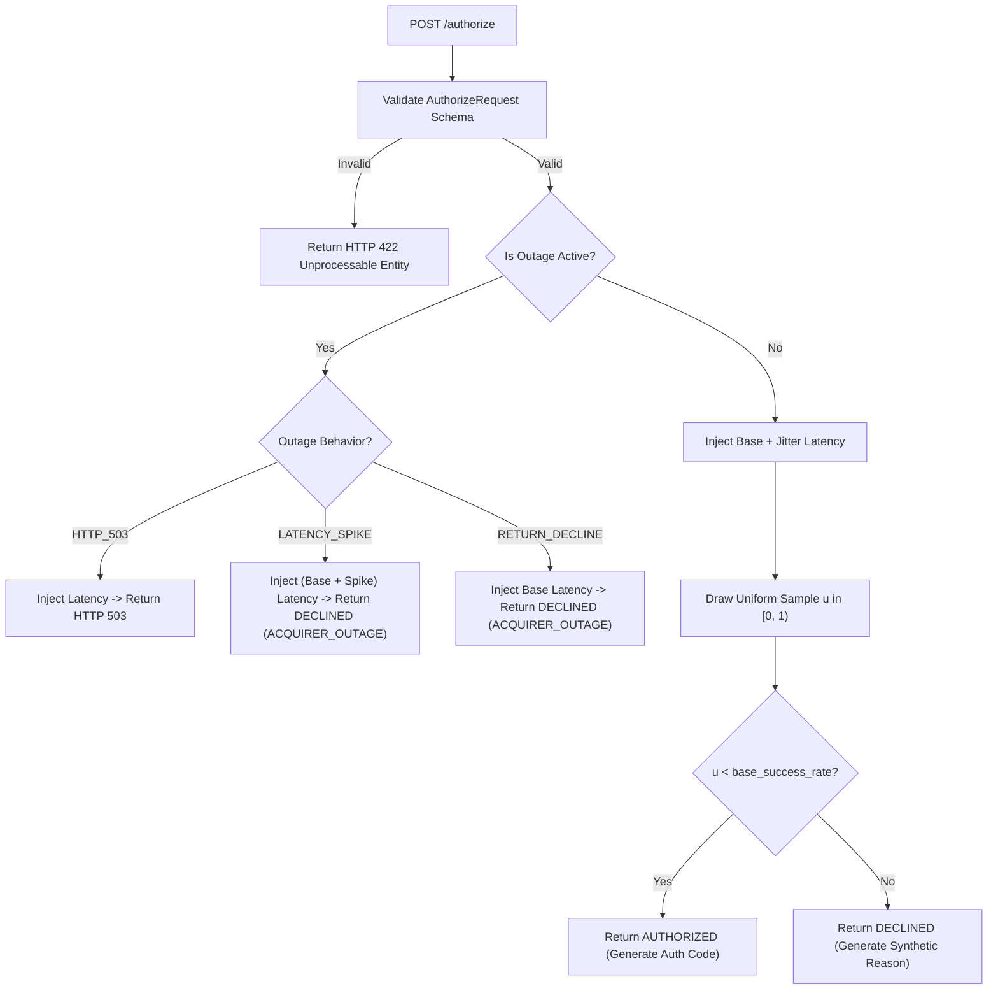

# Phase 2 Specification — Simulated Acquirer Service

**Role**: Systems Architect
**Audience**: Backend Engineer, QA Engineer, Tech Lead
**Scope**: Phase 2 (Simulated Acquirer Service & Admin API)
**Status**: Settled Architecture Contract

---

## 1. Executive Summary & Component Boundary

Phase 2 provides the external dependencies against which Loom's dynamic routing engine (Phase 3 and beyond) executes and learns: the **Simulated Acquirer Service**.

The simulated acquirer is a standalone HTTP service that faithfully mimics the external payment gateway interface (e.g., Stripe, Adyen, Chase Paymentech) while granting complete programmatic control over its runtime characteristics — specifically its live payment success rate (PSR) and operational availability (outages).

### Explicit Scope Boundaries

- **In Scope for Phase 2**:
  - FastAPI application serving the payment authorization contract (`POST /authorize`).
  - Admin control plane endpoints to set live success rates (`POST /admin/success-rate`) and toggle outage states (`POST /admin/outage`).
  - Read-only telemetry and ground-truth inspection endpoint (`GET /admin/state`).
  - In-memory state machine encapsulating deterministic or stochastic PRNG outcome generation.
  - Realistic artificial latency simulation (asynchronous non-blocking delay).
  - Pydantic v2 schemas strictly validating inbound payloads and outbound response envelopes.
  - Standalone and multi-instance CLI runner supporting dynamic acquirer IDs and ports.
  - Comprehensive unit and integration test suite (`tests/acquirer_sim/`).

- **Explicitly Out of Scope for Phase 2**:
  - Routing logic, Thompson Sampling, Beta distributions, or PID smoothing (belongs to `router_core/`).
  - Transaction generator loops or synthetic traffic generation scripts (belongs to `scripts/` in Phase 3).
  - Real bank, sandbox, or card network API integrations (permanently prohibited by `docs/CONSTITUTION.md`).
  - Redis persistence or SQLite telemetry logging (belongs to `data_layer/` in Phase 5).
  - Web UI or dashboard components (belongs to `dashboard/` in Phase 7).

---

## 2. Tech Stack & Directory Structure

Per `docs/CONSTITUTION.md`, the tech stack for Phase 2 is strictly pinned:

- **Framework**: `fastapi>=0.110.0`
- **ASGI Server**: `uvicorn[standard]>=0.28.0`
- **Data Validation & Schemas**: `pydantic>=2.6.0` / `pydantic-settings>=2.2.0`
- **Language**: Python 3.11+

### Directory Layout (`acquirer_sim/` and `tests/acquirer_sim/`)

```
loom/
├── acquirer_sim/
│   ├── __init__.py          # Package exports: create_app, AcquirerSimulator, models
│   ├── models.py            # Pydantic request/response schemas, enums, configs
│   ├── simulator.py         # Core simulation engine: state machine, PRNG, counters
│   ├── app.py               # FastAPI application factory and route declarations
│   └── server.py            # CLI entrypoint for spawning acquirer instances
└── tests/
    └── acquirer_sim/
        ├── __init__.py
        ├── test_models.py       # Pydantic schema validation, edge cases, defaults
        ├── test_simulator.py    # Deterministic unit tests of state machine and PRNG
        └── test_api.py          # FastAPI TestClient HTTP integration tests for all endpoints
```

---

## 3. Service Topology & Deployment Model

Payment routers in production communicate with independent remote acquirers over distinct HTTP endpoints. To preserve architectural fidelity and failure isolation:

1. **Instance Identity**: Every simulator instance owns an immutable identifier (`acquirer_id`, e.g., `"acquirer_alpha"`, `"acquirer_beta"`, `"acquirer_gamma"`).
2. **Application Factory Pattern**: The FastAPI application is generated via `create_app(config: AcquirerConfig)`. This allows:
   - **Multi-process mode (Standard)**: Running distinct processes on separate ports (e.g., `http://localhost:8001` for Alpha, `http://localhost:8002` for Beta). An outage or crash in Alpha has zero memory or event-loop cross-talk with Beta.
   - **In-process test mode**: QA and unit tests can spin up multiple `TestClient` instances with separate configs in memory without network port contention.
3. **No Hardcoded Counts or IDs**: In accordance with `docs/CONSTITUTION.md`, acquirer IDs and ports are never hardcoded. They are parameterized via environment variables (`ACQUIRER_ID`, `PORT`) or CLI arguments.

---

## 4. Architectural Analysis: Outage State & Degrade Curves

### The Question
Should the Phase 2 simulator support a gradual degrade/recover curve (e.g., linear ramp down over $T$ seconds, sigmoid degradation) or a hard on/off step function for v1?

### Architectural Trade-off Evaluation

| Dimension | Option A: Hard On/Off Step Function (Recommended for v1) | Option B: Gradual Degrade/Recover Curve |
| :--- | :--- | :--- |
| **System Complexity** | **Low**: Boolean operational flag. Immediate state transition. Zero background timers or wall-clock interpolation state. | **High**: Requires maintaining continuous wall-clock transitions, time-decay curves, and async background ticker tasks. |
| **Test Determinism** | **Absolute**: Unit tests flip state and immediately assert deterministic behavior without time delays, clock mocking, or race conditions. | **Low**: Tests must wait for wall-clock transition windows or mock system time across HTTP boundaries. |
| **Stress on Router** | **Maximum (Best for Demo)**: A step-function cliff represents the most violent shock to the control loop, clearly demonstrating PID damping vs raw bandit ringing. | **Ambiguous**: A gradual curve masks whether smooth traffic reallocation was achieved by Loom's PID controller or by the acquirer's soft drop. |
| **PRD Alignment** | **Exact**: PRD specifies: *"Outage state supports at minimum a hard on/off; a gradual degrade/recover curve is a nice-to-have, not required for v1."* | Premature optimization before Phase 3 proves basic bandit-router coupling. |

### Architectural Decision
**Hard on/off is the settled implementation for v1.**

### Non-Breaking Extension Path
1. **Extensibility by Scripting**: Any arbitrary gradual curve (linear, sigmoid, stepped) can be driven externally right now by having an orchestration script in `scripts/` call `POST /admin/success-rate` with descending/ascending values at discrete intervals. This adheres to Unix philosophy: *keep the service mechanism simple; compose complex policies in client scripts.*
2. **Contract Reservation**: The `OutageToggleRequest` schema reserves an optional `transition_seconds: float = 0.0` parameter. In v1, values $> 0.0$ return HTTP 422 with an explicit descriptive message (`"Gradual transition curves not supported in v1; use external orchestration script"`). When v2 introduces native curves, the API contract remains backward-compatible.

---

## 5. Domain Models & Pydantic Schemas (`acquirer_sim/models.py`)

All schemas enforce strict validation, reject extra attributes, and define clear OpenAPI documentation examples.

```python
"""Data models and serialization schemas for the simulated acquirer service."""

from __future__ import annotations

from enum import Enum
from typing import Literal
from pydantic import BaseModel, ConfigDict, Field


class OutageBehavior(str, Enum):
    """Failure response behavior when an outage is active."""

    RETURN_DECLINE = "RETURN_DECLINE"  # HTTP 200 with status=DECLINED (default payment behavior)
    HTTP_503 = "HTTP_503"  # HTTP 503 Service Unavailable (gateway failure)
    LATENCY_SPIKE = "LATENCY_SPIKE"  # Injects massive delay before declining


class LatencyConfig(BaseModel):
    """Configuration for artificial latency injection."""

    model_config = ConfigDict(frozen=True, extra="forbid")

    base_ms: float = Field(
        default=20.0,
        ge=0.0,
        description="Baseline network and processing latency in milliseconds.",
        examples=[20.0],
    )
    jitter_ms: float = Field(
        default=5.0,
        ge=0.0,
        description="Uniform random jitter (+/- ms) added to baseline latency.",
        examples=[5.0],
    )
    outage_spike_ms: float = Field(
        default=500.0,
        ge=0.0,
        description="Additional latency injected when outage_behavior is LATENCY_SPIKE.",
        examples=[500.0],
    )


class AcquirerConfig(BaseModel):
    """Runtime configuration for a simulated acquirer instance."""

    model_config = ConfigDict(extra="forbid")

    acquirer_id: str = Field(
        ...,
        min_length=1,
        description="Unique identifier for this acquirer instance.",
        examples=["acquirer_alpha"],
    )
    base_success_rate: float = Field(
        default=0.95,
        ge=0.0,
        le=1.0,
        description="Configured target success rate under normal operating conditions.",
        examples=[0.95],
    )
    latency: LatencyConfig = Field(
        default_factory=LatencyConfig,
        description="Latency simulation parameters.",
    )


# ---------------------------------------------------------------------------
# Authorization Contract Schemas
# ---------------------------------------------------------------------------


class AuthorizeRequest(BaseModel):
    """Inbound payment authorization request from router or client."""

    model_config = ConfigDict(extra="forbid")

    transaction_id: str = Field(
        ...,
        min_length=1,
        description="Unique identifier for the transaction (UUID or idempotency key).",
        examples=["tx_987e6543-e21b-12d3-a456-426614174000"],
    )
    amount: float = Field(
        ...,
        gt=0.0,
        description="Transaction amount in major currency units.",
        examples=[100.50],
    )
    currency: str = Field(
        default="USD",
        pattern=r"^[A-Z]{3}$",
        description="ISO 4217 three-letter currency code.",
        examples=["USD"],
    )
    merchant_id: str = Field(
        default="merchant_loom_default",
        min_length=1,
        description="Merchant identifier originating the payment.",
        examples=["merchant_loom_default"],
    )
    payment_method: str = Field(
        default="card",
        min_length=1,
        description="Payment instrument type.",
        examples=["card"],
    )
    timestamp: float | None = Field(
        default=None,
        ge=0.0,
        description="Client epoch timestamp in seconds. Defaults to server time if omitted.",
        examples=[1756972000.123],
    )


class AuthorizeResponse(BaseModel):
    """Outbound payment authorization result."""

    model_config = ConfigDict(extra="forbid")

    transaction_id: str = Field(
        ...,
        description="Transaction identifier echoed from request.",
        examples=["tx_987e6543-e21b-12d3-a456-426614174000"],
    )
    acquirer_id: str = Field(
        ...,
        description="Identifier of the acquirer answering the authorization.",
        examples=["acquirer_alpha"],
    )
    status: Literal["AUTHORIZED", "DECLINED"] = Field(
        ...,
        description="Payment outcome status.",
        examples=["AUTHORIZED"],
    )
    authorized: bool = Field(
        ...,
        description="Direct boolean convenience flag (True if AUTHORIZED, False if DECLINED).",
        examples=[True],
    )
    authorization_code: str | None = Field(
        default=None,
        description="Unique bank auth code generated on success (e.g. 'AUTH_123456').",
        examples=["AUTH_987654"],
    )
    decline_code: str | None = Field(
        default=None,
        description="Categorical reason code on decline (e.g. 'DO_NOT_HONOR', 'ACQUIRER_OUTAGE').",
        examples=[None],
    )
    decline_message: str | None = Field(
        default=None,
        description="Human-readable explanation of decline.",
        examples=[None],
    )
    simulated_latency_ms: float = Field(
        ...,
        ge=0.0,
        description="Actual simulated processing delay applied in milliseconds.",
        examples=[21.4],
    )
    timestamp: float = Field(
        ...,
        description="Server epoch timestamp when authorization was processed.",
        examples=[1756972000.145],
    )


# ---------------------------------------------------------------------------
# Admin API Contract Schemas
# ---------------------------------------------------------------------------


class SuccessRateUpdateRequest(BaseModel):
    """Payload to update the live base success rate."""

    model_config = ConfigDict(extra="forbid")

    success_rate: float = Field(
        ...,
        ge=0.0,
        le=1.0,
        description="New target success rate in range [0.0, 1.0].",
        examples=[0.85],
    )
    reason: str | None = Field(
        default=None,
        description="Optional audit note explaining the rate adjustment.",
        examples=["Simulating daytime network congestion"],
    )


class OutageToggleRequest(BaseModel):
    """Payload to toggle or update the outage state."""

    model_config = ConfigDict(extra="forbid")

    active: bool = Field(
        ...,
        description="True to engage outage mode, False to restore normal operations.",
        examples=[True],
    )
    behavior: OutageBehavior = Field(
        default=OutageBehavior.RETURN_DECLINE,
        description="Failure mode behavior while outage is active.",
        examples=[OutageBehavior.RETURN_DECLINE],
    )
    transition_seconds: float = Field(
        default=0.0,
        ge=0.0,
        description="Optional duration for gradual degrade. Must be 0.0 for v1.",
        examples=[0.0],
    )


class AdminStateResponse(BaseModel):
    """Telemetry and ground truth state snapshot of the acquirer."""

    model_config = ConfigDict(extra="forbid")

    acquirer_id: str = Field(..., description="Unique acquirer identifier.")
    base_success_rate: float = Field(..., description="Configured baseline success rate.")
    effective_success_rate: float = Field(
        ...,
        description="Current operational success rate (0.0 if outage is active, else base_success_rate).",
    )
    outage_active: bool = Field(..., description="Whether outage mode is currently engaged.")
    outage_behavior: OutageBehavior = Field(..., description="Active outage failure behavior.")
    latency: LatencyConfig = Field(..., description="Current latency injection parameters.")
    total_requests: int = Field(..., ge=0, description="Total authorizations received.")
    authorized_count: int = Field(..., ge=0, description="Total authorized transactions.")
    declined_count: int = Field(..., ge=0, description="Total declined transactions.")
    outage_declines: int = Field(
        ..., ge=0, description="Declines directly caused by active outage."
    )
    empirical_success_rate: float = Field(
        ...,
        ge=0.0,
        le=1.0,
        description="Empirical lifetime success rate: authorized_count / total_requests (1.0 if total=0).",
    )
    uptime_seconds: float = Field(..., ge=0.0, description="Seconds since service initialization.")


class ResetResponse(BaseModel):
    """Response after resetting telemetry counters."""

    model_config = ConfigDict(extra="forbid")

    acquirer_id: str
    message: str
    timestamp: float
```

---

## 6. Detailed API Endpoint Specifications

### 6.1 Payment Authorization Endpoint

- **Path**: `POST /authorize`
- **Purpose**: Simulates an acquirer card authorization request. Used by Phase 3's router.
- **Request Body**: `AuthorizeRequest` (application/json)
- **Response**: `AuthorizeResponse` (application/json)
- **Status Codes**:
  - `200 OK`: Transaction processed. The outcome (`AUTHORIZED` or `DECLINED`) is communicated inside the JSON body.
  - `422 Unprocessable Entity`: Inbound schema validation failure (e.g., negative amount, bad currency format).
  - `503 Service Unavailable`: Returned *only* if `outage_active == True` AND `outage_behavior == OutageBehavior.HTTP_503`.

#### Processing Logic Pipeline:


#### Deterministic Reason Codes
When `status == "DECLINED"`:
- Under outage: `decline_code = "ACQUIRER_OUTAGE"`, `decline_message = "Acquirer currently unavailable due to operational outage"`.
- Under normal random drop ($u \ge p$): `decline_code = "DO_NOT_HONOR"`, `decline_message = "Transaction declined by issuing bank"`.

---

### 6.2 Set Live Success Rate Endpoint

- **Path**: `POST /admin/success-rate`
- **Purpose**: Dynamically adjusts the target success rate of the acquirer without restarting the process.
- **Request Body**: `SuccessRateUpdateRequest` (application/json)
- **Response Body**: `AdminStateResponse` (application/json)
- **Status Codes**:
  - `200 OK`: Success rate updated.
  - `422 Unprocessable Entity`: Rate outside `[0.0, 1.0]`.

#### Contract Semantics:
- Changing `success_rate` alters future authorization trials immediately.
- If an outage is currently active, `base_success_rate` updates in the background, but `effective_success_rate` remains `0.0` until the outage is cleared.

---

### 6.3 Toggle Outage State Endpoint

- **Path**: `POST /admin/outage`
- **Purpose**: Engages or disengages an outage condition on demand.
- **Request Body**: `OutageToggleRequest` (application/json)
- **Response Body**: `AdminStateResponse` (application/json)
- **Status Codes**:
  - `200 OK`: Outage state successfully updated.
  - `422 Unprocessable Entity`: Inbound schema violation, or `transition_seconds > 0.0` in v1.

#### Contract Semantics:
- `active: true` forces `effective_success_rate = 0.0`.
- `active: false` restores `effective_success_rate = base_success_rate`.
- Cumulative outage counters (`outage_declines`) track all authorizations rejected while active.

---

### 6.4 Inspect Acquirer State Endpoint

- **Path**: `GET /admin/state`
- **Purpose**: Read-only observability for dashboards, test harnesses, and demo orchestrators.
- **Query Parameters**: None
- **Response Body**: `AdminStateResponse` (application/json)
- **Status Codes**: `200 OK`.

---

### 6.5 Reset Telemetry Endpoint

- **Path**: `POST /admin/reset`
- **Purpose**: Resets cumulative counters (`total_requests`, `authorized_count`, `declined_count`, `outage_declines`) to zero and restores default configuration. Used between test runs and demo resets.
- **Response Body**: `ResetResponse` (application/json)
- **Status Codes**: `200 OK`.

---

## 7. Core Simulator Engine Design (`acquirer_sim/simulator.py`)

The simulator engine encapsulates all mutable runtime state in an isolated, thread-safe class:

```python
class AcquirerSimulator:
    """Encapsulates runtime state, PRNG logic, and telemetry counters for an acquirer."""

    def __init__(
        self,
        config: AcquirerConfig,
        rng: np.random.Generator | None = None,
    ) -> None: ...

    @property
    def acquirer_id(self) -> str: ...

    @property
    def base_success_rate(self) -> float: ...

    @property
    def effective_success_rate(self) -> float:
        """Return 0.0 if outage is active, else base_success_rate."""
        ...

    @property
    def is_outage_active(self) -> bool: ...

    def set_success_rate(self, rate: float) -> None:
        """Update the base success rate in [0.0, 1.0]."""
        ...

    def set_outage(
        self, active: bool, behavior: OutageBehavior = OutageBehavior.RETURN_DECLINE
    ) -> None:
        """Engage or disengage outage state."""
        ...

    async def execute_authorization(self, request: AuthorizeRequest) -> AuthorizeResponse:
        """Simulate authorization delay and return probabilistic or outage outcome."""
        ...

    def get_telemetry_snapshot(self) -> AdminStateResponse:
        """Return point-in-time telemetry snapshot."""
        ...

    def reset(self) -> None:
        """Reset counters and restore initial configuration."""
        ...
```

### Deterministic Random Seed Support
To support 100% reproducible integration tests and QA scenario vectors:
- `AcquirerSimulator` accepts an optional `numpy.random.Generator` or integer seed.
- If no generator is passed, it uses `np.random.default_rng()`.
- Tests can supply a seeded PRNG (`np.random.default_rng(42)`) to verify exact sequences of authorized vs declined transactions.

### Asynchronous Latency Injection
To simulate realistic gateway latency without blocking FastAPI's ASGI event loop:
```python
simulated_latency = self._calculate_latency()
if simulated_latency > 0:
    await asyncio.sleep(simulated_latency / 1000.0)
```
In unit tests, `base_ms` and `jitter_ms` can be configured to `0.0` for maximum test execution speed.

---

## 8. Error Protocols & Handling for Phase 3 Router

To ensure Phase 3's router can be built against this contract without guessing, here is the exact client-side consumption specification:

### Router Outcome Mapping Table

| Acquirer HTTP Status | Acquirer Response Payload | Client Classification | Router Action |
| :--- | :--- | :--- | :--- |
| `200 OK` | `{"authorized": true, "status": "AUTHORIZED", ...}` | **Success** | Call `record_outcome(acquirer_id, success=True)` |
| `200 OK` | `{"authorized": false, "status": "DECLINED", "decline_code": "..."}` | **Business Decline** | Call `record_outcome(acquirer_id, success=False)` |
| `503 Service Unavailable` | Gateway error body | **System Failure** | Catch HTTP error, call `record_outcome(acquirer_id, success=False)` |
| Connection Timeout / Reset | None (Transport exception) | **Network Failure** | Catch `httpx.TimeoutException`, call `record_outcome(acquirer_id, success=False)` |
| `422 Unprocessable` | Schema validation error | **Client Bug** | Log critical alert; do **not** penalize acquirer health (router sent invalid data) |

---

## 9. Performance & Latency Budgets

| Metric | Threshold | Architectural Rationale |
| :--- | :--- | :--- |
| **FastAPI Request Overhead** | $< 1.5\ \text{ms}$ (excluding injected sleep) | Pydantic v2 validation + ASGI routing overhead. |
| **Throughput Capacity** | $> 1,000\ \text{req/sec}$ per instance (at $0\ \text{ms}$ sleep) | Async event loop handling non-blocking in-memory state. |
| **Telemetry Snapshot Latency** | $< 0.1\ \text{ms}$ | Plain dictionary read from in-memory counters. |
| **State Mutation Latency** | $< 0.1\ \text{ms}$ | Atomic scalar assignment. |

---

## 10. Hand-off Checklist for Backend Engineer

When implementing Phase 2:

1. [ ] Create `acquirer_sim/models.py` with all Pydantic v2 models (`AuthorizeRequest`, `AuthorizeResponse`, `SuccessRateUpdateRequest`, `OutageToggleRequest`, `AdminStateResponse`, `ResetResponse`, `OutageBehavior`, `LatencyConfig`, `AcquirerConfig`).
2. [ ] Create `acquirer_sim/simulator.py` implementing `AcquirerSimulator` with thread-safe counters, seeded PRNG support, async latency calculation, and deterministic decline reason generation.
3. [ ] Create `acquirer_sim/app.py` providing `create_app(config: AcquirerConfig)` with routes:
   - `POST /authorize`
   - `POST /admin/success-rate`
   - `POST /admin/outage`
   - `GET /admin/state`
   - `POST /admin/reset`
4. [ ] Create `acquirer_sim/server.py` supporting CLI execution: `python -m acquirer_sim.server --id acquirer_alpha --port 8001 --rate 0.95`.
5. [ ] Create `tests/acquirer_sim/test_models.py` testing schema boundaries, negative values, and serialization.
6. [ ] Create `tests/acquirer_sim/test_simulator.py` testing deterministic PRNG sequences, outage toggles, counter increments, and reset.
7. [ ] Create `tests/acquirer_sim/test_api.py` using `httpx` / `FastAPI.testclient` testing all 5 endpoints, status codes, and headers.
