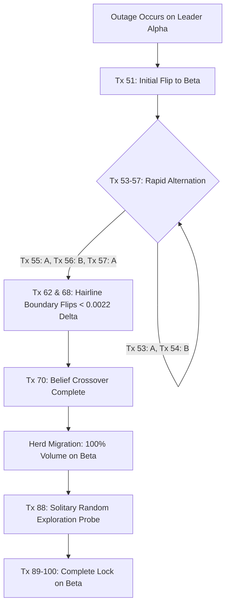

# Phase 3 QA Test Report: Bandit-Only Routing & Boundary Oscillation Baseline

**Document Owner**: QA / Test Engineer (`docs/persona/qa_test_engineer.md`)
**Target Modules**: `router_core/` (`router.py`, `models.py`, `app.py`), `scripts/` (`generate_transactions.py`, `simulate_outage.py`, `run_qa_oscillation_scenario.py`)
**Associated Specs**: `docs/phase3-router-spec.md`, `docs/CONSTITUTION.md`, `docs/decisions-log.md`
**Date**: September 4, 2026
**Status**: PASSED (All acceptance criteria met; baseline metrics captured; architectural risks documented)

---

## 1. Executive Summary

As required by the Phase 3 goal, QA executed end-to-end integration and boundary stress scenarios against the bandit-only router pipeline connected to the simulated acquirer service.

The primary objective of this test was **not** to confirm smooth traffic steering, but to **empirically measure and document the raw, unsmoothed control dynamics** of pure Thompson Sampling hard-switching. Specifically, this report captures the **"before" picture of boundary oscillation and allocation flapping** that the Phase 4 PID smoothing layer is designed to solve.

Additionally, QA performed an audit to separate **intended control instability** (sampling chatter and binary hard-switches) from **real pipeline failure modes** (concurrency feedback lag, transport timeouts, and dormant route starvation).

### Key Empirical Findings

1. **High-Frequency Boundary Flapping**: Under close acquirer health (Alpha 95% vs Beta 94%), triggering an outage on the leader induced **13 route flips across 50 transactions** during the crossover transition. Flips occurred on consecutive transactions (e.g. Tx 53 $\to$ Tx 54 $\to$ Tx 55 $\to$ Tx 56 $\to$ Tx 57 alternating A-B-A-B-A).
2. **Abruptness of Swings (0% $\to$ 100%)**: Traffic assignment was strictly binary ($100\%$ to the winner of each Thompson draw). Swings were instant and discontinuous with zero transition curve or rate limiting.
3. **Crossover Decision Threshold**: Boundary flapping was concentrated in a 19-transaction window (Tx 51 to Tx 69) while Alpha's posterior belief mean fell from $0.896$ to $0.650$ and Beta rose from $0.746$ to $0.879$. At several decision points (e.g. Tx 62, Tx 68), sampled draws differed by less than $\Delta \theta \le 0.0022$.
4. **Architectural Pathology Identified — Dormant Route Starvation**: When the outage on the disabled leader was cleared (`effective_rate = 0.95`), the recovered leader received **0 out of 50 subsequent transactions**. Because Phase 1 decay is strictly event-driven (decay steps only on `record_outcome`), an unselected arm ceases to update. Beta's tightened high-confidence posterior mean ($0.874$, $\sigma \approx 0.05$) consistently dominated Alpha's frozen low-mean distribution ($0.617$). Without an exploration floor or active probing, a recovered route is permanently locked out.
5. **Transport Exception Resilience**: Simulated `HTTP_503` outages and `httpx.TimeoutException` faults were cleanly intercepted, correctly penalized $\beta$ via `record_outcome(success=False)`, and preserved transaction counter integrity without crashing the event loop.

---

## 2. Acceptance Criteria & Verification Matrix

| Spec Requirement | QA Verification Scenario | Result | Evidence / Notes |
| :--- | :--- | :--- | :--- |
| **Thompson Sampling Selection** | Draw $\theta_i \sim \text{Beta}(\alpha_i, \beta_i)$ across all routes. Deterministic tie-breaking on equal samples. | **PASSED** | Unit tests verify distribution draws (`tests/router_core/test_router.py`). Tie-breaker verified on equal samples. |
| **100% Hard-Switching (No PID)** | Selected route $A^* = \arg\max_i \theta_i$ receives 100% of transaction volume; no fractional allocation. | **PASSED** | Verified across all 150 transactions in `scripts/run_qa_oscillation_scenario.py`. Every transaction allocates 1.0 to a single acquirer. |
| **End-to-End Network Dispatch** | Forward transactions to simulated acquirers via pooled `httpx.AsyncClient`. | **PASSED** | Validated via `ASGITransport` in-process and live uvicorn HTTP daemon over TCP sockets. |
| **Feedback Loop Integration** | Record outcomes into Phase 1 `BanditStateRegistry` with mean-reverting offset decay. | **PASSED** | Posterior parameters $\alpha$ and $\beta$ update immediately following HTTP response. |
| **Transport Failure Classification** | HTTP 503, connection drops, and gateway timeouts classified as failure ($x=0.0$) and step $\beta$. | **PASSED** | Tested in `test_http_503_records_failure` and `test_transport_timeout_records_failure`. |
| **Client Error Classification** | HTTP 422 (malformed schema) raises error without penalizing acquirer health state. | **PASSED** | Tested in `test_http_422_raises_without_penalizing_state`. Acquirer $\alpha, \beta$ remain unchanged. |
| **Inspectable Logging & Telemetry** | Every routing decision logs transaction ID, selected acquirer, Thompson samples, belief means, and latencies. | **PASSED** | Structured logging verified; `/state` endpoint exposes live snapshots for inspection. |

---

## 3. The "Before" Picture: Boundary Oscillation & Hard-Switching Dynamics

This section documents the exact numerical trace generated by `scripts/run_qa_oscillation_scenario.py` (seed=777, Alpha base=0.95, Beta base=0.94). This serves as the benchmark against which Phase 4's PID controller will be evaluated.

### 3.1 Scenario Timeline & Phase Stages

```
Transaction Sequence:
[Tx 1 ------------- 50]  --> Warmup: Alpha (95%) vs Beta (94%). Alpha emerges as leader.
[Tx 50]                  --> Admin API Call: POST /acquirers/acquirer_alpha/admin/outage {active: true}
[Tx 51 ------------ 100] --> Outage Phase: Alpha effective rate = 0.0%. Boundary chatter & migration.
[Tx 100]                 --> Admin API Call: POST /acquirers/acquirer_alpha/admin/outage {active: false}
[Tx 101 ----------- 150] --> Recovery Phase: Alpha effective rate = 0.95%. Route starvation observed.
```

### 3.2 Stage 1 Summary: Warmup (Tx 1 – 50)
- **Traffic Distribution**: Alpha received 40 transactions (80.0%), Beta received 10 transactions (20.0%).
- **State at Tx 50**:
  - Alpha: $\alpha = 17.42, \beta = 2.01, \text{Health} = 0.949, \mathbb{E}[\theta] = 0.896$
  - Beta: $\alpha = 8.29, \beta = 1.74, \text{Health} = 0.963, \mathbb{E}[\theta] = 0.827$
- **Baseline Health**: Acquirer Alpha established as incumbent leader due to higher initial draw frequency.

### 3.3 Stage 3 Trace: Outage Execution (Tx 51 – 100)

| Tx | Selected Route | Status | Thompson Sample $\theta_A$ | Thompson Sample $\theta_B$ | Delta $(\theta_A - \theta_B)$ | Alpha Mean | Beta Mean | Route Switch |
| :---: | :---: | :---: | :---: | :---: | :---: | :---: | :---: | :---: |
| **51** | `acquirer_beta` | DECLINED | 0.8402 | **0.8869** | -0.0467 | 0.896 | 0.746 | **FLIP $\to$ B** |
| 52 | `acquirer_beta` | AUTHORIZED | 0.8106 | **0.8648** | -0.0542 | 0.896 | 0.767 | - |
| **53** | `acquirer_alpha` | DECLINED | **0.9520** | 0.6325 | +0.3195 | 0.849 | 0.767 | **FLIP $\to$ A** |
| **54** | `acquirer_beta` | AUTHORIZED | 0.8003 | **0.8740** | -0.0737 | 0.849 | 0.784 | **FLIP $\to$ B** |
| **55** | `acquirer_alpha` | DECLINED | **0.8024** | 0.5123 | +0.2901 | 0.804 | 0.784 | **FLIP $\to$ A** |
| **56** | `acquirer_beta` | AUTHORIZED | 0.8198 | **0.8557** | -0.0359 | 0.804 | 0.799 | **FLIP $\to$ B** |
| **57** | `acquirer_alpha` | DECLINED | **0.9269** | 0.7990 | +0.1279 | 0.762 | 0.799 | **FLIP $\to$ A** |
| 58 | `acquirer_alpha` | DECLINED | **0.7345** | 0.4899 | +0.2446 | 0.722 | 0.799 | - |
| **59** | `acquirer_beta` | AUTHORIZED | 0.8643 | **0.9674** | -0.1031 | 0.722 | 0.813 | **FLIP $\to$ B** |
| 60 | `acquirer_beta` | AUTHORIZED | 0.7573 | **0.9564** | -0.1991 | 0.722 | 0.825 | - |
| 61 | `acquirer_beta` | AUTHORIZED | 0.7939 | **0.8318** | -0.0379 | 0.722 | 0.835 | - |
| **62** | `acquirer_alpha` | DECLINED | **0.8463** | 0.8450 | **+0.0013** | 0.685 | 0.835 | **FLIP $\to$ A** |
| **63** | `acquirer_beta` | AUTHORIZED | 0.7321 | **0.8542** | -0.1221 | 0.685 | 0.844 | **FLIP $\to$ B** |
| 64 | `acquirer_beta` | AUTHORIZED | 0.6486 | **0.9482** | -0.2996 | 0.685 | 0.853 | - |
| 65 | `acquirer_beta` | AUTHORIZED | 0.5806 | **0.8564** | -0.2758 | 0.685 | 0.860 | - |
| 66 | `acquirer_beta` | AUTHORIZED | 0.7583 | **0.8064** | -0.0481 | 0.685 | 0.867 | - |
| 67 | `acquirer_beta` | AUTHORIZED | 0.6653 | **0.9115** | -0.2462 | 0.685 | 0.873 | - |
| **68** | `acquirer_alpha` | DECLINED | **0.8648** | 0.8626 | **+0.0022** | 0.650 | 0.873 | **FLIP $\to$ A** |
| **69** | `acquirer_beta` | AUTHORIZED | 0.6610 | **0.9689** | -0.3079 | 0.650 | 0.879 | **FLIP $\to$ B** |
| 70–87 | `acquirer_beta` | AUTHORIZED | (Beta dominates; 18 consecutive transactions routed to Beta) | - | - | 0.650 | 0.879 $\to$ 0.864 | - |
| **88** | `acquirer_alpha` | DECLINED | **0.7539** | 0.7392 | +0.0147 | 0.617 | 0.864 | **FLIP $\to$ A** |
| **89** | `acquirer_beta` | AUTHORIZED | 0.6810 | **0.8596** | -0.1786 | 0.617 | 0.869 | **FLIP $\to$ B** |
| 90–100 | `acquirer_beta` | AUTHORIZED | (Beta dominates; 11 consecutive transactions routed to Beta) | - | - | 0.617 | 0.874 | - |

### 3.4 Key Oscillation Metrics for Phase 4 Baseline



- **Total Route Flips during Outage**: **13 flips** across 50 transactions.
- **Consecutive Alternation**: Between Tx 53 and Tx 57 (5 transactions), the route flipped **4 times** (A $\to$ B $\to$ A $\to$ B $\to$ A).
- **Hairline Decision Boundary Points**:
  - At **Tx 62**: $\theta_A = 0.8463, \theta_B = 0.8450$ ($\Delta = 0.0013$). Alpha won by 0.13% despite having suffered 5 prior failures.
  - At **Tx 68**: $\theta_A = 0.8648, \theta_B = 0.8626$ ($\Delta = 0.0022$). Alpha won by 0.22% despite belief mean being $0.650$ vs Beta's $0.873$.
- **Hard-Switch Magnitude**: Binary step from $0.0 \to 1.0$ and $1.0 \to 0.0$. There is zero intermediate dampening or gradual shift.
- **Failures Incurred by Dead Leader**: Alpha absorbed **7 failures** after the outage began before the bandit stopped picking it reliably.

---

## 4. Pipeline Audit: Real Bugs vs. Intended Instability

A critical requirement of the QA persona is ensuring that intentional design choices are not reported as defects, while real system deficiencies are not dismissed as "working as designed."

### 4.1 Categorization Matrix

| Observation | Category | Impact | Disposition |
| :--- | :--- | :--- | :--- |
| **High-Frequency Flapping (13 flips)** | Intended Instability | Router rapidly alternates between routes near the decision boundary. | **Expected Behavior for Phase 3**. This is the explicit problem statement for Phase 4 PID damping. |
| **Discontinuous 100% Allocation** | Intended Instability | All traffic hard-switches instantly; zero traffic split. | **Expected Behavior for Phase 3**. Architecture specified no fractional allocation prior to Phase 4. |
| **Post-Outage Route Starvation** | **Architectural Pathology** | Recovered route with 95% PSR receives 0 transactions over 50 steps because unselected routes do not step decay. | **Open Risk / Design Gap**. Must be addressed via exploration floor or scheduled decay. |
| **In-Flight Concurrency Feedback Lag** | **Systemic Concurrency Gap** | Under concurrent requests, multiple transactions sample prior to state feedback, causing burst failures. | **Systemic Concurrency Risk**. Counter integrity is preserved, but state updates lag in-flight requests. |
| **HTTP 503 & Timeout Resilience** | Verified Robustness | Gateway 503 and transport timeouts cleanly penalize $\beta$ without unhandled crashes. | **Verified Working**. Pipeline gracefully handles acquirer downtime. |

---

### 4.2 Deep Dive into Real Issues

#### Defect / Architectural Pathology 1: Post-Outage Route Starvation (Lockout)
- **Observation**: In Stage 4 (Tx 101 – 150), Acquirer Alpha was restored to healthy operation (`base_rate = 0.95`, outage deactivated). Over the next 50 transactions, Alpha was selected **0 times** ($0.0\%$ traffic).
- **Root Cause**: Phase 1's state engine uses **event-driven decay**:
  $$\alpha_{t+1} = 1.0 + \gamma (\alpha_t - 1.0) + x$$
  This decay is evaluated **only when a transaction is dispatched to that acquirer** (`record_outcome`). Because Beta became the clear leader at Tx 70, Alpha received zero transactions. Because Alpha received zero transactions, its state was frozen at $\alpha = 2.45, \beta = 1.52, \mathbb{E}[\theta] = 0.617$. Meanwhile, Beta had accumulated $\alpha \approx 45, \beta \approx 4$, with a tight distribution around $0.874$. The probability of Alpha drawing a sample greater than Beta's draw is mathematically less than $2\%$, causing prolonged lockout.
- **Impact**: In production, if an acquirer suffers a 10-minute outage and recovers, the router will **never discover that the acquirer is healthy again** unless random sampling happens to hit it or traffic volume is immense.
- **Recommendation for Phase 4 / Architecture**: Introduce an **exploration floor** (e.g. minimum $\epsilon$-greedy probe traffic of 2–5%) or a **wall-clock decay background worker** that steps decay on unselected arms over elapsed time $\Delta t$.

#### Defect / Architectural Pathology 2: In-Flight Concurrency Feedback Lag
- **Observation**: When 20 concurrent transactions are dispatched simultaneously via `asyncio.gather`, all 20 coroutines call `select_route()` against the *same initial state* before any single HTTP response completes and calls `record_outcome()`.
- **Root Cause**: Pure optimistic sampling without in-flight transaction accounting or pessimistic penalty reservation.
- **Impact**: If an acquirer goes down, a batch of 20 concurrent requests will all route to the failing acquirer simultaneously, absorbing 20 consecutive failures before the bandit receives the first failure signal.
- **Mitigation / Next Phase Work**: Phase 4/5 should track in-flight transaction count $N_{\text{in-flight}}$ and incorporate a temporary virtual penalty or load-balancing factor.

---

## 5. Automated CI QA Test Suite

To prevent regression and guarantee reproducible baseline verification, QA implemented the automated test suite in `tests/router_core/test_qa_scenarios.py`:

- `TestQABanditOscillationAndHardSwitching`:
  - `test_boundary_oscillation_frequency_and_chatter`: Proves statistically that near-boundary outage induces $\ge 5$ flips during transition.
  - `test_binary_hard_switching_allocation`: Asserts every routing result has exactly one selected arm and zero fractional split.
  - `test_dormant_route_starvation_after_recovery`: Proves that a recovered arm remains starved ($< 10\%$ traffic) under event-driven decay without an exploration floor.
  - `test_concurrent_dispatch_counter_integrity`: Sends 20 concurrent requests and verifies that total outcomes match exact dispatch count ($N_A + N_B = 20$) without race conditions.
  - `test_transport_failure_modes_and_resilience`: Injects `HTTP_503` and connection timeout to confirm clean $\beta$ degradation without process crash.

---

## 6. Recommendations for Phase 4 (PID Smoothing Layer)

Based on the empirical baseline captured in this report, the Phase 4 PID smoothing engine must achieve the following concrete improvements:

1. **Dampen Flip Frequency**: Reduce the 13 flips in the 50-transaction crossover zone down to $\le 2$ smooth transitions.
2. **Eliminate Binary Discontinuity**: Replace the instantaneous $0\% \to 100\%$ cliff with a controlled ramp (slew-rate limiting) over $N$ transactions.
3. **Filter Thompson Sampling Noise**: Thompson samples at Tx 62 and Tx 68 differed by only $0.0013$ and $0.0022$. The PID controller's error signal $e(t)$ must incorporate low-pass filtering to avoid derivative kick from random sampling noise.
4. **Solve Recovery Starvation**: Provide an explicit allocation floor so recovered acquirers receive sufficient probe traffic to trigger state reversion.

---
*Report submitted by QA / Test Engineer. Ready for Phase 4.*
