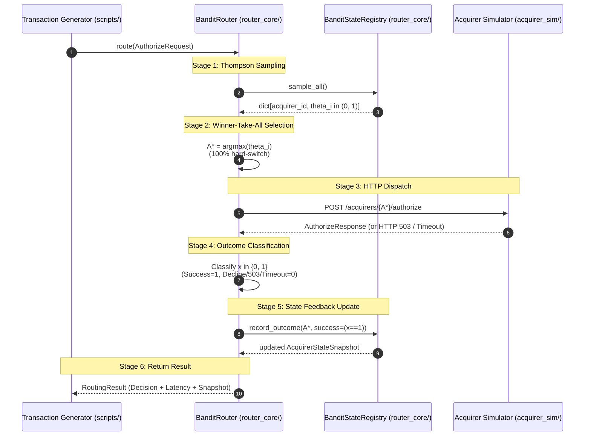

# Phase 3 Specification — Bandit-Only Router & End-to-End Simulation Pipeline

**Role**: Systems Architect
**Audience**: Backend Engineer, QA Engineer, Tech Lead
**Scope**: Phase 3 (Bandit-Only Router, Simulator Wiring, Transaction Generator)
**Status**: Settled Architecture Contract

---

## 1. Executive Summary & Component Boundary

Phase 3 unites the foundational components built in Phase 1 and Phase 2 into Loom's first closed-loop transaction processing pipeline. It connects:
1. **The Bandit Brain (`router_core/state.py`, `router_core/bandit.py`)**: Thompson Sampling over decaying Beta distributions ($\alpha, \beta$) and EWMA health scores ($H$).
2. **The Simulated Payment Gateways (`acquirer_sim`)**: The HTTP authorization and admin control plane providing scriptable ground truth.
3. **The Synthetic Transaction Generator (`scripts/generate_transactions.py`)**: A rate-controlled client emitting realistic payment transactions.

### Architectural Core Directive: Deliberate 100% Hard-Switching (No PID Yet)
In Phase 3, the router operates **strictly on raw Thompson Sampling without PID smoothing or heuristic damping**. For every incoming transaction, the router draws a sample $\theta_i \sim \text{Beta}(\alpha_i, \beta_i)$ from each acquirer's belief distribution and directs **100% of that transaction to the winning arm** ($A^* = \arg\max_i \theta_i$).

> [!IMPORTANT]
> Hard-switching 100% of traffic to whichever acquirer the bandit currently favors is **an intentional, foundational requirement of Phase 3, not a defect or missing feature**.
>
> Raw Thompson Sampling produces rapid herd migration and high-frequency allocation oscillation ("chattering/ringing") when routes degrade. Demonstrating and measuring this exact instability in Phase 3 is required to prove that Phase 4's PID controller actually solves the oscillation problem. Backend engineers MUST NOT introduce moving averages, fractional traffic splitting, or heuristic smoothing in this phase.

### Explicit Scope Boundaries

- **In Scope for Phase 3**:
  - `BanditRouter` core engine coordinating sampling, selection, HTTP dispatch, outcome classification, and state feedback.
  - Connection-pooled asynchronous HTTP client (`httpx.AsyncClient`) communicating with Phase 2 acquirers.
  - Comprehensive outcome mapping: classifying HTTP 200 approvals, HTTP 200 declines, HTTP 503 gateway outages, and transport timeouts into binary outcomes ($x \in \{0, 1\}$).
  - Synchronous/asynchronous state feedback executing Phase 1's mean-reverting offset decay update rules.
  - Optional FastAPI daemon wrapper exposing `POST /route` and `GET /state` for standalone network deployments.
  - Standalone, rate-controlled transaction generator script (`scripts/generate_transactions.py`) supporting fixed and Poisson arrival intervals with real-time console metrics.
  - Deterministic integration test suite (`tests/router_core/test_router.py`, `tests/router_core/test_pipeline_integration.py`).

- **Explicitly Out of Scope for Phase 3**:
  - PID control loop, proportional-integral-derivative error calculations, and smoothed allocation weights (Phase 4).
  - Value-scaled exploration or amount-weighted routing policies (Stretch Goal / Phase 8).
  - Redis persistence or pub/sub event broadcasting (Phase 5).
  - SQLite append-only transaction logging database (Phase 5).
  - Baseline rule-based router comparison (Phase 6).
  - React dashboard or WebSocket visualization (Phase 7).
  - Inline multi-arm retry cascades on single transactions (permanently out of scope for primary routing).

---

## 2. Tech Stack & Directory Structure

Per `docs/CONSTITUTION.md`, all components strictly follow the pinned repository conventions:

- **Language**: Python 3.11+
- **HTTP Client**: `httpx>=0.27.0` (async connection pooling)
- **Framework & Validation**: `fastapi>=0.110.0`, `pydantic>=2.6.0`
- **Math & Sampling**: `numpy>=1.26.0`, `scipy>=1.11.0`

### Directory Layout

```
loom/
├── router_core/
│   ├── __init__.py               # Exports: BanditRouter, RouterConfig, RoutingResult
│   ├── state.py                  # [Phase 1] AcquirerState, Config, Snapshot
│   ├── bandit.py                 # [Phase 1] BanditStateRegistry, calculate_gamma
│   ├── models.py                 # [Phase 3 NEW] Routing schemas, configs, outcomes
│   ├── router.py                 # [Phase 3 NEW] BanditRouter execution pipeline
│   ├── app.py                    # [Phase 3 NEW] FastAPI router service wrapper
│   └── server.py                 # [Phase 3 NEW] CLI launcher for router daemon
├── scripts/
│   ├── README.md
│   ├── generate_transactions.py  # [Phase 3 NEW] Synthetic transaction generator CLI
│   └── simulate_outage.py        # [Phase 3 NEW] Admin script for outage triggering
└── tests/
    ├── router_core/
    │   ├── test_state.py         # [Phase 1] Unit tests
    │   ├── test_bandit.py        # [Phase 1] Unit tests
    │   ├── test_router.py        # [Phase 3 NEW] Unit tests for BanditRouter logic
    │   └── test_pipeline_integration.py # [Phase 3 NEW] End-to-end integration tests
    └── scripts/
        ├── __init__.py
        └── test_generator.py     # [Phase 3 NEW] Generator rate & payload tests
```

---

## 3. End-to-End Pipeline Architecture & Data Flow

The transaction lifecycle flows through six discrete stages in a strictly synchronous, non-branching pipeline:



### Detailed Pipeline Stage Contracts

#### Stage 1: Transaction Emission
The client (`scripts/generate_transactions.py` or an external caller) creates an `AuthorizeRequest` containing:
- `transaction_id`: Cryptographically unique UUID string (`tx_...`).
- `amount`: Floating point charge value ($> 0.00$).
- `currency`: ISO 4217 code (default: `"USD"`).
- `merchant_id`: String identifier (default: `"merchant_loom_default"`).
- `payment_method`: String instrument type (default: `"card"`).
- `timestamp`: High-resolution client epoch timestamp in seconds.

#### Stage 2: Thompson Sampling Belief Evaluation
The router requests independent random draws from `BanditStateRegistry`:
$$\theta_i \sim \text{Beta}(\alpha_i, \beta_i) \quad \forall i \in \mathcal{A}$$
Where $\mathcal{A} = \{A_1, A_2, \dots, A_K\}$ is the set of registered acquirer identifiers.

#### Stage 3: Winner-Take-All Route Selection (100% Hard-Switch)
The winning acquirer $A^*$ is selected by taking the maximum sampled value:
$$A^* = \arg\max_{i \in \mathcal{A}} \theta_i$$
- **100% Allocation**: All traffic for this transaction is directed to $A^*$. No probability splitting, smoothing, or proportional throttling is applied.
- **Deterministic Tie-Breaking**: If two arms produce identical floating-point samples ($\theta_i == \theta_j$), the tie is broken deterministically by alphabetical order of `acquirer_id`.

#### Stage 4: Network Dispatch to Acquirer Gateway
The router constructs the endpoint URL for $A^*$ and dispatches an asynchronous HTTP POST request using a shared `httpx.AsyncClient`:
- **Target URL**: `{base_url}/acquirers/{A*}/authorize` (authoritative path per Phase 2).
- **Request Body**: JSON representation of `AuthorizeRequest`.
- **Headers**: `Content-Type: application/json`, `X-Transaction-Id: {transaction_id}`.
- **Timeout**: Configured network deadline (default: $2.0\ \text{seconds}$).

#### Stage 5: Outcome Classification
The response is evaluated against the authoritative outcome mapping table:

| HTTP Status Code | Response Body Pattern | Exception Type | Classification | Feedback $x$ | Rationale |
| :--- | :--- | :--- | :--- | :---: | :--- |
| `200 OK` | `{"authorized": true, "status": "AUTHORIZED"}` | None | **Success** | $x = 1.0$ | Transaction successfully approved by bank. |
| `200 OK` | `{"authorized": false, "status": "DECLINED"}` | None | **Business Decline** | $x = 0.0$ | Bank declined or acquirer returned outage decline. |
| `503 Service Unavailable` | Any error payload | None | **System Outage** | $x = 0.0$ | Gateway unavailable under outage condition. |
| `5xx Server Error` | Any error payload | None | **Gateway Error** | $x = 0.0$ | Acquirer internal server failure. |
| N/A | None | `httpx.TimeoutException` | **Network Timeout** | $x = 0.0$ | Acquirer hung or exceeded latency budget. |
| N/A | None | `httpx.ConnectError` / `NetworkError` | **Transport Drop** | $x = 0.0$ | Network unreachable or connection refused. |
| `422 Unprocessable` | Validation error JSON | None | **Client Bug** | **None** | Bad request schema. Do NOT penalize acquirer! Raise or return error. |

#### Stage 6: State Feedback Loop
Immediately upon determining $x \in \{0, 1\}$, the router updates the state of the winning arm via `BanditStateRegistry.record_outcome`:
$$\alpha_{A^*} \leftarrow \alpha_0 + \gamma \cdot (\alpha_{A^*} - \alpha_0) + x$$
$$\beta_{A^*} \leftarrow \beta_0 + \gamma \cdot (\beta_{A^*} - \beta_0) + (1.0 - x)$$
$$H_{A^*} \leftarrow \gamma \cdot H_{A^*} + (1.0 - \gamma) \cdot x$$

Non-selected arms ($j \ne A^*$) undergo **zero state update** on this transaction (event-driven observation model).

---

## 4. Mathematical Analysis of 100% Hard-Switching Dynamics

To verify implementation accuracy and understand why PID is necessary in Phase 4, here is the formal mathematical derivation of the raw bandit's behavior under outage.

### 4.1 Steady-State Traffic Dominance
Consider a two-acquirer topology:
- **Acquirer Alpha**: $p_A = 0.95$ (Configured baseline PSR)
- **Acquirer Beta**: $p_B = 0.80$ (Configured baseline PSR)
- **Decay Factor**: $\gamma = 0.98 \implies N_{\text{eff}} = \frac{1}{1 - \gamma} = 50$ observations.

Under steady-state traffic, the accumulated pseudo-counts converge to:
$$\alpha_A \approx 1.0 + N_{\text{eff}} \cdot p_A = 1.0 + 50 \times 0.95 = 48.5, \quad \beta_A \approx 1.0 + 50 \times 0.05 = 3.5$$
$$\alpha_B \approx 1.0 + N_{\text{eff}} \cdot p_B = 1.0 + 50 \times 0.80 = 41.0, \quad \beta_B \approx 1.0 + 50 \times 0.20 = 11.0$$

The expected belief means and standard deviations are:
$$\mathbb{E}[\theta_A] = \frac{48.5}{52.0} \approx 0.9327, \quad \sigma_A = \sqrt{\frac{48.5 \times 3.5}{52^2 \times 53}} \approx 0.0344$$
$$\mathbb{E}[\theta_B] = \frac{41.0}{52.0} \approx 0.7885, \quad \sigma_B = \sqrt{\frac{41.0 \times 11.0}{52^2 \times 53}} \approx 0.0561$$

The probability that Alpha wins the Thompson draw is:
$$P(\theta_A > \theta_B) = \int_{0}^1 f_{\text{Beta}}(\theta_A; 48.5, 3.5) \cdot F_{\text{Beta}}(\theta_A; 41.0, 11.0) \, d\theta_A \approx 0.988 \ (98.8\%)$$

**Conclusion**: In steady state, Alpha captures $\approx 99\%$ of total traffic. Beta receives only $\approx 1\%$ exploration probes.

### 4.2 Outage Crossover Trajectory (The Step-Function Cliff)
Suppose an instantaneous outage strikes Alpha at $t=0$, causing all subsequent authorizations on Alpha to fail ($x=0$).

Because Alpha holds 99% of traffic, incoming transactions continue dispatching to Alpha. Each failure attenuates $\alpha$ and inflates $\beta$:
$$\alpha_k = 1.0 + 0.98 \cdot (\alpha_{k-1} - 1.0)$$
$$\beta_k = 1.0 + 0.98 \cdot (\beta_{k-1} - 1.0) + 1.0$$

The table below traces the exact step-by-step decay of Alpha's belief against dormant Beta ($\mathbb{E}[\theta_B] = 0.7885$):

| Failure Step $k$ | $\alpha_A$ | $\beta_A$ | $\mathbb{E}[\theta_A]$ | $\sigma_A$ | $P(\theta_A > \theta_B)$ (Traffic % to Alpha) | System Behavior |
| :---: | :---: | :---: | :---: | :---: | :---: | :--- |
| **0** | $48.500$ | $3.500$ | $0.9327$ | $0.0344$ | **$98.8\%$** | Steady state: Alpha dominates. |
| **1** | $47.550$ | $4.450$ | $0.9144$ | $0.0381$ | **$98.1\%$** | First failure: Alpha remains dominant. |
| **2** | $46.619$ | $5.381$ | $0.8965$ | $0.0415$ | **$96.8\%$** | Second failure: Alpha still favored. |
| **3** | $45.707$ | $6.293$ | $0.8790$ | $0.0445$ | **$94.5\%$** | Continued failure streak. |
| **4** | $44.813$ | $7.187$ | $0.8618$ | $0.0471$ | **$90.8\%$** | Beta sample competition intensifies. |
| **5** | $43.936$ | $8.064$ | $0.8449$ | $0.0494$ | **$84.9\%$** | Vulnerable window. |
| **6** | $43.078$ | $8.922$ | $0.8284$ | $0.0514$ | **$76.1\%$** | High probability of split routing. |
| **7** | $42.236$ | $9.764$ | $0.8122$ | $0.0531$ | **$64.4\%$** | **CRITICAL CROSSOVER REGION** |
| **8** | $41.411$ | $10.589$ | $0.7964$ | $0.0546$ | **$50.6\%$** | **50/50 FLIP POINT** |
| **9** | $40.603$ | $11.397$ | $0.7808$ | $0.0558$ | **$36.7\%$** | Beta overtakes Alpha's expected mean! |
| **10** | $39.811$ | $12.189$ | $0.7656$ | $0.0569$ | **$24.3\%$** | Traffic floods to Beta. |
| **12** | $38.275$ | $13.722$ | $0.7361$ | $0.0586$ | **$8.4\%$** | Herd migration nearly complete. |
| **15** | $36.079$ | $15.908$ | $0.6940$ | $0.0605$ | **$1.1\%$** | Complete hard switch: 100% to Beta. |

### 4.3 The Instability Manifestation: Oscillation & Ringing
Notice the dynamics between steps $k=6$ and $k=10$:
1. **The Crossover Window ($k=7$ to $9$)**: The expected values of Alpha and Beta overlap within their statistical variance bands ($\sigma \approx 0.055$).
2. **High-Frequency Flapping**: Because each individual transaction draws independent pseudo-random variates:
   - At $k=7$: Transaction 1 draws $\theta_A = 0.83, \theta_B = 0.79 \implies$ Routes to Alpha $\implies$ **FAILS!**
   - At $k=8$: Transaction 2 draws $\theta_A = 0.77, \theta_B = 0.81 \implies$ Routes to Beta $\implies$ **SUCCEEDS!**
   - At $k=8$: Transaction 3 draws $\theta_A = 0.82, \theta_B = 0.76 \implies$ Routes to Alpha $\implies$ **FAILS!**
   - At $k=9$: Transaction 4 draws $\theta_A = 0.75, \theta_B = 0.82 \implies$ Routes to Beta $\implies$ **SUCCEEDS!**
3. **The Hard Cliff**: By step $k=15$, traffic makes an instantaneous, 100% herd migration to Beta.

> [!CAUTION]
> This oscillation and subsequent 100% herd cliff is **the explicit target behavior to demonstrate in Phase 3**.
> It provides the visual and quantitative baseline against which Phase 4's PID controller will demonstrate smooth, exponential easing without chattering or overshoot.

---

## 5. Domain Models & Schemas (`router_core/models.py`)

```python
"""Data models and contract schemas for the bandit router core."""

from __future__ import annotations

from typing import Any, Literal
from pydantic import BaseModel, ConfigDict, Field

from acquirer_sim.models import AuthorizeRequest, AuthorizeResponse
from router_core.state import AcquirerStateConfig, AcquirerStateSnapshot


class AcquirerRouteConfig(BaseModel):
    """Configuration for an individual acquirer route endpoint."""

    model_config = ConfigDict(extra="forbid")

    acquirer_id: str = Field(
        ...,
        min_length=1,
        description="Unique acquirer route identifier matching simulator instance.",
        examples=["acquirer_alpha"],
    )
    base_url: str = Field(
        ...,
        description="Base HTTP URL for the acquirer service (e.g. 'http://127.0.0.1:8001').",
        examples=["http://127.0.0.1:8001"],
    )
    auth_path_template: str = Field(
        default="/acquirers/{acquirer_id}/authorize",
        description="Path template for authorization endpoint.",
        examples=["/acquirers/{acquirer_id}/authorize"],
    )
    timeout_sec: float = Field(
        default=2.0,
        gt=0.0,
        description="HTTP request timeout in seconds.",
        examples=[2.0],
    )
    state_config: AcquirerStateConfig = Field(
        default_factory=AcquirerStateConfig,
        description="Bandit prior and decay configuration for this route.",
    )

    def get_authorize_url(self) -> str:
        """Construct full authoritative authorization URL."""
        path = self.auth_path_template.format(acquirer_id=self.acquirer_id)
        return f"{self.base_url.rstrip('/')}/{path.lstrip('/')}"


class RouterConfig(BaseModel):
    """Configuration for the overall BanditRouter engine."""

    model_config = ConfigDict(extra="forbid")

    routes: list[AcquirerRouteConfig] = Field(
        ...,
        min_length=1,
        description="List of configured acquirer candidate routes.",
    )
    max_connections: int = Field(
        default=100,
        gt=0,
        description="Maximum pooled HTTP client connections.",
    )
    max_keepalive_connections: int = Field(
        default=20,
        gt=0,
        description="Maximum idle keepalive HTTP connections.",
    )
    seed: int | None = Field(
        default=None,
        description="Optional seed for Thompson Sampling PRNG (for deterministic testing).",
    )


class RoutingResult(BaseModel):
    """Complete envelope detailing the routing decision, execution outcome, and state mutation."""

    model_config = ConfigDict(extra="forbid")

    transaction_id: str = Field(
        ...,
        description="Transaction identifier echoed from request.",
        examples=["tx_12345678-abcd-ef01-2345-6789abcdef01"],
    )
    selected_acquirer: str = Field(
        ...,
        description="The acquirer selected by Thompson Sampling argmax.",
        examples=["acquirer_alpha"],
    )
    thompson_samples: dict[str, float] = Field(
        ...,
        description="Point-in-time Beta distribution samples drawn for all candidate routes.",
        examples=[{"acquirer_alpha": 0.892, "acquirer_beta": 0.741}],
    )
    status: Literal["AUTHORIZED", "DECLINED", "ERROR"] = Field(
        ...,
        description="Outcome classification status.",
        examples=["AUTHORIZED"],
    )
    authorized: bool = Field(
        ...,
        description="True if payment authorized, False if declined or gateway error.",
        examples=[True],
    )
    success: bool = Field(
        ...,
        description="Binary outcome feedback value x fed back to update the bandit state.",
        examples=[True],
    )
    response_payload: AuthorizeResponse | None = Field(
        default=None,
        description="Raw AuthorizeResponse payload if acquirer returned HTTP 200.",
    )
    error_message: str | None = Field(
        default=None,
        description="Error description if transport failure, timeout, or HTTP 5xx occurred.",
        examples=[None],
    )
    routing_latency_ms: float = Field(
        ...,
        ge=0.0,
        description="Time taken by the router to sample beliefs and select route in ms.",
        examples=[0.05],
    )
    acquirer_latency_ms: float = Field(
        ...,
        ge=0.0,
        description="Round-trip network and processing latency to the acquirer in ms.",
        examples=[22.4],
    )
    total_latency_ms: float = Field(
        ...,
        ge=0.0,
        description="Total end-to-end execution latency in ms.",
        examples=[22.45],
    )
    state_snapshot: AcquirerStateSnapshot = Field(
        ...,
        description="Updated snapshot of the selected acquirer immediately following the outcome.",
    )
    timestamp: float = Field(
        ...,
        description="Epoch timestamp when the routing decision completed.",
        examples=[1756973000.123],
    )
```

---

## 6. Bandit Router Core Specification (`router_core/router.py`)

The core execution engine encapsulates all state, PRNG sampling, HTTP transport, and feedback mechanics:

```python
"""Bandit-only payment router executing Thompson Sampling route selection."""

from __future__ import annotations

import time
from typing import Any
import httpx
import numpy as np

from acquirer_sim.models import AuthorizeRequest, AuthorizeResponse
from router_core.bandit import BanditStateRegistry
from router_core.models import AcquirerRouteConfig, RouterConfig, RoutingResult
from router_core.state import AcquirerStateSnapshot


class BanditRouter:
    """Coordinates Thompson Sampling route selection and closed-loop state updates."""

    def __init__(
        self,
        config: RouterConfig,
        http_client: httpx.AsyncClient | None = None,
        rng: np.random.Generator | None = None,
    ) -> None:
        """Initialize router registry, HTTP client configuration, and PRNG."""
        self._config = config
        self._routes: dict[str, AcquirerRouteConfig] = {r.acquirer_id: r for r in config.routes}
        self._registry = BanditStateRegistry()
        for r in config.routes:
            self._registry.register_acquirer(
                acquirer_id=r.acquirer_id,
                config=r.state_config,
            )

        self._rng = rng if rng is not None else np.random.default_rng(config.seed)
        self._client = http_client
        self._owns_client = http_client is None

    async def start(self) -> None:
        """Initialize pooled HTTP client if owned."""
        if self._client is None:
            limits = httpx.Limits(
                max_connections=self._config.max_connections,
                max_keepalive_connections=self._config.max_keepalive_connections,
            )
            self._client = httpx.AsyncClient(limits=limits)

    async def close(self) -> None:
        """Close pooled HTTP client if owned."""
        if self._owns_client and self._client is not None:
            await self._client.aclose()
            self._client = None

    async def __aenter__(self) -> BanditRouter:
        """Async context manager entry."""
        await self.start()
        return self

    async def __aexit__(self, exc_type: Any, exc_val: Any, exc_tb: Any) -> None:
        """Async context manager exit."""
        await self.close()

    def select_route(self) -> tuple[str, dict[str, float]]:
        """Sample Beta beliefs across all candidate routes and select argmax arm."""
        samples = self._registry.sample_all(rng=self._rng)
        # Deterministic tie-breaking: max by sample value, then by acquirer_id
        selected_id = max(samples.keys(), key=lambda aid: (samples[aid], aid))
        return selected_id, samples

    async def route(self, request: AuthorizeRequest) -> RoutingResult:
        """Execute end-to-end routing decision, acquirer dispatch, and state update."""
        t_start = time.perf_counter()

        # 1. Thompson Sampling & Argmax Selection (100% hard-switch)
        t_sample_start = time.perf_counter()
        selected_id, samples = self.select_route()
        t_sample_end = time.perf_counter()
        routing_latency_ms = (t_sample_end - t_sample_start) * 1000.0

        route_info = self._routes[selected_id]
        url = route_info.get_authorize_url()

        # 2. HTTP Dispatch to Acquirer
        if self._client is None:
            await self.start()
        assert self._client is not None

        t_dispatch_start = time.perf_counter()
        status: str
        authorized: bool
        success: bool
        response_payload: AuthorizeResponse | None = None
        error_msg: str | None = None

        try:
            resp = await self._client.post(
                url,
                json=request.model_dump(),
                timeout=route_info.timeout_sec,
            )

            if resp.status_code == 200:
                payload = AuthorizeResponse.model_validate(resp.json())
                response_payload = payload
                authorized = payload.authorized
                success = payload.authorized  # True if AUTHORIZED, False if DECLINED
                status = "AUTHORIZED" if success else "DECLINED"
            elif resp.status_code == 503:
                status = "ERROR"
                authorized = False
                success = False
                error_msg = f"Acquirer HTTP 503 Outage: {resp.text}"
            elif resp.status_code == 422:
                # Schema bug from client; do not penalize acquirer
                raise ValueError(f"Acquirer rejected schema (HTTP 422): {resp.text}")
            else:
                status = "ERROR"
                authorized = False
                success = False
                error_msg = f"Acquirer HTTP {resp.status_code}: {resp.text}"

        except (httpx.TimeoutException, httpx.NetworkError) as err:
            status = "ERROR"
            authorized = False
            success = False
            error_msg = f"Transport error to {selected_id}: {type(err).__name__} ({err})"

        t_dispatch_end = time.perf_counter()
        acquirer_latency_ms = (t_dispatch_end - t_dispatch_start) * 1000.0

        # 3. Closed-Loop State Feedback Update (Phase 1 mean-reverting offset decay)
        updated_snapshot = self._registry.record_outcome(
            acquirer_id=selected_id,
            success=success,
            timestamp=time.time(),
        )

        t_end = time.perf_counter()
        total_latency_ms = (t_end - t_start) * 1000.0

        return RoutingResult(
            transaction_id=request.transaction_id,
            selected_acquirer=selected_id,
            thompson_samples=samples,
            status=status,
            authorized=authorized,
            success=success,
            response_payload=response_payload,
            error_message=error_msg,
            routing_latency_ms=routing_latency_ms,
            acquirer_latency_ms=acquirer_latency_ms,
            total_latency_ms=total_latency_ms,
            state_snapshot=updated_snapshot,
            timestamp=time.time(),
        )

    def get_state(self, acquirer_id: str) -> AcquirerStateSnapshot:
        """Return point-in-time state snapshot for a single acquirer."""
        return self._registry.get_state(acquirer_id)

    def get_all_states(self) -> dict[str, AcquirerStateSnapshot]:
        """Return state snapshots across all registered acquirers."""
        return self._registry.get_all_states()
```

---

## 7. Router Service Daemon API (`router_core/app.py`)

When running in multi-process network topologies, `router_core/app.py` provides a standalone FastAPI service exposing the router over HTTP:

### HTTP Endpoints Contract

| Method | Path | Request Body | Response Body | HTTP Status | Description |
| :--- | :--- | :--- | :--- | :--- | :--- |
| `POST` | `/route` | `AuthorizeRequest` | `RoutingResult` | `200`, `422` | Executes Thompson Sampling selection, calls acquirer, updates state, returns result. |
| `GET` | `/health` | None | JSON | `200` | Health check reporting registered routes and engine uptime. |
| `GET` | `/state` | None | `dict[str, AcquirerStateSnapshot]` | `200` | Inspects live bandit parameters ($\alpha, \beta, H$) across all routes. |
| `GET` | `/state/{acquirer_id}` | None | `AcquirerStateSnapshot` | `200`, `404` | Inspects state for a single acquirer route. |

---

## 8. Synthetic Transaction Generator (`scripts/generate_transactions.py`)

The transaction generator produces synthetic workloads at controlled rates to stress-test the closed-loop control pipeline.

### Functional Requirements
1. **Target Arrival Modes**:
   - **Fixed Interval**: Inter-arrival time $\Delta t = \frac{1}{\text{TPS}}$ (deterministic pacing).
   - **Poisson Process**: Exponentially distributed inter-arrival times $\Delta t \sim \text{Exponential}(\lambda)$ where $\lambda = \text{TPS}$ (realistic traffic jitter).
2. **Realistic Payload Generation**:
   - Synthetic UUIDs (`tx_{uuid.uuid4()}`).
   - Realistic log-normal amount distribution (e.g. median $50.00, 95th percentile $250.00).
   - Valid currency codes (`"USD"`), standard merchant IDs.
3. **Dual Execution Targets**:
   - **HTTP Target Mode**: Dispatches `POST /route` to a running `BanditRouter` daemon.
   - **In-Process Mode**: Directly imports and calls `BanditRouter.route(req)` for ultra-high throughput local benchmarking without socket overhead.
4. **Live Telemetry Dashboard**:
   Prints real-time console metrics at regular intervals (e.g. every 1.0 second):
   - Current actual TPS vs configured target TPS.
   - Lifetime & rolling window PSR (last 100 transactions).
   - Traffic distribution percentages: `% Alpha`, `% Beta`, `% Gamma`.
   - Latency percentiles: $p_{50}, p_{95}, p_{99}$ in milliseconds.

### CLI Interface Specification
```bash
python -m scripts.generate_transactions \
    --target-url http://127.0.0.1:8000/route \
    --tps 20.0 \
    --duration 60 \
    --distribution poisson \
    --concurrency 10
```

---

## 9. Non-Functional Latency Budgets & Performance Bounds

| Component / Step | Target Budget | Upper Bound | Architectural Rationale |
| :--- | :--- | :--- | :--- |
| **Thompson Sampling (3 Arms)** | $< 10\ \mu\text{s}$ | $< 50\ \mu\text{s}$ | In-memory NumPy Beta PRNG generation. |
| **Route Selection (Argmax)** | $< 1.0\ \mu\text{s}$ | $< 5.0\ \mu\text{s}$ | $O(K)$ scalar comparison across $K=3$ arms. |
| **State Feedback Update** | $< 2.0\ \mu\text{s}$ | $< 10\ \mu\text{s}$ | Pure floating-point scalar arithmetic on winning arm. |
| **Total Router Overhead** | $< 50\ \mu\text{s}$ | $< 200\ \mu\text{s}$ | Router internal logic must never be the visible bottleneck. |
| **Acquirer HTTP Round-Trip** | $20 - 30\ \text{ms}$ | $2000\ \text{ms}$ | Dominated by acquirer simulated latency + asyncio task switch. |
| **Generator Throughput (In-Process)** | $> 5,000\ \text{TPS}$ | N/A | When simulated latency is set to 0ms. |

---

## 10. Hand-Off Checklist for Backend Engineer & QA

When implementing Phase 3:

1. [ ] **`router_core/models.py`**:
   - Implement `AcquirerRouteConfig`, `RouterConfig`, and `RoutingResult`.
   - Ensure strict Pydantic v2 validation (`extra="forbid"`).
2. [ ] **`router_core/router.py`**:
   - Implement `BanditRouter` supporting `start()`, `close()`, `route()`, `select_route()`, `get_state()`.
   - Enforce 100% hard-switching argmax action selection (NO smoothing, NO PID).
   - Implement comprehensive error handling matching the Stage 5 classification table.
   - Ensure `httpx.AsyncClient` connection pooling is utilized.
3. [ ] **`router_core/app.py` & `server.py`**:
   - Implement FastAPI service wrapper with `/route`, `/health`, and `/state` routes.
   - Implement CLI argument parser (`--port`, `--acquirers`).
4. [ ] **`scripts/generate_transactions.py`**:
   - Implement `TransactionGenerator` with fixed and Poisson arrival distributions.
   - Support both HTTP client dispatch and direct in-process calling.
   - Output real-time terminal metrics (rolling PSR, traffic allocation split, latency).
5. [ ] **`tests/router_core/test_router.py`**:
   - Test winner-take-all selection logic and tie-breaking.
   - Test outcome classification: verify 200 approved updates $\alpha$, 200 declined updates $\beta$, 503 updates $\beta$, transport timeout updates $\beta$, and 422 raises without penalizing state.
6. [ ] **`tests/router_core/test_pipeline_integration.py`**:
   - Run end-to-end integration test against `acquirer_sim.app.create_app` using `httpx.ASGITransport`.
   - Verify steady-state dominance (Alpha gets ~98% of traffic).
   - Trigger outage on Alpha via admin API (`POST /acquirers/acquirer_alpha/admin/outage`); assert traffic hard-switches to Beta within $10$ transactions.
   - Observe and assert high-frequency allocation flapping during the crossover window.
7. [ ] **`tests/scripts/test_generator.py`**:
   - Verify generator respects target TPS within $\pm 10\%$ over 5-second sample windows.
