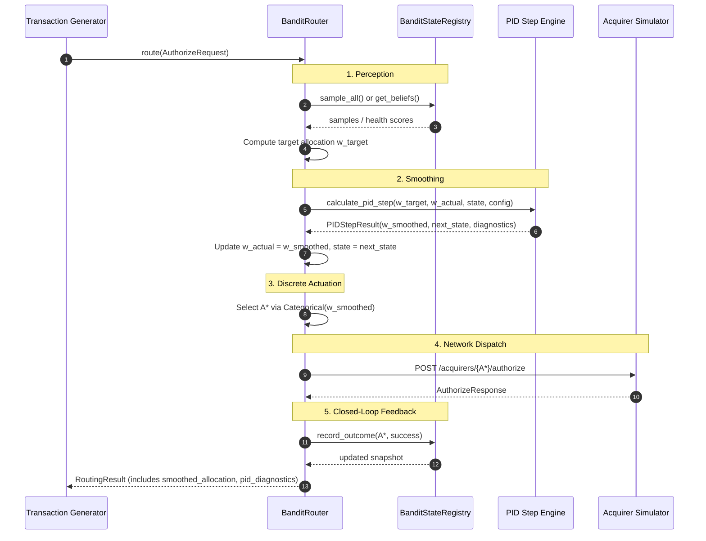

# Phase 4 Specification — The PID Control Layer

**Role**: Systems Architect
**Audience**: Backend Engineer, QA Engineer, Tech Lead
**Scope**: Phase 4 (PID Smoothing Engine, Bounded Simplex Projection, Gain Tuning)
**Status**: Settled Architecture Contract

---

## 1. Executive Summary & Component Boundary

Phase 3 proved that unbuffered Thompson Sampling exhibits severe control instability under stress:
1. **High-frequency route flapping**: 13 flips across 50 transactions in the crossover region, including 4 consecutive back-to-back flips (Tx 53–57).
2. **Discontinuous hard-switching**: Instantaneous, binary $0\% \leftrightarrow 100\%$ swings with zero easing or transition ramp.
3. **Dormant route starvation**: A recovered leader receiving $0$ out of $50$ transactions due to frozen event-driven decay.

Phase 4 introduces Loom's stabilizing actuator: **The PID Control Layer** (`router_core/pid.py`). The PID layer sits directly between the bandit's statistical perception engine (`BanditStateRegistry`) and the network dispatch actuator (`BanditRouter`), converting noisy, jumpy raw target allocations into a smooth, damped, continuous traffic-steering trajectory.

```
+-----------------------------------------------------------------------------------+
|                                  ROUTER CORE                                      |
|                                                                                   |
|  +--------------------+        +---------------------+        +----------------+  |
|  | Bandit State       |  raw   | PID Control Engine  | smooth | Discrete       |  |
|  | Registry           | target | (Pure Function Step)| alloc  | Actuator       |  |
|  | (Thompson Sampling | -----> |                     | -----> | (Stochastic or |  |
|  |  + EWMA Health)    | w_targ | P, I, D Math        | w_next |  Deficit RR)   |  |
|  +--------------------+        +---------------------+        +-------+--------+  |
|            ^                              |                           |           |
|            |                              v                           v           |
|            |                     PID Diagnostics Snapshot     Selected Acquirer   |
|            |                                                          |           |
+------------|----------------------------------------------------------|-----------+
             |                                                          |
             | outcome (x in {0, 1})                          HTTP POST | /authorize
             |                                                          v
    +--------+----------------------------------------------------------+-----------+
    |                     SIMULATED ACQUIRERS (acquirer_sim)                        |
    +-------------------------------------------------------------------------------+
```

### Architectural Mandates

1. **Decoupled Pure-Function Math (Ticket A)**:
   The core PID algorithm must be implemented as a side-effect-free pure function of its inputs:
   $$\mathbf{w}_{t+1}, \mathbf{S}_{t+1} = f_{\text{PID}}(\mathbf{w}_t^{\text{target}}, \mathbf{w}_t^{\text{actual}}, \mathbf{S}_t, \Delta t, \mathbf{K})$$
   It must not maintain hidden state, mutate globals, or perform I/O. All state is passed in via an immutable snapshot and returned as a new snapshot.

2. **Derivative-on-Measurement (Zero Derivative Kick)**:
   To prevent catastrophic derivative spikes ($K_d \frac{de}{dt}$) when the bandit's target allocation jumps discontinuously (e.g. $0.0 \to 1.0$), the derivative term must be computed from the rate of change of the **actual allocation** (process variable), not the error signal:
   $$D_t = - K_d \frac{w_t - w_{t-1}}{\Delta t}$$

3. **Anti-Windup Bounded Accumulator**:
   During prolonged outages, the integral term must not accumulate error without limit. The integrator must be bounded by a configurable symmetric threshold $I_{\text{max}}$ and support optional leaky integration ($\gamma_I$) to guarantee rapid recovery without overshoot.

4. **Mandatory Exploration Floor ($w_{\text{min}} \ge 3\%$)**:
   To resolve the post-outage route starvation identified by QA in Phase 3, the output allocation vector must be projected onto a bounded simplex where every active route receives at least $w_{\text{min}} = 0.03$.

5. **Empirical Iterative Tuning (Ticket B)**:
   Tuning $(K_p, K_i, K_d)$ is an iterative calibration process executed against Phase 3's exact outage scenario script (`scripts/run_qa_oscillation_scenario.py`) to achieve the "good damping" criteria defined in the PRD.

---

## 2. Review of the Phase 3 Baseline & Pathologies

The PID layer is engineered specifically to address the quantitative pathologies documented in `docs/phase3-qa-report.md`:

| Pathology in Phase 3 | Root Cause in Phase 3 | Phase 4 PID Solution | Quantitative Acceptance Target |
| :--- | :--- | :--- | :--- |
| **High-Frequency Flapping** (13 flips / 50 tx) | Winner-take-all argmax ($\arg\max_i \theta_i$) on overlapping Beta distributions near boundary ($\Delta \theta \le 0.0022$). | Continuous probability allocation; proportional error damping and derivative rate-limiting. | Crossover flips reduced from **13 flips down to $\le 2$**. |
| **Discontinuous Swings** ($0\% \leftrightarrow 100\%$) | Unbuffered hard-switching committing entire traffic stream to single arm. | Smooth allocation vector $\mathbf{w}_t \in [0, 1]^K$; discrete actuation via stochastic or deficit tracking. | Maximum allocation delta per transaction bounded to $\le 15\%$. |
| **Derivative Kick Sensitivity** | Differentiating raw stochastic Thompson samples yields infinite or explosive impulses. | **Derivative-on-Measurement** (rate of change of actual allocation) with low-pass filter. | Zero output spike on instantaneous target step. |
| **Post-Outage Route Starvation** (0/50 tx post-recovery) | Event-driven decay never steps unselected arms; recovered leader locked out. | **Bounded Simplex Projection** guaranteeing exploration floor $w_i \ge w_{\text{min}} = 0.03$. | Recovered leader receives $\ge 15\%$ traffic in first 25 recovery tx. |
| **Integral Windup Lag** | Persistent setpoint deficit during outage causes unbounded accumulator growth. | **Symmetric Clamping** ($[-I_{\text{max}}, +I_{\text{max}}]$) + leaky retention factor ($\gamma_I = 0.95$). | Integrator recovers within $\le 5$ transactions of setpoint reversal. |

---

## 3. The PID Interface Contract

### 3.1 Domain Models (`router_core/pid.py`)

```python
"""Domain models and pure-function step engine for the Phase 4 PID smoothing layer."""

from __future__ import annotations

from dataclasses import dataclass
from typing import Literal
from pydantic import BaseModel, ConfigDict, Field


class PIDConfig(BaseModel):
    """Immutable configuration for the PID smoothing controller."""

    model_config = ConfigDict(frozen=True, extra="forbid")

    kp: float = Field(
        default=0.20,
        ge=0.0,
        description="Proportional gain constant. Controls immediate reaction to allocation error.",
    )
    ki: float = Field(
        default=0.01,
        ge=0.0,
        description="Integral gain constant. Eliminates steady-state offset.",
    )
    kd: float = Field(
        default=0.10,
        ge=0.0,
        description="Derivative gain constant. Dampens oscillation and rate of change.",
    )
    integral_max: float = Field(
        default=1.0,
        gt=0.0,
        description="Anti-windup clamping limit for the accumulated error: [-integral_max, +integral_max].",
    )
    integral_decay: float = Field(
        default=1.0,
        gt=0.0,
        le=1.0,
        description="Leaky integration retention factor gamma_I in (0.0, 1.0]. 1.0 = standard clamped accumulator.",
    )
    derivative_filter_alpha: float = Field(
        default=0.0,
        ge=0.0,
        lt=1.0,
        description="First-order low-pass filter smoothing coefficient beta_d for derivative term.",
    )
    derivative_on_measurement: bool = Field(
        default=True,
        description="If True, derivative is computed on actual allocation change (-dw/dt) to eliminate derivative kick.",
    )
    min_allocation: float = Field(
        default=0.03,
        ge=0.0,
        lt=0.20,
        description="Exploration floor w_min per acquirer to prevent dormant route starvation.",
    )
    actuation_mode: Literal["stochastic", "deficit"] = Field(
        default="stochastic",
        description="Discrete transaction dispatch policy: 'stochastic' (categorical draw) or 'deficit' (Bresenham round-robin).",
    )


@dataclass(frozen=True, slots=True)
class PIDState:
    """Immutable snapshot of the PID controller internal state."""

    accumulated_error: dict[str, float]
    previous_error: dict[str, float]
    previous_allocation: dict[str, float]
    filtered_derivative: dict[str, float]
    step_count: int = 0

    @classmethod
    def initialize(
        cls, acquirer_ids: list[str], initial_allocation: dict[str, float] | None = None
    ) -> PIDState:
        """Create a clean, initialized PID state for registered acquirers."""
        k = len(acquirer_ids)
        if k == 0:
            raise ValueError("Cannot initialize PIDState with zero acquirers.")
        default_w = 1.0 / k
        alloc = initial_allocation or {aid: default_w for aid in acquirer_ids}
        return cls(
            accumulated_error={aid: 0.0 for aid in acquirer_ids},
            previous_error={aid: 0.0 for aid in acquirer_ids},
            previous_allocation=dict(alloc),
            filtered_derivative={aid: 0.0 for aid in acquirer_ids},
            step_count=0,
        )


@dataclass(frozen=True, slots=True)
class PIDDiagnostics:
    """Detailed point-in-time calculation telemetry for observability and live dashboard."""

    error: dict[str, float]
    p_term: dict[str, float]
    i_term: dict[str, float]
    d_term: dict[str, float]
    raw_delta: dict[str, float]
    pre_projection_allocation: dict[str, float]


@dataclass(frozen=True, slots=True)
class PIDStepResult:
    """Immutable result of a single PID smoothing step."""

    smoothed_allocation: dict[str, float]
    next_state: PIDState
    diagnostics: PIDDiagnostics
```

---

## 4. Mathematical Specification of the PID Engine

Let $\mathcal{A} = \{A_1, A_2, \dots, A_K\}$ be the set of $K \ge 1$ registered acquirers.
Let $\mathbf{w}_t^{\text{target}} \in [0, 1]^K$ be the bandit's target allocation at transaction $t$, with $\sum_{i=1}^K w_{t, i}^{\text{target}} = 1.0$.
Let $\mathbf{w}_t^{\text{actual}} \in [0, 1]^K$ be the current actual allocation, with $\sum_{i=1}^K w_{t, i}^{\text{actual}} = 1.0$ and $w_{t, i}^{\text{actual}} \ge w_{\text{min}}$.

### 4.1 Error Calculation
For each acquirer $i \in \mathcal{A}$:
$$e_{t, i} = w_{t, i}^{\text{target}} - w_{t, i}^{\text{actual}}$$

**Theorem (Zero-Sum Invariant)**:
Because both vectors reside on the probability simplex:
$$\sum_{i=1}^K e_{t, i} = \sum_{i=1}^K w_{t, i}^{\text{target}} - \sum_{i=1}^K w_{t, i}^{\text{actual}} = 1.0 - 1.0 = 0.0$$
Any floating-point imprecision ($|\sum e_{t, i}| > 10^{-12}$) is projected out via mean subtraction:
$$e_{t, i} \leftarrow e_{t, i} - \frac{1}{K} \sum_{j=1}^K e_{t, j}$$

---

### 4.2 Proportional Term ($P$)
The proportional term acts immediately on current discrepancy:
$$P_{t, i} = K_p \cdot e_{t, i}$$

---

### 4.3 Integral Term ($I$) with Anti-Windup Protection
To eliminate persistent steady-state offset without causing recovery lag:
1. **Accumulation with Leaky Retention**:
   $$I_{\text{raw}, i} = (\gamma_I \cdot I_{t-1, i}) + (e_{t, i} \cdot \Delta t)$$
   where $\gamma_I \in (0.0, 1.0]$ is `config.integral_decay` (default $1.0$).
2. **Symmetric Clamping (Anti-Windup Bound)**:
   $$I_{t, i} = \max\left(-I_{\text{max}}, \; \min\left(+I_{\text{max}}, \; I_{\text{raw}, i}\right)\right)$$
3. **Zero-Sum Centering**:
   $$I_{t, i} \leftarrow I_{t, i} - \frac{1}{K} \sum_{j=1}^K I_{t, j}$$
4. **Term Calculation**:
   $$I_{\text{term}, i} = K_i \cdot I_{t, i}$$

---

### 4.4 Derivative Term ($D$) and Derivative Kick Mitigation
In standard PID, $D = K_d \frac{de}{dt}$. But when the bandit's target steps abruptly:
$$\frac{d e}{dt} = \frac{d(w^{\text{target}} - w^{\text{actual}})}{dt} = \frac{d w^{\text{target}}}{dt} - \frac{d w^{\text{actual}}}{dt}$$
Because $w^{\text{target}}$ jumps discontinuously, $\frac{d w^{\text{target}}}{dt}$ is a Dirac delta impulse, causing a massive, destabilizing **derivative kick**.

**Architectural Solution: Derivative-on-Measurement**:
When `config.derivative_on_measurement = True`, the derivative is computed strictly on the rate of change of the process variable (the actual allocation):
$$\text{rate}_{t, i} = - \frac{w_{t, i}^{\text{actual}} - w_{t-1, i}^{\text{actual}}}{\Delta t}$$

When `config.derivative_on_measurement = False`:
$$\text{rate}_{t, i} = \frac{e_{t, i} - e_{t-1, i}}{\Delta t}$$

**First-Order Low-Pass Filter**:
To suppress high-frequency numerical jitter, the derivative rate is filtered:
$$D_{\text{filt}, t, i} = \beta_d \cdot D_{\text{filt}, t-1, i} + (1.0 - \beta_d) \cdot \text{rate}_{t, i}$$
where $\beta_d \in [0.0, 1.0)$ is `config.derivative_filter_alpha`.
The derivative term is:
$$D_{\text{term}, i} = K_d \cdot D_{\text{filt}, t, i}$$

---

### 4.5 Actuation Delta & Raw Allocation
$$\Delta u_{t, i} = P_{t, i} + I_{\text{term}, i} + D_{\text{term}, i}$$
$$\tilde{w}_{t+1, i} = w_{t, i}^{\text{actual}} + \Delta u_{t, i}$$

---

### 4.6 Bounded Simplex Projection with Exploration Floor ($w_{\text{min}}$)

Due to clamping, actuator bounds, and independent P/I/D terms, $\tilde{\mathbf{w}}_{t+1}$ may violate the constraints:
1. $w_{t+1, i} \ge w_{\text{min}}$ (exploration floor to prevent starvation)
2. $\sum_{i=1}^K w_{t+1, i} = 1.0$ (conservation of total traffic)

#### The Projection Algorithm:
Let $w_{\text{min}} = \text{config.min\_allocation}$. Precondition: $K \cdot w_{\text{min}} < 1.0$.

1. **Floor Clamping**:
   $$w_i^{(0)} = \max(w_{\text{min}}, \; \tilde{w}_{t+1, i}) \quad \forall i \in \mathcal{A}$$
2. **Deficit / Excess Calculation**:
   $$S = \sum_{i=1}^K w_i^{(0)}$$
   - If $|S - 1.0| \le 10^{-12}$: Done.
   - If $S > 1.0$ (Excess mass to remove):
     Identify the set of adjustable routes with headroom above the floor:
     $$\mathcal{J} = \{ j \in \mathcal{A} \mid w_j^{(0)} > w_{\text{min}} \}$$
     Excess to remove: $\Delta_{\text{excess}} = S - 1.0$.
     Total available headroom: $H = \sum_{j \in \mathcal{J}} (w_j^{(0)} - w_{\text{min}})$.
     If $H > 0$:
     $$w_j^{(1)} = w_j^{(0)} - \Delta_{\text{excess}} \cdot \frac{w_j^{(0)} - w_{\text{min}}}{H} \quad \forall j \in \mathcal{J}$$
     $$w_k^{(1)} = w_{\text{min}} \quad \forall k \notin \mathcal{J}$$
   - If $S < 1.0$ (Deficit mass to add):
     Deficit to add: $\Delta_{\text{deficit}} = 1.0 - S$.
     Distribute proportionally across all arms:
     $$w_i^{(1)} = w_i^{(0)} + \Delta_{\text{deficit}} \cdot \frac{w_i^{(0)}}{S}$$
3. **Exact Normalization**:
   $$w_{t+1, i} = \frac{w_i^{(1)}}{\sum_{j=1}^K w_j^{(1)}}$$
   Assert $w_{t+1, i} \ge w_{\text{min}} - 10^{-9}$ and $|\sum w_{t+1, i} - 1.0| \le 10^{-9}$.

---

## 5. Discrete Actuation & Routing Pipeline Integration

Payment authorizations are discrete and indivisible (a $\$50.00$ charge cannot be split $80\%/20\%$ across gateways). The continuous smoothed allocation vector $\mathbf{w}_{t+1} \in [0, 1]^K$ must govern discrete transaction routing.

### 5.1 Actuation Modes

1. **Stochastic Categorical Draw (`actuation_mode = "stochastic"`, Default)**:
   Each transaction selects route $A^*$ via a pseudo-random draw weighted by $\mathbf{w}_{t+1}$:
   $$P(\text{Route} = A_i) = w_{t+1, i}$$
   - *Pros*: Zero inter-transaction state; natural exploration matching probability matching; zero determinism coupling.
   - *Cons*: Generates slight binomial sampling jitter around the allocation trajectory.

2. **Deterministic Deficit Tracking (`actuation_mode = "deficit"`, Alternative)**:
   Maintains a virtual cumulative volume counter $V_i = \sum_{\tau=1}^t w_{\tau, i}$ and actual dispatched counter $C_i$. Dispatches the next transaction to the acquirer with the largest unsatisfied deficit:
   $$A^* = \arg\max_{i \in \mathcal{A}} (V_i - C_i)$$
   - *Pros*: Completely eliminates discrete binomial jitter; produces mathematically exact flow pacing (Bresenham duty-cycling).
   - *Cons*: Requires tracking cumulative dispatch state across transactions.

### 5.2 Updated Transaction Flow Sequence



---

## 6. Ticket A Specification: Pure-Function PID Step Engine

### 6.1 Objective & Boundaries
Implement the complete mathematical step engine in `router_core/pid.py` with 100% test coverage in `tests/router_core/test_pid.py`.

- **Target File**: `router_core/pid.py`
- **Test File**: `tests/router_core/test_pid.py`
- **Deliverables**:
  1. `PIDConfig`, `PIDState`, `PIDDiagnostics`, `PIDStepResult` dataclasses/Pydantic models.
  2. `calculate_pid_step(...)` pure function.
  3. `project_to_bounded_simplex(weights, min_floor)` utility.
  4. Unit test suite verifying:
     - Pure function determinism (identical inputs produce identical outputs).
     - Proportional reaction to step error.
     - Anti-windup accumulator bounding at $\pm I_{\text{max}}$.
     - Zero derivative kick under `derivative_on_measurement=True`.
     - Exact simplex projection with floor $w_i \ge w_{\text{min}}$.
     - Degenerate single-acquirer ($K=1$) and multi-acquirer ($K=3, 5$) safety.
     - Robustness to zero and negative $dt$ (must raise `ValueError`).

### 6.2 Pure Function Signature

```python
def calculate_pid_step(
    target_allocation: dict[str, float],
    current_allocation: dict[str, float],
    state: PIDState,
    config: PIDConfig,
    dt: float = 1.0,
) -> PIDStepResult:
    """Execute a single discrete PID control step as a pure, deterministic function."""
```

### 6.3 Ticket A Verification Test Vectors

| Test Case ID | Description | Input Conditions | Expected Behavior |
| :--- | :--- | :--- | :--- |
| `TC-PID-01` | **Proportional Response** | $K_p = 0.5, K_i = 0, K_d = 0$, $w^{\text{target}} = (1.0, 0.0)$, $w^{\text{actual}} = (0.5, 0.5)$. | Error $e = (+0.5, -0.5)$. Delta $\Delta u = (+0.25, -0.25)$. New smoothed allocation $w^{\text{smoothed}} = (0.75, 0.25)$. |
| `TC-PID-02` | **Anti-Windup Clamping** | Sustained error $e_A = -0.5$ over 100 steps with $I_{\text{max}} = 1.0, \Delta t = 1.0$. | Accumulated error clamps strictly at $-1.0$. Does NOT grow to $-50.0$. |
| `TC-PID-03` | **Derivative Kick Elimination** | $w^{\text{target}}$ steps instantly from $(0.9, 0.1)$ to $(0.1, 0.9)$. $w^{\text{actual}}$ unchanged. | With `derivative_on_measurement=True`, derivative term $D = 0.0$ on step turn. Zero kick. |
| `TC-PID-04` | **Exploration Floor Enforcement** | Severe outage drives $w_A$ toward 0.0 with $w_{\text{min}} = 0.03$. | Output allocation guarantees $w_A \ge 0.03$, $\sum w_i = 1.0$. |
| `TC-PID-05` | **Zero-Sum Centering** | Clamped integral accumulator across 3 arms. | $\sum_{i=1}^3 I_{t, i} = 0.0$ to within $10^{-12}$. |
| `TC-PID-06` | **Degenerate Single Arm** | $K=1$, `acquirer_alpha` only. | Output trivially $\{ \text{acquirer\_alpha}: 1.0 \}$, zero error. |

---

## 7. Ticket B Specification: Empirical Gain Tuning & Damping Verification

### 7.1 Objective & Boundaries
Tune the gain constants $(K_p, K_i, K_d)$ and integrate the PID engine into `BanditRouter` to achieve the "good damping" criteria against Phase 3's exact outage scenario script.

- **Target Files**:
  - `router_core/router.py`: Integrate PID step into `BanditRouter`.
  - `router_core/models.py`: Update `RouterConfig` with `pid_config: PIDConfig`.
  - `scripts/run_qa_oscillation_scenario.py`: Add PID evaluation mode.
  - `scripts/tune_pid_gains.py`: Parameter sweep harness for gain calibration.
  - `tests/router_core/test_pid_tuning.py`: Automated verification of tuned damping criteria.

### 7.2 Why Ticket B is Iterative, Not a One-Shot Task
PID gain tuning for discrete payment routing cannot be solved with pure continuous Laplace transforms (Ziegler-Nichols classical equations) because:
1. **Discrete Transaction Granularity**: Actuation occurs on individual indivisible transactions, not a continuous fluid flow.
2. **Coupled Non-Linear Decay**: The bandit's belief decay ($\gamma = 0.95$) continuously changes setpoint confidence while the PID controller acts.
3. **Exploration Floor Interaction**: The $3\%$ exploration floor creates a non-linear saturation boundary during deep outages.

Engineers must run iterative sweeps across the parameter search grid:
- $K_p \in [0.05, 0.40]$ (step $0.05$)
- $K_i \in [0.001, 0.05]$ (step $0.005$)
- $K_d \in [0.05, 0.50]$ (step $0.05$)

### 7.3 Quantitative Acceptance Criteria for Ticket B

All criteria are evaluated on the identical Phase 3 scenario (Seed=777, Alpha 95%, Beta 94%, Outage at Tx 50, Recovery at Tx 100):

| Metric | Phase 3 Baseline (No PID) | Phase 4 Tuned Acceptance Gate | Verification Method |
| :--- | :--- | :--- | :--- |
| **Crossover Flip Frequency** | **13 flips** in Tx 51–100 | **$\le 2$ transitions** in continuous allocation | `test_pid_eliminates_crossover_flapping` |
| **Maximum Allocation Delta** | **100% cliff** (discontinuous jump) | **$\le 15\%$ delta** per transaction | Trace analysis of $|\Delta w_t|$ |
| **Damping Overshoot / Ringing** | High-frequency ringing (Tx 53–57 A-B-A-B-A) | **$< 5\%$ overshoot** past steady state; zero chatter | Monotonic or near-monotonic easing curve |
| **Dormant Route Recovery** | **0 / 50 tx** (0.0% traffic to recovered leader) | **$\ge 15\%$ traffic** within first 25 tx post-recovery | `test_recovered_leader_traffic_restoration` |
| **Overall Scenario PSR** | Baseline unbuffered PSR | **Equal or higher PSR** than Phase 3 baseline | Benchmark run comparison |

---

## 8. Non-Functional Requirements & Performance Budgets

| Metric / Boundary | Budget Target | Upper Bound | Architectural Justification |
| :--- | :--- | :--- | :--- |
| **`calculate_pid_step` Latency** | $< 5.0\ \mu\text{s}$ | $< 25.0\ \mu\text{s}$ | Pure floating-point math across $K=2$ to $5$ arms. Must never bottleneck router. |
| **Simplex Projection Latency** | $< 2.0\ \mu\text{s}$ | $< 10.0\ \mu\text{s}$ | Single-pass clamping and bounded water-filling reduction. |
| **Total Added Router Latency** | $< 10.0\ \mu\text{s}$ | $< 50.0\ \mu\text{s}$ | Leaves $> 99.9\%$ of latency budget for acquirer HTTP round-trip. |
| **Memory Footprint per Arm** | $< 200\ \text{bytes}$ | $< 1\ \text{KB}$ | Immutable dataclass slots for state tracking. |
| **Numerical Precision** | Double precision (`float64`) | N/A | Total allocation sum strictly conserved: $|\sum w_i - 1.0| \le 10^{-9}$. |

---

## 9. Architecture Decision Records (ADRs)

### ADR-01: Pure Function Decoupled Step Engine
- **Context**: The PID engine must calculate smoothed allocations from target allocations and state.
- **Alternatives Considered**:
  1. Stateful object with mutable instance variables (`self.accumulated_error += err`).
  2. Free function with global state dictionary.
  3. Pure function taking state snapshot and returning new state snapshot.
- **Decision**: Option 3 (Pure function).
- **Cost**: Caller must pass state and capture returned state snapshot.
- **Benefit**: 100% deterministic, zero side-effects, perfectly reproducible test vectors, and clean integration into async event loops without race conditions.

### ADR-02: Derivative-on-Measurement
- **Context**: Discontinuous jumps in bandit target allocation induce explosive derivative spikes if differentiating error ($de/dt$).
- **Alternatives Considered**:
  1. Derivative on error ($de/dt$) with raw values.
  2. Heavy low-pass filtering on error derivative.
  3. Derivative on measurement ($-dw^{\text{actual}}/dt$).
- **Decision**: Option 3 (Derivative on measurement), optionally combined with mild low-pass filtering.
- **Cost**: Does not anticipate sudden target changes via the D term.
- **Benefit**: Completely eliminates derivative kick. The derivative acts as a viscous dashpot against rapid movements of the actual traffic allocation, guaranteeing smooth damping.

### ADR-03: Anti-Windup Clamping & Leaky Integration
- **Context**: During deep outages, setpoint errors persist for dozens of transactions, causing unbounded integral windup and delayed recovery.
- **Alternatives Considered**:
  1. Unbounded integrator.
  2. Back-calculation anti-windup.
  3. Symmetric accumulator clamping ($[-I_{\text{max}}, +I_{\text{max}}]$) with leaky decay ($\gamma_I$).
- **Decision**: Option 3.
- **Cost**: May have slight residual offset if $I_{\text{max}}$ is set too small.
- **Benefit**: Prevents recovery lag; mathematically bounds integral contribution to $K_i \cdot I_{\text{max}}$.

### ADR-04: Mandatory Exploration Floor ($w_{\text{min}} \ge 3\%$)
- **Context**: Phase 3 proved that recovered acquirers are permanently starved under event-driven decay because unselected routes experience zero state updates.
- **Alternatives Considered**:
  1. Background timer decay on unselected arms.
  2. Epsilon-greedy random probing outside PID.
  3. Bounded simplex projection enforcing $w_i \ge w_{\text{min}}$ inside PID.
- **Decision**: Option 3.
- **Cost**: Commits up to $K \cdot w_{\text{min}}$ of traffic to non-optimal arms during an outage.
- **Benefit**: Solves dormant route recovery natively inside the control loop without extra background threads, timers, or ad-hoc probe routing layers.

---

## 10. Hand-Off Checklist for Backend Engineer & QA

### Phase 4 Implementation Order

1. [ ] **Ticket A (`router_core/pid.py`)**:
   - [ ] Implement `PIDConfig`, `PIDState`, `PIDDiagnostics`, `PIDStepResult`.
   - [ ] Implement `project_to_bounded_simplex(weights, min_floor)`.
   - [ ] Implement `calculate_pid_step(...)` as a pure function.
   - [ ] Implement `tests/router_core/test_pid.py` covering all test cases `TC-PID-01` through `TC-PID-06`.

2. [ ] **Pipeline Wiring (`router_core/router.py`, `router_core/models.py`)**:
   - [ ] Add `pid_config: PIDConfig` to `RouterConfig`.
   - [ ] Instantiate `PIDState` inside `BanditRouter.__init__`.
   - [ ] Update `BanditRouter.route` to invoke `calculate_pid_step` between sampling and dispatch.
   - [ ] Implement `stochastic` and `deficit` discrete actuation modes.
   - [ ] Include `smoothed_allocation` and `pid_diagnostics` in `RoutingResult`.

3. [ ] **Ticket B Tuning & Scenario Verification (`scripts/`, `tests/`)**:
   - [ ] Create `scripts/tune_pid_gains.py` parameter sweep tool.
   - [ ] Tune $(K_p, K_i, K_d)$ against `scripts/run_qa_oscillation_scenario.py` (seed=777).
   - [ ] Verify flip reduction ($\le 2$ transitions) and smooth easing curve.
   - [ ] Verify post-outage route recovery ($\ge 15\%$ traffic in first 25 recovery tx).
   - [ ] Implement automated regression tests in `tests/router_core/test_pid_tuning.py`.
