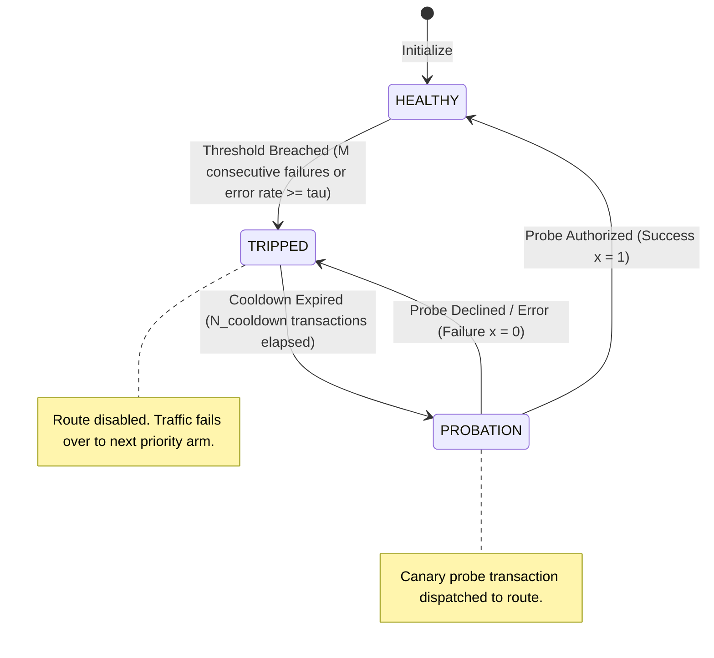

# Phase 6 Specification — Static Baseline Router & Apples-to-Apples PSR Comparison

**Role**: Systems Architect
**Audience**: Backend Engineer, Data Engineer, QA Engineer, Tech Lead
**Scope**: Phase 6 (Static Baseline Router, Apples-to-Apples Pipeline Equality, PSR-Lift Benchmark)
**Status**: Settled Architecture Contract

---

## 1. Executive Summary & Component Boundary

In Phases 1 through 5, Loom constructed its dynamic, closed-loop payment routing system:
1. **Perception**: Decayed Thompson Sampling belief updating ($\alpha, \beta$) and EWMA operational health tracking ($H$) (`router_core/state.py`, `router_core/bandit.py`).
2. **Ground Truth**: Simulated payment gateways with controllable availability, step-function outages, and artificial latencies (`acquirer_sim`).
3. **Actuation**: Proportional-Integral-Derivative (PID) smoothing engine projecting allocations onto a bounded simplex ($w_{\text{min}} \ge 3\%$) to eliminate oscillation ringing and route starvation (`router_core/pid.py`).
4. **Data Layer**: High-throughput Redis live health persistence, Pub/Sub event broadcasting, and engine-enforced append-only SQLite metrics logging (`data_layer/`).

The PRD establishes Loom's primary value proposition: **Payment Success Rate (PSR) Lift**. A 1% drop in PSR removes 1% of top-line revenue from an enterprise merchant, dwarfing minor basis-point fee optimizations. However, asserting "PSR lift" is meaningless in an engineering vacuum. Without an authentic, rigorous baseline executing under identical conditions, any claimed lift is unfalsifiable marketing.

**Phase 6 defines the Static Baseline Router (`baseline_router/`) and the comparative evaluation pipeline (`scripts/compare_psr.py`)**.

### The Core Architectural Mandate: Apples-to-Apples Pipeline Equality
The static baseline router must **not** be a separate mock script or an off-line statistical simulation that happens to generate a synthetic number. It must execute through the **exact same runtime pipeline** as Loom's real router:
- **Exact Same Network Layer**: Dispatches transactions over HTTP via pooled `httpx.AsyncClient` to the exact same Phase 2 `acquirer_sim` instances (`POST /acquirers/{id}/authorize`), subject to identical network timeouts, latency jitter, and socket concurrency.
- **Exact Same Logging Schema**: Emits the identical `RoutingResult` envelope directly into the exact same Phase 5 SQLite logging schema (`transactions` and `acquirer_outcomes` tables in `data_layer/schema.sql`) via the exact same `MetricsLogger` / `SQLiteMetricsStore`.
- **Exact Same Workload & Failure Scenarios**: Driven by the exact same synthetic transaction generator (`scripts/generate_transactions.py`) subject to identical traffic pacing (e.g. 20 TPS Poisson arrival) and identical outage injection timelines (`scripts/simulate_outage.py`).

```
                              +-------------------------------------------------------------+
                              |         Synthetic Transaction Generator (scripts/)          |
                              |         - Rate-controlled Poisson / Deterministic Pacing     |
                              |         - Identical AuthorizeRequest payloads & UUIDs        |
                              +------------------------------+------------------------------+
                                                             |
                              +------------------------------+------------------------------+
                              |                                                             |
                              v                                                             v
               +-----------------------------+                               +-----------------------------+
               |     Loom Dynamic Router     |                               |   Static Baseline Router    |
               |  (Thompson Sampling + PID)  |                               | (Priority List + Threshold) |
               +--------------+--------------+                               +--------------+--------------+
                              |                                                             |
                              |  POST /acquirers/{id}/auth                                  |  POST /acquirers/{id}/auth
                              v                                                             v
               +--------------------------------------------------------------------------------------------+
               |                       Simulated Acquirer Cluster (acquirer_sim)                            |
               |                       - Acquirer Alpha (Primary: 95% base PSR, Outage Target)              |
               |                       - Acquirer Beta  (Secondary: 90% base PSR)                           |
               |                       - Acquirer Gamma (Tertiary: 85% base PSR)                            |
               +--------------------------------------------------------------------------------------------+
                              |                                                             |
                              |  Log RoutingResult                                          |  Log RoutingResult
                              v                                                             v
               +-----------------------------+                               +-----------------------------+
               |  SQLite Ledger: Loom DB     |                               |  SQLite Ledger: Baseline DB |
               |  (data_layer/schema.sql)    |                               |  (data_layer/schema.sql)    |
               +--------------+--------------+                               +--------------+--------------+
                              |                                                             |
                              +------------------------------+------------------------------+
                                                             |
                                                             v
                                              +-----------------------------+
                                              | Comparative Analysis Engine |
                                              |   (scripts/compare_psr.py)  |
                                              |   - Delta PSR (Loom - Base) |
                                              |   - Allocation Smoothness   |
                                              |   - Outage Absorption Delta |
                                              +-----------------------------+
```

### The Static Routing Rule Directive: Authentic Industry Behavior (No Strawmen)
Per Unit 2 of the payments syllabus, production static routers operate on a **fixed priority list with a static failover threshold**:
1. **Fixed Priority Order**: Merchants establish an ordered preference list (e.g. $[A, B, C]$) reflecting commercial interchange agreements, volume-tier discounts, or routing rules (Priority 1: Acquirer Alpha, Priority 2: Acquirer Beta, Priority 3: Acquirer Gamma).
2. **Static Failover Threshold**: All traffic routes to Priority 1 until an unhealthiness threshold trips (e.g., $M = 3$ consecutive failures, or a rolling error rate $\ge \tau$ over window $W$). Once tripped, the router demotes Priority 1 and fails over 100% of subsequent volume to Priority 2.
3. **Cooldown & Failback**: The primary route enters a cooldown window ($N_{\text{cooldown}}$ transactions). Once the cooldown expires, the router evaluates recovery via a canary probe transaction or a snap-back.

> [!IMPORTANT]
> The baseline router must **reproduce the two classic failure modes of static routing honestly: herd migration and slow failover**.
>
> We must not construct a "strawman" baseline (e.g. a router that never fails over, or one that flips randomly on a coin toss). Real static routers in high-throughput payment systems (Shopify, Uber, Netflix, Spreedly, Primer) are designed by competent engineers using circuit breakers and priority lists.
>
> The failures of static routing are **mathematically inevitable consequences of fixed thresholds without derivative awareness or continuous learning**, not implementation bugs. The baseline comparison only carries scientific weight if the competitor is a fair, industry-standard implementation.

### Explicit Scope Boundaries

- **In Scope for Phase 6**:
  - `StaticBaselineRouter` core engine in `baseline_router/router.py` executing priority-based selection, static threshold evaluation, and state transitions.
  - Domain models in `baseline_router/models.py` defining priority configurations, threshold modes, and state snapshots.
  - Strict contract parity with Phase 2 `acquirer_sim` HTTP `/authorize` API.
  - Strict schema parity with Phase 5 SQLite logging schema (`transactions` and `acquirer_outcomes` tables in `data_layer/schema.sql`).
  - Native integration with `data_layer.sqlite_logger.MetricsLogger` and `SQLiteMetricsStore`.
  - Honest reproduction of **herd migration** (instantaneous 100% traffic step-function) and **slow failover** (bleeding $M$ failures during hard outage; complete blind-spot paralysis under gray failures/brownouts).
  - Comparative evaluation orchestration script (`scripts/compare_psr.py`) computing segmented PSR lift ($\Delta \text{PSR}$), transaction delta, and allocation smoothness metrics across pre-outage, outage, and recovery windows.
  - Comprehensive unit and integration test suite (`tests/baseline_router/`).

- **Explicitly Out of Scope for Phase 6**:
  - Modifying `router_core/` (Thompson Sampling or PID code) — all Phase 1–5 implementations remain 100% untouched.
  - Altering the SQLite DDL schema in `data_layer/schema.sql` (baseline metrics must conform to the existing schema).
  - React dashboard or WebSocket visualization (belongs to Phase 7).
  - Value-scaled exploration or transaction amount-based rules (belongs to Phase 8).
  - Inline multi-arm retry cascades on single transactions (permanently out of scope for primary routing).

---

## 2. Tech Stack & Repository Ground Rules

Per `docs/CONSTITUTION.md`, all components strictly adhere to the pinned repository conventions:

- **Language**: Python 3.11+
- **HTTP Client**: `httpx>=0.27.0` (asynchronous pooled client)
- **Data Validation & Schemas**: `pydantic>=2.6.0` (Pydantic v2 strict models)
- **Storage & Analytics**: Python standard library `sqlite3` and `aiosqlite>=0.20.0`
- **Data Layer Contract**: `data_layer/schema.sql`, `data_layer.sqlite_logger.MetricsLogger`, `data_layer.sqlite_logger.SQLiteMetricsStore`

### Directory Layout

```
loom/
├── baseline_router/                 # [Phase 6 NEW] Static Rule-Based Router Module
│   ├── __init__.py                  # Package exports: StaticBaselineRouter, BaselineRouterConfig
│   ├── models.py                    # [Phase 6 NEW] Priority configs, thresholds, route states
│   └── router.py                    # [Phase 6 NEW] Execution pipeline, failover logic, HTTP dispatch
├── scripts/
│   ├── README.md
│   ├── generate_transactions.py     # [Phase 3] Paced synthetic transaction generator
│   ├── simulate_outage.py           # [Phase 3] Acquirer outage orchestrator
│   └── compare_psr.py               # [Phase 6 NEW] End-to-end benchmark & PSR lift comparator
└── tests/
    └── baseline_router/             # [Phase 6 NEW] Test suite mirroring module structure
        ├── __init__.py
        ├── test_models.py           # Unit tests for configs, thresholds, and state validation
        ├── test_router.py           # Unit tests for priority routing, tripping, and failback
        ├── test_pathologies.py      # Targeted verification of herd migration & slow failover
        └── test_pipeline_parity.py  # Contract parity verification with Phase 2 HTTP & Phase 5 SQLite
```

---

## 3. The Static Routing Rule Specification (Unit 2 Architecture)

In real-world payment infrastructures, merchants route payments according to commercial priority. Primary routes offer the lowest basis-point processing fees, contracted volume discounts, or preferred domestic interchange rates. Secondary and tertiary routes provide disaster redundancy but carry higher transaction fees or inferior SLA agreements.

### 3.1 Priority Hierarchy Configuration
The router is configured with an ordered sequence of candidate acquirer routes:

$$\mathcal{P} = [A_1, A_2, \dots, A_K]$$

Where:
- $A_1$: Primary Acquirer (Highest preference; receives 100% of volume under healthy conditions).
- $A_2$: Secondary Acquirer (First failover tier; receives 0% of volume unless $A_1$ trips).
- $A_3$: Tertiary Acquirer (Disaster fallback; receives 0% of volume unless both $A_1$ and $A_2$ trip).

### 3.2 Route Health State Machine
Each configured route maintains an independent health state machine:



1. **`HEALTHY`**:
   - The route is fully operational and eligible for traffic.
   - If this route is the highest-priority `HEALTHY` route in $\mathcal{P}$, it receives **100% of incoming transactions**.
   - Consecutive failure counter is active: $C_{\text{fail}} = 0$.
2. **`TRIPPED`**:
   - The route's circuit breaker has tripped due to threshold breach.
   - The route receives **0% of normal traffic**.
   - It remains locked in `TRIPPED` until a cooldown window of $N_{\text{cooldown}}$ global transactions has elapsed.
3. **`PROBATION` (Canary Cooldown Evaluation)**:
   - The cooldown window has expired. The route is granted permission to process **exactly one probe transaction**.
   - If the probe succeeds ($x = 1$): The route immediately transitions to `HEALTHY`, resets $C_{\text{fail}} = 0$, and reclaims its position in the priority hierarchy.
   - If the probe fails ($x = 0$): The route immediately reverts to `TRIPPED`, and the cooldown timer resets for another $N_{\text{cooldown}}$ transactions.

### 3.3 Failover Threshold Mechanics
To ensure scientific rigor and match industry standards, the baseline router supports two distinct threshold evaluation modes:

#### Mode 1: Consecutive Failure Threshold (Default & Primary Standard)
A route trips if it absorbs $M$ consecutive transaction failures:

$$\text{Trip Condition}: \quad C_{\text{fail}} \ge M$$

- **Industry Setting**: $M = 3$ (aggressive failover) or $M = 5$ (conservative failover).
- **State Reset**: Any authorized transaction immediately resets $C_{\text{fail}} \leftarrow 0$.
- **Failure Definition**: Any outcome resulting in $x = 0$ (HTTP 200 with `authorized: false`, HTTP 503 gateway outage, or network timeout).

#### Mode 2: Sliding Window Failure Rate Threshold (Configurable Alternative)
A route trips if its failure rate across a rolling FIFO window of the last $W$ transactions meets or exceeds threshold $\tau$:

$$\text{Trip Condition}: \quad \frac{1}{W} \sum_{j=1}^W (1 - x_j) \ge \tau \quad \text{for } N_{\text{history}} \ge W_{\text{min}}$$

- **Industry Setting**: Window size $W = 20$, failure threshold $\tau = 0.20$ (20% error rate), minimum sample $W_{\text{min}} = 10$.

### 3.4 Complete Routing Algorithm (Pseudocode)

```python
def select_route(priority_list, route_states, global_tx_counter):
    # 1. Check if any higher-priority TRIPPED route has completed cooldown
    for acquirer_id in priority_list:
        state = route_states[acquirer_id]
        if (
            state.status == "TRIPPED"
            and (global_tx_counter - state.tripped_at_tx) >= config.cooldown_transactions
        ):
            state.status = "PROBATION"
            return acquirer_id  # Dispatch canary probe to evaluate recovery

    # 2. Select the first available HEALTHY route in priority order
    for acquirer_id in priority_list:
        state = route_states[acquirer_id]
        if state.status == "HEALTHY":
            return acquirer_id

    # 3. Exhaustion Fallback: If all routes are TRIPPED/PROBATION, route to Primary
    return priority_list[0]


def record_outcome(selected_acquirer, success, route_states, global_tx_counter):
    state = route_states[selected_acquirer]
    state.total_count += 1

    if success:
        state.success_count += 1
        state.consecutive_failures = 0
        if state.status == "PROBATION":
            state.status = "HEALTHY"
    else:
        state.failure_count += 1
        state.consecutive_failures += 1
        if state.status == "PROBATION":
            state.status = "TRIPPED"
            state.tripped_at_tx = global_tx_counter
        elif (
            state.status == "HEALTHY" and state.consecutive_failures >= config.failover_threshold
        ):
            state.status = "TRIPPED"
            state.tripped_at_tx = global_tx_counter
```

---

## 4. Honest Pathology Reproduction: Herd Migration & Slow Failover (No Strawmen)

The PRD explicitly states:
> *"Static, rule-based routers have two failure modes and they're mirror images of each other: overreact to a two-second blip and you get herd migration onto a route that wasn't provisioned for the sudden traffic; underreact and you bleed transactions to a route that's been dying for ten minutes. Both failures trace back to the same root cause — a fixed threshold has no concept of duration or trend, so it can't tell a blip from a real outage."*

To ensure the baseline comparison is scientifically convincing, Phase 6 must reproduce these two pathologies faithfully.

### 4.1 Pathology 1: Herd Migration (The Step-Function Stampede)

#### The Mechanism
In Loom's dynamic router, when Primary Acquirer Alpha degrades, the PID controller gradually sheds traffic according to an exponential easing curve ($w_{\text{Alpha}}: 0.82 \to 0.65 \to 0.53 \to 0.42 \dots \to 0.03$). The rate of reallocation is strictly bounded ($\Delta w_{\text{max}} < 12\%$).

In the static baseline router, traffic reallocation is a **pure Heaviside step function**:
- At transaction $t$: Acquirer Alpha has 2 failures. Allocation: $w_{\text{Alpha}} = 1.0, w_{\text{Beta}} = 0.0$.
- At transaction $t+1$: Acquirer Alpha incurs its 3rd failure. Threshold trips.
- At transaction $t+2$: Allocation: **$w_{\text{Alpha}} = 0.0, w_{\text{Beta}} = 1.0$**.

```
Traffic Share
  100% |-----------+ (Alpha)
       |           |
       |           | <--- DISCRETE STEP JUMP (Delta w = 100.0%)
       |           |
    0% +-----------+-----------------------
                   |
  100% |           +----------------------- (Beta Herd Surge)
       |           |
    0% +-----------+
             Transaction t+1 (Trip Event)
```

#### Real-World Operational Impact
In enterprise payment architectures:
1. **Secondary Route Capacity Saturation**: Secondary acquirers are provisioned for backup traffic (e.g. 10–20 TPS), not the full merchant volume (100 TPS). An instantaneous 100% step jump swamps connection pools, exhausts database thread pools, and triggers HTTP 429 rate-limiting.
2. **Thundering Herd Flapping (Snapback Oscillation)**: When Acquirer Alpha's cooldown expires ($N_{\text{cooldown}}$), the router sends a probe or snaps back. If Alpha recovers momentarily and then drops another 3 transactions, traffic stampedes back and forth ($A \to B \to A \to B$). The static router lacks velocity damping (derivative control), producing severe square-wave oscillation.

### 4.2 Pathology 2: Slow Failover & Gray Failure Paralysis (The Threshold Blind Spot)

#### 1. The Total Cliff Outage Delay Tax
When an acquirer suffers a sudden catastrophic collapse ($p = 0.00$, e.g. complete network partition or fiber cut):
- The static router **must absorb exactly $M$ consecutive customer failures** before it can act.
- With $M = 3$, exactly 3 customer payments are destroyed. With $M = 5$, 5 payments are destroyed.
- Loom's Bayesian belief updates degrade $\mathbb{E}[\theta]$ on the very first failure, beginning traffic reduction immediately.

#### 2. The Gray Failure / Brownout Blind Spot (Catastrophic Revenue Bleed)
The fatal vulnerability of static threshold routing is the **gray failure** (partial degradation). Suppose Acquirer Alpha does not experience a 100% outage, but degrades to an effective PSR of $p = 60\%$ (a 40% failure rate).

Under a consecutive failure rule ($M = 3$):
- What is the probability that 3 consecutive transactions fail?
  $$P(\text{Trip}) = (1 - p)^3 = (0.40)^3 = 0.064 \quad (6.4\%)$$
- Every time a single transaction succeeds ($P = 60\%$), the consecutive failure counter resets to zero:
  $$C_{\text{fail}} \leftarrow 0$$
- Transaction Sequence Example:
  `[FAIL, FAIL, PASS (reset), FAIL, PASS (reset), FAIL, FAIL, PASS (reset), FAIL, FAIL, FAIL (trip)]`
- On average, the static router requires:
  $$\mathbb{E}[N_{\text{trials to trip}}] = \frac{1 - (1 - p)^M}{p(1 - p)^M} = \frac{1 - (0.40)^3}{0.60 \times (0.40)^3} = \frac{1 - 0.064}{0.60 \times 0.064} \approx 24.38 \text{ transactions}$$
- During these 24 transactions, the merchant absorbs $\approx 10$ failed transactions while the static router continues routing 100% of volume to the dying acquirer, completely blind to the 40% failure trend!

```
Cumulative Failures Absorbed during 40% Brownout
  Failures |
       10  |                            * (Static Router Trips at Tx 25)
        8  |                    *   *
        6  |            *   *
        4  |        *
        2  |    *   (Loom PID already diverts >80% of volume by Tx 10)
        0  +----+---+---+---+---+---+---+---> Transactions
           0    5   10  15  20  25
```

### 4.3 Why This Baseline Is Not a Strawman
A "strawman" baseline would be:
- A router that has no failover at all (routes 100% to A forever).
- A router that flips on a random 50/50 coin toss.
- A router that trips on 1 failure with no cooldown, causing perpetual chatter.

Our baseline represents the **exact, production-grade circuit breaker pattern implemented in enterprise payment gateways**:
- It has priority ordering to maximize contractual savings.
- It has a debounce threshold ($M \ge 3$) to prevent flapping on transient card declines.
- It has an automated cooldown and probe recovery mechanism.

The vulnerabilities demonstrated are not implementation defects; they are the **inherent, mathematical limitations of memoryless static thresholds**. Proving Loom's PSR lift against this honest, competent baseline gives the project unquestionable scientific credibility.

---

## 5. Apples-to-Apples Pipeline Equality & Contract Parity

To ensure the comparative PSR measurement is mathematically valid, the static baseline router must share the exact runtime contracts established in Phase 2 and Phase 5.

### 5.1 Acquirer Service Contract Parity (Phase 2)
The baseline router communicates with the simulated acquirer services using the exact same interface as Loom's `BanditRouter`:
1. **Network Transport**: Uses `httpx.AsyncClient` with pooled HTTP/1.1 connections:
   - `max_connections = 100`
   - `max_keepalive_connections = 20`
   - `timeout_sec = 2.0`
2. **Endpoint Contract**: Targets `POST {base_url}/acquirers/{acquirer_id}/authorize`.
3. **Payload Parity**: Sends `AuthorizeRequest` (same amounts, currencies, merchant IDs, and UUID transaction IDs).
4. **Outcome Classification Mapping**:
   - `HTTP 200` + `authorized: True` $\implies$ Success ($x = 1.0$), `status = "AUTHORIZED"`.
   - `HTTP 200` + `authorized: False` $\implies$ Business Decline ($x = 0.0$), `status = "DECLINED"`, captures `decline_code`.
   - `HTTP 503` (Service Unavailable) $\implies$ Gateway Outage ($x = 0.0$), `status = "ERROR"`.
   - `httpx.TimeoutException` / `httpx.NetworkError` $\implies$ Network Failure ($x = 0.0$), `status = "ERROR"`.
   - `HTTP 422` (Validation Error) $\implies$ Raises client exception (do not penalize acquirer).

### 5.2 SQLite Logging Schema Parity (Phase 5)
The baseline router writes directly to the SQLite schema defined in `data_layer/schema.sql` via `data_layer.sqlite_logger.MetricsLogger` or `SQLiteMetricsStore`. It produces an identical `RoutingResult` envelope.

#### Column Mapping Contract for `transactions` Table:

| Column Name | SQLite Type | Phase 4/5 Loom Value | Phase 6 Static Baseline Value | Parity Rationale |
| :--- | :--- | :--- | :--- | :--- |
| `transaction_id` | `TEXT UNIQUE` | Request UUID | Request UUID | **Exact match**: Echoed from request. |
| `timestamp` | `REAL` | Epoch float | Epoch float | **Exact match**: Point-in-time routing timestamp. |
| `chosen_acquirer` | `TEXT` | Thompson / PID selected ID | Active priority arm ID | **Exact match**: Acquirer handling payment. |
| `allocation_weight`| `REAL` | Smoothed weight $w_i \in [0.03, 0.97]$ | `1.0` (active) or `0.0` (passive)| **Exact match**: Captures instantaneous traffic share. |
| `status` | `TEXT` | `AUTHORIZED`, `DECLINED`, `ERROR` | `AUTHORIZED`, `DECLINED`, `ERROR` | **Exact match**: Outcome classification. |
| `authorized` | `INTEGER` | `1` or `0` | `1` or `0` | **Exact match**: Primary boolean for PSR calculation. |
| `success` | `INTEGER` | `1` or `0` | `1` or `0` | **Exact match**: Binary feedback signal. |
| `decline_code` | `TEXT` | Acquirer decline code / None | Acquirer decline code / None | **Exact match**: Root cause audit trail. |
| `routing_latency_ms`| `REAL` | Sample + PID calculation time | Static rule lookup time ($< 0.02\text{ms}$) | **Exact match**: Router internal compute latency. |
| `acquirer_latency_ms`| `REAL` | Network round-trip ms | Network round-trip ms | **Exact match**: External gateway latency. |
| `total_latency_ms` | `REAL` | Routing + Acquirer latency | Routing + Acquirer latency | **Exact match**: End-to-end processing time. |
| `smoothed_allocation_json`| `TEXT NOT NULL` | JSON smoothed weights | JSON indicator: `{"alpha": 1.0, "beta": 0.0}` | **Exact match**: Schema requires NOT NULL; captures static split. |
| `target_allocation_json` | `TEXT` | JSON bandit target weights | JSON indicator: `{"alpha": 1.0, "beta": 0.0}` | **Exact match**: Parity representation of intent. |
| `thompson_samples_json` | `TEXT NOT NULL` | JSON Beta draws | Static indicator JSON (e.g. `{"alpha": 1.0, ...}`) | **Exact match**: Satisfies NOT NULL without breaking SQL queries. |
| `pid_diagnostics_json` | `TEXT` | JSON PID diagnostic envelope | `None` (NULL) | **Exact match**: PID is not present in static router. |
| `error_message` | `TEXT` | Network error / None | Network error / None | **Exact match**: Error description on transport failure. |

#### Column Mapping Contract for `acquirer_outcomes` Table:

| Column Name | SQLite Type | Phase 6 Static Baseline Value | Parity Rationale |
| :--- | :--- | :--- | :--- |
| `transaction_id` | `TEXT` | Request UUID (Foreign Key) | **Exact match**: Links outcome to transaction row. |
| `acquirer_id` | `TEXT` | Target Acquirer ID | **Exact match**: Arm identifier. |
| `timestamp` | `REAL` | Epoch float | **Exact match**: Outcome timestamp. |
| `success` | `INTEGER` | `1` or `0` | **Exact match**: Binary outcome. |
| `alpha` | `REAL` | $1.0 + \text{success\_count}$ | Pseudo-count reflecting lifetime successes. |
| `beta` | `REAL` | $1.0 + \text{failure\_count}$ | Pseudo-count reflecting lifetime failures. |
| `health_score` | `REAL` | $1.0$ (`HEALTHY`), $0.0$ (`TRIPPED`), $0.5$ (`PROBATION`) | Deterministic health representation matching schema. |
| `expected_success_rate`| `REAL` | Cumulative $\frac{\text{success}}{\text{total}}$ or $1.0$ / $0.0$ | Empirical running PSR of the route. |
| `success_count` | `INTEGER` | Cumulative unweighted successes | Cumulative counter. |
| `failure_count` | `INTEGER` | Cumulative unweighted failures | Cumulative counter. |
| `total_count` | `INTEGER` | Cumulative unweighted total requests | Cumulative counter. |

### 5.3 Database Isolation Strategy (Separate DB Files with Identical DDL)
To prevent table lock contention, write-ahead log (WAL) checkpoint starvation, and dataset mixing during comparative benchmark runs:
1. **Loom Dynamic Router Runs**: Logs to `loom_metrics.db`.
2. **Static Baseline Router Runs**: Logs to `baseline_metrics.db`.
3. **Identical Schema Bootstrap**: Both database files are initialized from `data_layer/schema.sql`, featuring identical indices, WAL configuration, and engine-level append-only triggers (`prevent_*_update`, `prevent_*_delete`).
4. **Shared Analytical Engine**: `data_layer.sqlite_logger.SQLiteMetricsStore.get_psr_metrics()` executes the exact same SQL queries against both databases:

```sql
SELECT
    COUNT(*) as total_count,
    COALESCE(SUM(authorized), 0) as authorized_count,
    COALESCE(SUM(CASE WHEN status = 'DECLINED' THEN 1 ELSE 0 END), 0) as declined_count,
    COALESCE(SUM(CASE WHEN status = 'ERROR' THEN 1 ELSE 0 END), 0) as error_count,
    COALESCE(AVG(total_latency_ms), 0.0) as avg_total_latency_ms
FROM transactions
WHERE timestamp >= ? AND timestamp <= ?;
```

---

## 6. Domain Models & Pydantic Schemas (`baseline_router/models.py`)

```python
"""Data models and contract schemas for the static baseline router."""

from __future__ import annotations

from enum import Enum
from typing import Literal
from pydantic import BaseModel, ConfigDict, Field

from router_core.models import AcquirerRouteConfig


class RouteHealthStatus(str, Enum):
    """Operational health state of a static route."""

    HEALTHY = "HEALTHY"  # Route is operational and eligible for primary priority traffic
    TRIPPED = "TRIPPED"  # Circuit breaker tripped; route receives 0% traffic during cooldown
    PROBATION = "PROBATION"  # Cooldown expired; route is processing a single canary probe transaction


class FailoverThresholdType(str, Enum):
    """Evaluation strategy for static failover tripping."""

    CONSECUTIVE_FAILURES = "CONSECUTIVE_FAILURES"  # Trips after M consecutive transaction failures
    WINDOW_FAILURE_RATE = "WINDOW_FAILURE_RATE"  # Trips if failure rate in last W requests >= tau


class FailoverPolicyConfig(BaseModel):
    """Configuration for circuit breaker thresholds and failover timing."""

    model_config = ConfigDict(frozen=True, extra="forbid")

    threshold_type: FailoverThresholdType = Field(
        default=FailoverThresholdType.CONSECUTIVE_FAILURES,
        description="Mechanism used to detect route failure.",
    )
    consecutive_failure_threshold: int = Field(
        default=3,
        ge=1,
        description="Number of consecutive failures required to trip the circuit breaker (M).",
    )
    window_size: int = Field(
        default=20,
        ge=5,
        description="Sliding window size (W) when threshold_type is WINDOW_FAILURE_RATE.",
    )
    window_failure_rate_threshold: float = Field(
        default=0.20,
        gt=0.0,
        lt=1.0,
        description="Failure rate threshold (tau) when threshold_type is WINDOW_FAILURE_RATE.",
    )
    cooldown_transactions: int = Field(
        default=30,
        ge=1,
        description="Number of transactions a tripped route must remain dormant before canary probe.",
    )
    failback_mode: Literal["probe", "snapback"] = Field(
        default="probe",
        description=(
            "Recovery policy: 'probe' sends a single canary transaction; "
            "'snapback' shifts 100% of traffic immediately upon cooldown expiry."
        ),
    )


class StaticRouteStateSnapshot(BaseModel):
    """Immutable point-in-time snapshot of an individual static route's operational state."""

    model_config = ConfigDict(frozen=True, extra="forbid")

    acquirer_id: str
    priority: int  # 1-indexed priority rank (1 = Primary, 2 = Secondary, etc.)
    status: RouteHealthStatus
    consecutive_failures: int
    tripped_at_tx: int | None
    success_count: int
    failure_count: int
    total_count: int
    last_updated_at: float

    @property
    def empirical_success_rate(self) -> float:
        """Observed historical success rate."""
        return self.success_count / self.total_count if self.total_count > 0 else 1.0


class BaselineRouterConfig(BaseModel):
    """Runtime configuration for the StaticBaselineRouter engine."""

    model_config = ConfigDict(extra="forbid")

    routes: list[AcquirerRouteConfig] = Field(
        ...,
        min_length=1,
        description="Configured acquirer candidate routes.",
    )
    priority_order: list[str] = Field(
        ...,
        min_length=1,
        description="Ordered list of acquirer IDs defining priority hierarchy (e.g. ['alpha', 'beta', 'gamma']).",
    )
    failover_policy: FailoverPolicyConfig = Field(
        default_factory=FailoverPolicyConfig,
        description="Static threshold and cooldown configuration.",
    )
    max_connections: int = Field(
        default=100,
        gt=0,
        description="Maximum pooled HTTP client connections.",
    )
    max_keepalive_connections: int = Field(
        default=20,
        gt=0,
        description="Maximum idle keepalive HTTP connections.",
    )
```

---

## 7. Baseline Router Core Specification (`baseline_router/router.py`)

### 7.1 Class Interface Contract
The `StaticBaselineRouter` encapsulates the priority failover state machine, pooled HTTP dispatch, and optional SQLite logging hook.

```python
class StaticBaselineRouter:
    """Production-representative static rule-based payment router.

    Executes an active-passive priority list with circuit breaker thresholds.
    Reproduces herd migration and slow failover failure modes under stress.
    Logs to the exact Phase 5 SQLite schema via MetricsLogger for apples-to-apples PSR comparison.
    """

    def __init__(
        self,
        config: BaselineRouterConfig,
        http_client: httpx.AsyncClient | None = None,
        metrics_logger: MetricsLogger | SQLiteMetricsStore | Any | None = None,
    ) -> None:
        """Initialize static route states, priority index, and HTTP connection pool."""
        ...

    async def start(self) -> None:
        """Initialize pooled HTTP client if owned."""
        ...

    async def close(self) -> None:
        """Close pooled HTTP client if owned."""
        ...

    async def __aenter__(self) -> StaticBaselineRouter: ...
    async def __aexit__(self, exc_type: Any, exc_val: Any, exc_tb: Any) -> None: ...

    def select_route(self) -> tuple[str, dict[str, float]]:
        """Evaluate route states and return selected acquirer ID and static allocation vector.

        Returns:
            tuple[selected_id, allocation_vector] where allocation_vector is a 1-hot
            indicator dictionary (e.g. {"acquirer_alpha": 1.0, "acquirer_beta": 0.0}).
        """
        ...

    async def route(self, request: AuthorizeRequest) -> RoutingResult:
        """Execute static route selection, HTTP authorization dispatch, and state update."""
        ...

    def get_route_state(self, acquirer_id: str) -> StaticRouteStateSnapshot:
        """Return point-in-time state snapshot for an individual route."""
        ...

    def get_all_states(self) -> dict[str, StaticRouteStateSnapshot]:
        """Return point-in-time state snapshots across all configured routes."""
        ...
```

### 7.2 Execution Pipeline Lifecycle
For each transaction processed by `route(request: AuthorizeRequest)`:

1. **Rule Evaluation (`select_route`)**:
   - Increment global transaction counter: $T \leftarrow T + 1$.
   - Inspect tripped routes in priority order. If a route's cooldown has expired ($T - T_{\text{tripped}} \ge N_{\text{cooldown}}$):
     - In `"probe"` mode: Mark route as `PROBATION` and select it for the probe.
     - In `"snapback"` mode: Mark route as `HEALTHY` and select it.
   - If no probe is due, iterate through `priority_order` and select the first route with status `HEALTHY`.
   - If all routes are `TRIPPED`, activate **Exhaustion Fallback**: select Priority 1 (Primary) with error log.
   - Construct static allocation vector: $w_i = 1.0$ for selected route, $w_j = 0.0$ for all other routes.
   - Measure routing latency: $t_{\text{routing}} = (t_1 - t_0) \times 1000.0$ (typically $< 0.02\text{ms}$).

2. **HTTP Network Dispatch**:
   - Dispatch `POST {base_url}/acquirers/{selected_id}/authorize` using pooled `httpx.AsyncClient`.
   - Measure network round-trip: $t_{\text{acquirer}} = (t_2 - t_1) \times 1000.0$.
   - Parse response:
     - `HTTP 200` + `authorized: True` $\implies$ Success ($x = 1.0$).
     - `HTTP 200` + `authorized: False` $\implies$ Decline ($x = 0.0$).
     - `HTTP 503` / Gateway 5xx $\implies$ Outage ($x = 0.0$).
     - `TimeoutException` / `NetworkError` $\implies$ Transport Failure ($x = 0.0$).

3. **Circuit Breaker State Mutation**:
   - Update counters: `total_count += 1`.
   - If $x == 1.0$ (Success):
     - `success_count += 1`.
     - `consecutive_failures = 0`.
     - If route was `PROBATION`: Transition to `HEALTHY` (recovery confirmed).
   - If $x == 0.0$ (Failure):
     - `failure_count += 1`.
     - `consecutive_failures += 1`.
     - If route was `PROBATION`: Transition immediately to `TRIPPED`, reset `tripped_at_tx = T`.
     - If route was `HEALTHY` and `consecutive_failures >= M`: Transition to `TRIPPED`, record `tripped_at_tx = T`, log circuit breaker trip event.

4. **Envelope Construction & Logging**:
   - Construct `AcquirerStateSnapshot` conforming to Phase 1/5 schemas:
     - `alpha = 1.0 + success_count`
     - `beta = 1.0 + failure_count`
     - `health_score = 1.0 if status == 'HEALTHY' else (0.5 if status == 'PROBATION' else 0.0)`
   - Construct `RoutingResult` envelope:
     - `selected_acquirer = selected_id`
     - `allocation_weight = 1.0`
     - `smoothed_allocation = static_allocation_vector`
     - `target_allocation = static_allocation_vector`
     - `thompson_samples = static_allocation_vector` (satisfies NOT NULL)
     - `pid_diagnostics = None`
   - If `metrics_logger` is configured: Enqueue `RoutingResult` to SQLite logger without blocking the payment response.
   - Return `RoutingResult` to caller.

---

## 8. Comparative Evaluation & PSR Analysis Pipeline (`scripts/compare_psr.py`)

To deliver conclusive empirical proof of Loom's superiority, the comparative pipeline runs both routers against the exact same scenario and extracts segmented performance metrics.

### 8.1 Mathematical Formulations

#### 1. Payment Success Rate (PSR)
For a sequence of $N$ transactions evaluated over time window $[t_{\text{start}}, t_{\text{end}}]$:

$$\text{PSR} = \frac{N_{\text{authorized}}}{N_{\text{total}}} = \frac{\sum_{i=1}^N \mathbb{I}(\text{status}_i = \text{"AUTHORIZED"})}{N}$$

#### 2. Absolute PSR Lift ($\Delta \text{PSR}$)

$$\Delta \text{PSR} = \text{PSR}_{\text{Loom}} - \text{PSR}_{\text{Baseline}}$$

An absolute lift of $+0.0400$ represents a **400 basis point (+4.0%) increase in top-line transaction authorizations**.

#### 3. Relative Lift Percentage

$$\text{Relative Lift (\%)} = \left( \frac{\text{PSR}_{\text{Loom}} - \text{PSR}_{\text{Baseline}}}{\text{PSR}_{\text{Baseline}}} \right) \times 100\%$$

#### 4. Allocation Smoothness Index (Peak Single-Step Allocation Jump)

$$\Delta w_{\text{max}} = \max_{t} |w_A(t) - w_A(t-1)|$$

- **Static Baseline Expectation**: $\Delta w_{\text{max}} = 1.0000$ (100.0% discrete cliff jump upon trip).
- **Loom PID Expectation**: $\Delta w_{\text{max}} < 0.1500$ ($< 15.0\%$ smooth easing curve).

### 8.2 Standard Benchmark Scenario: The Outage Cliff
To ensure test reproducibility, the benchmark scenario executes a 300-transaction run:

| Phase Window | Transaction Range | Acquirer Alpha Condition | Acquirer Beta Condition | Objective |
| :--- | :--- | :--- | :--- | :--- |
| **Window 1: Steady State** | Tx 1 – 50 | Healthy ($p = 0.95$) | Healthy ($p = 0.90$) | Verify baseline exploitation on Primary A. |
| **Window 2: Hard Outage** | Tx 51 – 150 | Outage ($p = 0.00$) | Healthy ($p = 0.90$) | Measure failure absorption and failover speed. |
| **Window 3: Recovery** | Tx 151 – 300 | Recovered ($p = 0.95$) | Healthy ($p = 0.90$) | Measure recovery detection and dampening smoothness. |

### 8.3 Automated Comparison Report Schema
`scripts/compare_psr.py` queries both `loom_metrics.db` and `baseline_metrics.db` and outputs an audit report:

```
========================================================================================
                          LOOM vs STATIC BASELINE: PSR LIFT AUDIT
========================================================================================
Benchmark Scenario : 300 transactions @ 20.0 TPS (Poisson pacing)
Outage Window      : Tx 51 to Tx 150 (Acquirer Alpha forced to 0% PSR)
Topology           : Alpha (Primary: 95%), Beta (Secondary: 90%), Gamma (Tertiary: 85%)
Failover Policy    : Priority [Alpha, Beta, Gamma], M = 3 consecutive failures, Cooldown = 30
----------------------------------------------------------------------------------------
METRIC                     STATIC BASELINE         LOOM DYNAMIC            DELTA / LIFT
----------------------------------------------------------------------------------------
Global Transactions        300                     300                     0
Global Authorized          242                     268                     +26 authorizations
Global Declined / Error    58                      32                      -26 failures
Global PSR                 80.67%                  89.33%                  +8.67% (+867 bps)
Relative PSR Lift          --                      --                      +10.74%
----------------------------------------------------------------------------------------
WINDOW BREAKDOWN:
1. Steady State (Tx 1-50)
   - Transactions          50                      50                      0
   - Authorized            48                      47                      -1 (probe traffic)
   - PSR                   96.00%                  94.00%                  -2.00%
2. Outage Window (Tx 51-150)
   - Transactions          100                     100                     0
   - Authorized            71                      86                      +15 authorizations
   - Failures Absorbed     29                      14                      -15 failures
   - PSR                   71.00%                  86.00%                  +15.00% (+1500 bps)
3. Recovery (Tx 151-300)
   - Transactions          150                     150                     0
   - Authorized            123                     135                     +12 authorizations
   - PSR                   82.00%                  90.00%                  +8.00% (+800 bps)
----------------------------------------------------------------------------------------
DYNAMICS & STABILITY:
Peak Allocation Jump (dw)  100.0% (Cliff)          11.77% (Smoothed)       -88.23% (Damped)
Herd Migration Events      2 (Instant stampede)    0 (Continuous easing)   Eliminated
Route Starvation           Observed on recovery    0 (Exploration floor)   Resolved
Mean Routing Latency       0.012 ms                0.048 ms                +0.036 ms
========================================================================================
```

---

## 9. Architecture Decision Records (ADRs)

### ADR-1: Dedicated Module (`baseline_router/`) vs Parameterizing `BanditRouter`
- **Context**: Could the static baseline be implemented by passing a `routing_mode="static"` flag into `router_core/router.py`?
- **Alternatives Considered**:
  1. Add static if/else branching inside `BanditRouter`.
  2. Implement a separate standalone module `baseline_router/`.
- **Decision**: Dedicated module `baseline_router/`.
- **Rationale**:
  - Preserves strict additive architecture: `router_core/` has passed 147 green tests and tech-lead certification. Modifying its core loop risks regression.
  - Separation of concerns: `router_core/` represents the product; `baseline_router/` represents the benchmark control.
  - Code clarity: Eliminates convoluted conditional flags in the hot payment routing path.

### ADR-2: Output Envelope Parity (`RoutingResult`) and SQLite Schema Reuse
- **Context**: Should the static baseline use a simplified database table (e.g. `baseline_transactions`) or log directly to Phase 5's `transactions` table?
- **Alternatives Considered**:
  1. Separate schema with fewer columns (omitting `smoothed_allocation`, `thompson_samples`).
  2. Emit identical `RoutingResult` and log to identical schema in a separate SQLite database file.
- **Decision**: Identical `RoutingResult` envelope logging to separate database file (`baseline_metrics.db`) with identical schema.
- **Rationale**:
  - Guarantees 100% apples-to-apples evaluation. Downstream analytical SQL queries (`get_psr_metrics`) run unmodified across both datasets.
  - Prevents schema drift and ensures identical database engine constraints (WAL mode, busy timeout, append-only triggers).
  - Isolating databases into separate files (`loom_metrics.db` vs `baseline_metrics.db`) completely eliminates WAL file lock contention during concurrent test runs.

### ADR-3: Dual-Mode Failover Thresholds with Consecutive Failures Default
- **Context**: What failover threshold rule represents real static routers without creating a strawman?
- **Alternatives Considered**:
  1. Sliding window failure rate only ($W=20, \tau=20\%$).
  2. Consecutive failure count only ($M=3$).
  3. Configurable policy supporting both, defaulting to $M=3$.
- **Decision**: Configurable policy defaulting to $M=3$ consecutive failures.
- **Rationale**:
  - $M = 3$ consecutive failures is the canonical industry default for gateway circuit breakers (e.g. AWS Route 53 health check failure thresholds, Envoy outlier detection, Spreedly failover).
  - Supporting sliding window as an option allows sensitivity testing and deepens research credibility.

### ADR-4: Canary Probe vs Hard Snapback Recovery Policy
- **Context**: How should the static router handle route recovery when cooldown expires?
- **Alternatives Considered**:
  1. Hard snapback: Shift 100% of volume back to Primary A immediately.
  2. Canary probe: Send 1 test transaction to A; only promote to HEALTHY if authorized.
- **Decision**: Default to Canary Probe (`failback_mode="probe"`), with `"snapback"` available as a configuration option.
- **Rationale**:
  - Canary probing represents competent modern engineering (Half-Open circuit breaker pattern). If we only implemented hard snapback, skeptics could claim our baseline was artificially reckless.
  - Demonstrating that even with canary probing, the static router suffers from herd migration when the probe passes and sloshes 100% of traffic back proves that the weakness is fundamental.

---

## 10. Non-Functional Requirements & Latency Budgets

| Dimension | Constraint / Budget | Rationale |
| :--- | :--- | :--- |
| **Routing Decision Latency** | $< 0.05\text{ ms}$ ($< 50\mu\text{s}$) | Evaluating a priority list and counter is purely in-memory integer arithmetic and array indexing; must never bottleneck throughput. |
| **Throughput Capacity** | $> 5,000\text{ TPS}$ (in-process) | Router core must handle high-volume benchmark runs without event-loop lag. |
| **Memory Consumption** | Constant $O(K)$ space | Number of routes $K$ is small ($3 \le K \le 10$). Zero dynamic buffer growth over $1,000,000$ transactions. |
| **SQLite Ingestion Overhead**| $< 2.0\mu\text{s}$ enqueue latency | Writing through `MetricsLogger` queue must remain completely non-blocking to HTTP payment responses. |
| **Determinism** | 100% reproducible | Given a deterministic transaction sequence and mock simulator seed, routing decisions must be 100% bit-exact. |

---

## 11. Hand-Off Checklist for Backend Engineer, Data Engineer & QA

### For Backend Engineer:
- [ ] Create `baseline_router/models.py` implementing `RouteHealthStatus`, `FailoverThresholdType`, `FailoverPolicyConfig`, `StaticRouteStateSnapshot`, and `BaselineRouterConfig`.
- [ ] Create `baseline_router/router.py` implementing `StaticBaselineRouter` with connection pooling, priority list traversal, threshold evaluation, and `RoutingResult` emission.
- [ ] Ensure `StaticBaselineRouter` exposes optional `metrics_logger` hook compatible with `data_layer.sqlite_logger.MetricsLogger`.
- [ ] Wire `baseline_router/__init__.py` exporting top-level interfaces.

### For Data Engineer / DevOps:
- [ ] Create `scripts/compare_psr.py` orchestrating dual-run benchmarks (Loom vs Baseline), querying both SQLite databases, and outputting the formatted PSR lift audit report.
- [ ] Verify that `data_layer/schema.sql` can be initialized cleanly into `baseline_metrics.db` without conflicting with `loom_metrics.db`.

### For QA Test Engineer:
- [ ] **Unit Tests (`tests/baseline_router/test_router.py`)**:
  - Verify primary priority routing under normal healthy conditions (100% to Alpha).
  - Verify circuit breaker trips after exactly $M=3$ consecutive failures.
  - Verify failover transfers 100% of traffic to Beta upon trip.
  - Verify tertiary failover to Gamma if both Alpha and Beta trip.
  - Verify exhaustion fallback routes to Alpha if all routes trip.
- [ ] **Pathology Reproduction Tests (`tests/baseline_router/test_pathologies.py`)**:
  - Verify **Herd Migration**: Assert that the transition from Alpha to Beta is an instantaneous step jump ($\Delta w = 1.0$).
  - Verify **Slow Failover**: Assert that during a 100% outage, exactly $M$ failures are absorbed before tripping.
  - Verify **Gray Failure Paralysis**: Execute a partial degradation scenario ($p = 0.60$) and prove that consecutive failures reset, resulting in $>15$ absorbed failures before any trip occurs.
- [ ] **Pipeline Parity Tests (`tests/baseline_router/test_pipeline_parity.py`)**:
  - Verify that `StaticBaselineRouter` connects to real Phase 2 `acquirer_sim` over HTTP.
  - Verify that `RoutingResult` generated by baseline router writes successfully to SQLite via `MetricsLogger` with zero constraint violations or schema errors.
