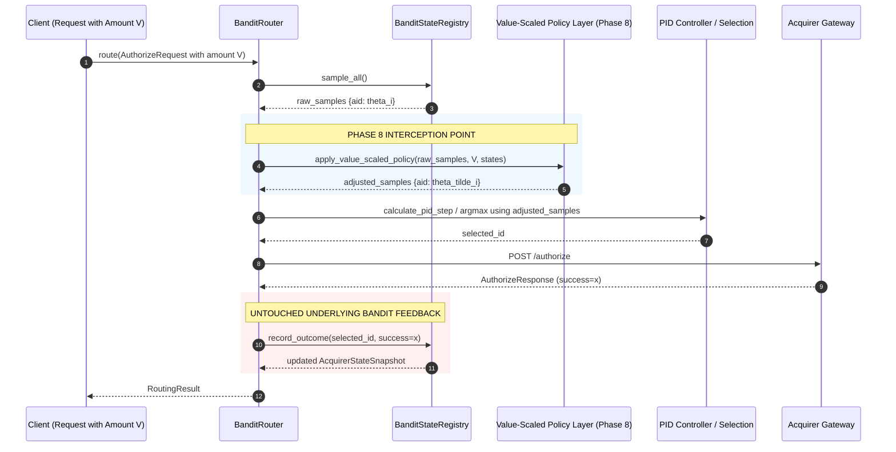

# Phase 8 Specification — Value-Scaled Exploration (Stretch Goal Policy Layer)

**Role**: Systems Architect
**Audience**: Backend Engineer, QA Test Engineer, Tech Lead Reviewer
**Scope**: Phase 8 (Value-Scaled Exploration Policy Layer)
**Status**: Settled Architecture Contract

---

## 1. Executive Summary & Component Boundary

Phase 8 defines the stretch goal of Loom: **Value-Scaled Exploration**. In production payment routing, all transactions are not economically equal. In standard multi-armed bandit formulations (including Phase 1's Thompson Sampling), exploration is value-blind: a \$5 micro-transaction and a \$10,000 enterprise settlement are treated as identical Bernoulli trials. If a degrading or secondary route is probed during an exploratory draw and fails, the loss on a \$10,000 charge is catastrophic to the merchant, whereas the loss on a \$5 charge is negligible.

Phase 8 introduces a **policy layer** that sits strictly on top of the existing bandit and router execution pipeline. It modulates the decision step based on transaction monetary value ($V$):
- **Micro / Low-Value Transactions ($V \to 0$)**: Explore normally with full posterior sampling width, discovering healthy alternate routes and keeping belief states active.
- **High-Value Transactions ($V \gg \tau$)**: Lean conservatively toward the current best-known estimate ($\hat{\mu}^*$), collapsing exploration variance so high-stakes volume is routed almost exclusively to the most confident, highest-performing acquirer.

### Explicit Scope Boundaries

- **In Scope for Phase 8**:
  - A lightweight policy layer wrapping Phase 1/3's sampling step.
  - Mathematical definition of shrinkage toward the posterior mean as a function of transaction value $V$.
  - Configurable sensitivity parameter ($\tau$ or $\kappa$) allowing tuning or complete bypass ($\lambda = 0$).
  - Telemetry capture of adjusted samples and shrinkage factors in `RoutingResult`.
  - Verification that holding transaction value constant preserves 100% parity with Phase 1–7 behavior.

- **Explicitly Out of Scope for Phase 8**:
  - **Zero changes to Beta distribution update mechanics**: $\alpha$ and $\beta$ updates in `router_core/state.py` must remain unweighted by transaction dollar amounts. Each transaction remains a single Bernoulli trial ($x \in \{0, 1\}$).
  - **Zero changes to the EWMA health score update**: $H_t = \gamma H_{t-1} + (1 - \gamma) x_t$ remains strictly event-driven.
  - **Zero modifications to PID internal equations**: The PID controller still receives target and current allocations; the policy layer acts upstream during perception/selection.
  - Multi-currency forex conversion or dynamic risk scoring.

---

## 2. Theoretical Foundation: Appendix A & Exploration-via-Sampling-Width

### 2.1 The Mechanics of Exploration in Thompson Sampling

In Thompson Sampling, exploration is not driven by an explicit randomized coin flip (as in $\epsilon$-greedy) or an artificial bonus term (as in UCB1). Rather, **exploration is an emergent property of the posterior distribution's width (variance)**.

For an acquirer route $i$ with accumulated Beta parameters $(\alpha_i, \beta_i)$:
- **Posterior Mean (Best-Known Expected Success Rate)**:
  $$\hat{\mu}_i = \mathbb{E}[\theta_i] = \frac{\alpha_i}{\alpha_i + \beta_i}$$
- **Posterior Variance**:
  $$\sigma_i^2 = \text{Var}(\theta_i) = \frac{\alpha_i \beta_i}{(\alpha_i + \beta_i)^2 (\alpha_i + \beta_i + 1)}$$
- **Sampling Width (Standard Deviation)**:
  $$\sigma_i = \sqrt{\frac{\alpha_i \beta_i}{(\alpha_i + \beta_i)^2 (\alpha_i + \beta_i + 1)}}$$

When the router draws a Thompson sample $\theta_i \sim \text{Beta}(\alpha_i, \beta_i)$, the draw falls within an uncertainty envelope proportional to $\sigma_i$.

Suppose Acquirer Alpha has $\hat{\mu}_A = 0.95, \sigma_A = 0.03$, while Acquirer Beta has $\hat{\mu}_B = 0.85, \sigma_B = 0.08$ (higher uncertainty due to fewer recent observations). Even though $\hat{\mu}_A > \hat{\mu}_B$, the right tail of Beta's distribution extends high enough that on approximately $10\%\text{--}15\%$ of draws, $\theta_B > \theta_A$.

**This stochastic dispersion—the sampling width—is the sole engine of exploration.**

### 2.2 The Economic Asymmetry Problem (Appendix A Framing)

While wide sampling distributions are statistically optimal for minimizing asymptotic regret in stationary Bernoulli games, they are economically reckless in financial transaction routing:

$$\text{Expected Financial Loss on Failure} = V \cdot (1 - p)$$

Routing a \$10,000 transaction to Acquirer Beta during an exploratory sampling spike exposes the merchant to \$10,000 of failed payment risk. In contrast, routing a \$5 transaction to Acquirer Beta yields the exact same statistical information ($\Delta N_{\text{eff}} = 1$) with only \$5 of risk exposure.

Therefore, an optimal routing policy must **compress the sampling width** for high-value transactions while preserving it for low-value transactions.

---

## 3. Reference Implementation: Phase 1 Thompson Sampling Core

Per the architectural mandate, we paste the authoritative Phase 1 sampling and state transition implementations below to explicitly demarcate the boundary between the underlying bandit and the Phase 8 policy layer.

### 3.1 `router_core/state.py` (Phase 1 Baseline)

```python
class AcquirerState:
    """Encapsulates the decaying Beta belief and EWMA health score for a single acquirer."""

    def __init__(
        self,
        acquirer_id: str,
        config: AcquirerStateConfig | None = None,
        initial_timestamp: float | None = None,
    ) -> None:
        self._acquirer_id: str = acquirer_id.strip()
        self._config: AcquirerStateConfig = config or AcquirerStateConfig()
        self._alpha: float = self._config.alpha_prior
        self._beta: float = self._config.beta_prior
        self._health_score: float = self._config.initial_health
        self._success_count: int = 0
        self._failure_count: int = 0
        self._last_updated_at: float = (
            initial_timestamp if initial_timestamp is not None else time.time()
        )

    def record_outcome(
        self,
        success: bool,
        timestamp: float | None = None,
    ) -> AcquirerStateSnapshot:
        """Update Beta parameters and EWMA health score with a transaction outcome."""
        gamma = self._config.decay_factor
        a0 = self._config.alpha_prior
        b0 = self._config.beta_prior
        x = 1.0 if success else 0.0

        # Mean-reverting decayed Beta parameters
        self._alpha = max(a0, a0 + gamma * (self._alpha - a0) + x)
        self._beta = max(b0, b0 + gamma * (self._beta - b0) + (1.0 - x))

        # EWMA health score update
        new_health = gamma * self._health_score + (1.0 - gamma) * x
        self._health_score = max(0.0, min(1.0, new_health))

        if success:
            self._success_count += 1
        else:
            self._failure_count += 1

        self._last_updated_at = timestamp if timestamp is not None else time.time()
        return self.get_state()

    def sample(self, rng: np.random.Generator | None = None) -> float:
        """Draw a Thompson sample from the current Beta distribution belief."""
        generator = rng if rng is not None else np.random.default_rng()
        return float(generator.beta(self._alpha, self._beta))
```

### 3.2 `router_core/bandit.py` (Phase 1 Baseline)

```python
class BanditStateRegistry:
    """Manages state across all configured acquirers and coordinates Thompson Sampling."""

    def sample_all(self, rng: np.random.Generator | None = None) -> dict[str, float]:
        """Draw independent Thompson samples across all registered acquirers."""
        generator = rng if rng is not None else np.random.default_rng()
        return {
            acquirer_id: state.sample(rng=generator)
            for acquirer_id, state in self._acquirers.items()
        }
```

---

## 4. Phase 8 Policy Layer Specification

### 4.1 Input Specification

The policy layer consumes exactly:
1. `transaction_value` ($V \in [0, \infty)$): Floating-point transaction amount from `AuthorizeRequest.amount`.
2. `raw_samples` ($\{\theta_i\}_{i \in \mathcal{A}}$): Raw Thompson samples drawn from `BanditStateRegistry.sample_all()`.
3. `posterior_means` ($\{\hat{\mu}_i\}_{i \in \mathcal{A}}$): Current expected success rates $\hat{\mu}_i = \frac{\alpha_i}{\alpha_i + \beta_i}$ for each acquirer.

### 4.2 Mathematical Formulation of Value-Scaled Shrinkage

We define a continuous, monotonic shrinkage mapping $\lambda(V) \in [0, 1)$:

$$\lambda(V) = 1 - \exp\left(-\frac{V}{\tau}\right) = 1 - \exp(-\kappa \cdot V)$$

Where:
- $\tau > 0$ is the **value scale parameter** (in monetary currency units, e.g. $\$100.00$).
- $\kappa = \frac{1}{\tau} \ge 0$ is the equivalent **value sensitivity parameter**.
- If $\tau \to \infty$ or $\kappa = 0$, $\lambda(V) = 0$ (policy completely disabled / bypass mode).

For each candidate acquirer route $i \in \mathcal{A}$, the policy layer computes the **value-adjusted sample** $\tilde{\theta}_i$:

$$\tilde{\theta}_i = (1 - \lambda(V)) \cdot \theta_i + \lambda(V) \cdot \hat{\mu}_i$$

### 4.3 Modulation of Sampling Width

Applying this affine transformation yields:
- **Expected Value of Adjusted Sample**:
  $$\mathbb{E}[\tilde{\theta}_i] = (1 - \lambda(V)) \mathbb{E}[\theta_i] + \lambda(V) \hat{\mu}_i = (1 - \lambda(V))\hat{\mu}_i + \lambda(V)\hat{\mu}_i = \hat{\mu}_i$$
  *Notice:* The expected value is invariant to transaction amount! The policy does not artificially bias the estimated health of any arm.
- **Adjusted Variance**:
  $$\text{Var}(\tilde{\theta}_i) = (1 - \lambda(V))^2 \cdot \text{Var}(\theta_i)$$
- **Effective Sampling Width**:
  $$\text{Width}(\tilde{\theta}_i) = (1 - \lambda(V)) \cdot \sigma_i$$

### 4.4 Boundary Behaviors

1. **Micro-Transactions ($V \to 0$)**:
   $$\lim_{V \to 0} \lambda(V) = 0 \implies \tilde{\theta}_i = \theta_i$$
   The effective width is 100% of the raw Beta distribution standard deviation. The router explores with standard Thompson Sampling.
2. **Reference Value ($V = \tau$)**:
   $$\lambda(\tau) = 1 - e^{-1} \approx 0.632$$
   Sampling width is compressed by $63.2\%$.
3. **High-Value Transactions ($V \gg \tau$, e.g. $V = 5\tau$)**:
   $$\lambda(5\tau) = 1 - e^{-5} \approx 0.993 \implies \tilde{\theta}_i \approx \hat{\mu}_i$$
   Sampling width is crushed to near-zero ($< 1\%$). The arm with the highest posterior mean $\arg\max_i \hat{\mu}_i$ wins with near $100\%$ determinism.

---

## 5. Exact Pipeline Interception Point

The policy layer intercepts the decision pipeline in `router_core/router.py` strictly between **Thompson Sampling Perception** and **Selection / PID Actuation**.



### 5.1 Step-by-Step Interception in `BanditRouter.route()`

In `BanditRouter.route(request)`:

1. Draw raw samples:
   ```python
   raw_samples = self._registry.sample_all(rng=self._rng)
   ```
2. **Phase 8 Policy Interception**:
   ```python
   adjusted_samples = self._apply_value_scaled_policy(
       samples=raw_samples,
       amount=request.amount,
   )
   ```
3. Downstream Route Selection:
   - When PID is disabled (Phase 3 mode):
     ```python
     selected_id = max(adjusted_samples.keys(), key=lambda aid: (adjusted_samples[aid], aid))
     ```
   - When PID is enabled (Phase 4 mode):
     ```python
     win_id = max(adjusted_samples.keys(), key=lambda aid: (adjusted_samples[aid], aid))
     target_allocation = {aid: 1.0 if aid == win_id else 0.0 for aid in adjusted_samples}
     # proceed with calculate_pid_step...
     ```
4. **Acquirer HTTP Dispatch & Outcome Classification**: Exactly as in Phase 3/4.
5. **State Feedback**:
   ```python
   updated_snapshot = self._registry.record_outcome(
       acquirer_id=selected_id,
       success=success,
       timestamp=time.time(),
   )
   ```
   **Crucial invariant**: The update takes only the binary outcome `success`. No transaction dollar amount touches `AcquirerState.record_outcome`.

---

## 6. Data Contract & Configuration Schema

### 6.1 `ValueScaledExplorationConfig`

```python
class ValueScaledExplorationConfig(BaseModel):
    """Configuration for Phase 8 value-scaled exploration policy."""

    model_config = ConfigDict(extra="forbid", arbitrary_types_allowed=True)

    enabled: bool = Field(
        default=False,
        description="Whether value-scaled exploration is active.",
    )
    tau: float = Field(
        default=100.0,
        gt=0.0,
        description=(
            "Reference transaction value threshold (tau) in currency units. "
            "Defines the scale where exploration width is compressed by 63.2%."
        ),
    )

    def calculate_shrinkage(self, amount: float) -> float:
        """Calculate the shrinkage factor lambda(V) in [0, 1)."""
        if not self.enabled or amount <= 0.0:
            return 0.0
        return 1.0 - math.exp(-amount / self.tau)
```

### 6.2 Addition to `RouterConfig`

```python
class RouterConfig(BaseModel):
    ...
    value_scaled_config: ValueScaledExplorationConfig | None = Field(
        default=None,
        description="Optional Phase 8 value-scaled exploration policy configuration.",
    )
```

### 6.3 Telemetry Additions to `RoutingResult`

To ensure full observability for QA and monitoring:
```python
class RoutingResult(BaseModel):
    ...
    adjusted_samples: dict[str, float] | None = Field(
        default=None,
        description="Value-scaled adjusted samples if Phase 8 policy is active.",
    )
    exploration_shrinkage: float | None = Field(
        default=None,
        description="Shrinkage factor lambda(V) applied to Thompson samples.",
    )
```

---

## 7. Architectural Trade-Off Analysis

| Decision | Alternative Considered | Selected Rationale | Trade-Off Incurred |
| :--- | :--- | :--- | :--- |
| **Affine Shrinkage toward Mean ($\tilde{\theta} = (1-\lambda)\theta + \lambda\hat{\mu}$)** | Hard rule threshold (e.g. `if amount > 500: route_to_leader()`) | Continuous exponential decay avoids knife-edge cliff instability at boundary amounts. | Small residual exploration variance still exists at moderate values (\$100–\$200). |
| **Wrapper Policy Layer** | Modifying Beta posterior parameters $(\alpha \leftarrow \alpha + V)$ | Preserves Bayesian conjugate likelihood integrity ($N_{\text{eff}}$ doesn't explode). | Does not allow high-value successes to accelerate posterior learning faster than micro-transactions. |
| **Single Configurable Scaling Parameter ($\tau$)** | Complex piecewise or multi-tier pricing brackets | Simple to tune, mathematically clean, trivially disablable ($\tau \to \infty$ or `enabled=False`). | Assumes risk aversion scales exponentially with dollar amount rather than custom stepped brackets. |

---

## 8. Hand-Off Checklist for Backend Engineer

1. [ ] Create `router_core/value_policy.py` containing `ValueScaledExplorationConfig` and the pure calculation `calculate_value_scaled_samples(...)`.
2. [ ] Update `router_core/models.py` to include `value_scaled_config` in `RouterConfig` and telemetry fields in `RoutingResult`.
3. [ ] Integrate policy layer in `router_core/router.py` at the exact interception point identified in Section 5.
4. [ ] Ensure when `value_scaled_config` is `None` or `enabled=False`, output is byte-for-byte and float-for-float identical to Phase 1–7.
5. [ ] Provide unit tests in `tests/router_core/test_value_scaled_exploration.py`:
   - Config validation ($\tau > 0$, negative amount handling).
   - Exact shrinkage calculations ($\lambda(0) = 0$, $\lambda(\tau) \approx 0.63212$, $\lambda(5\tau) \approx 0.99326$).
   - Statistical verification: across 1,000 draws on identical distributions, high-value transactions route to the highest-mean arm significantly more often than low-value transactions.
